# Ikasan Dashboard - Architecture Overview

## Introduction

The Ikasan Dashboard is a unified web-based management and monitoring platform that serves two primary integration solutions:

1. **Ikasan ESB (Enterprise Service Bus)** - Traditional integration platform for module, flow, and component management
2. **Ikasan Scheduler** - Job orchestration and scheduling platform for complex workflow management

Built on **Spring Boot** and **Vaadin Flow**, the dashboard provides real-time monitoring, configuration management, and operational control through a responsive web interface.

---

## High-Level Architecture

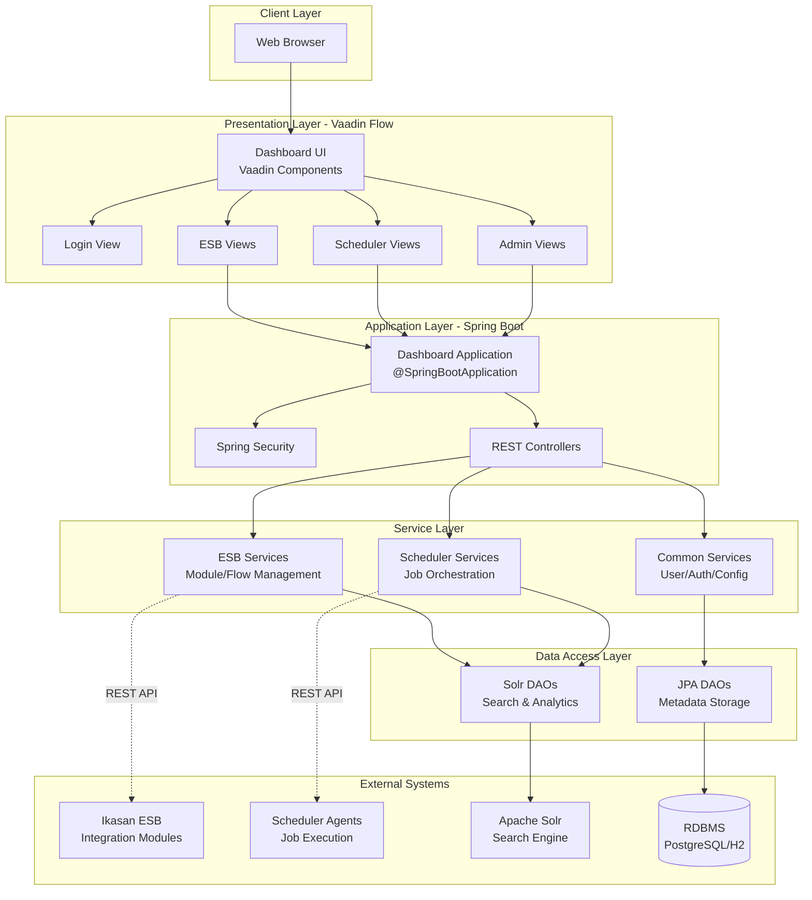

---

## Core Components

### 1. Presentation Layer (Vaadin Flow)

The dashboard uses **Vaadin Flow** for server-side UI rendering with the following key views:

#### Main Layout
- **`IkasanAppLayout`** - Main application shell with navigation

#### ESB Views
- **`GraphView`** - Interactive module and flow topology visualization
- **`ModuleVisualisation`** - Real-time module state and component visualization
- **`BusinessStreamDesignerView`** - Visual business stream composition
- **`MapView`** - Geographic topology mapping
- **`SearchView`** - Wiretap, error, and replay event search
- **Module Control** - Start/stop/pause flows and components
- **Configuration Management** - Dynamic component configuration
- **Replay Management** - Event replay and resubmission
- **Exclusion Management** - Error exclusion handling
- **Wiretap Viewer** - Message payload inspection

#### Scheduler Views
- **`SchedulerView`** - Main scheduler dashboard
- **`ContextTemplateManagementView`** - Job plan template management
- **Context Instance Widget** - Real-time job execution monitoring
- **Context Instance Tree View** - Hierarchical job visualization
- **Scheduler Visualisation** - DAG (Directed Acyclic Graph) visualization
- **Job Plan Editor** - Visual job dependency editor

#### Administration Views
- **`UserDirectoriesView`** - LDAP/user management
- **`RoleManagementView`** - Role-based access control
- **`JobLockManagementView`** - Distributed lock management
- **`SystemEventSearchView`** - System audit logs
- **`DashboardSessionsView`** - Active session management

#### Security
- **`LoginView`** - Authentication interface

---

### 2. Application Layer (Spring Boot)

```mermaid
graph LR
    subgraph "Spring Boot Application"
        App[Application.java<br/>@SpringBootApplication]
        Security[Security Config<br/>Spring Security]
        WebConfig[Web Config<br/>CORS/Sessions]
        SchedulerConfig[Scheduler Config]
    end

    subgraph "REST API Controllers"
        ESBControllers[ESB Controllers<br/>Module/Flow/Component]
        JobControllers[Job Orchestration Controllers<br/>Context/Job Management]
        EventControllers[Event Controllers<br/>Process Events]
    end

    App --> Security
    App --> WebConfig
    App --> SchedulerConfig

    App --> ESBControllers
    App --> JobControllers
    App --> EventControllers
```

**Key Configuration:**
- Spring Boot auto-configuration
- Embedded Tomcat server
- Session management
- CORS configuration
- Security filters

---

### 3. Service Layer Architecture

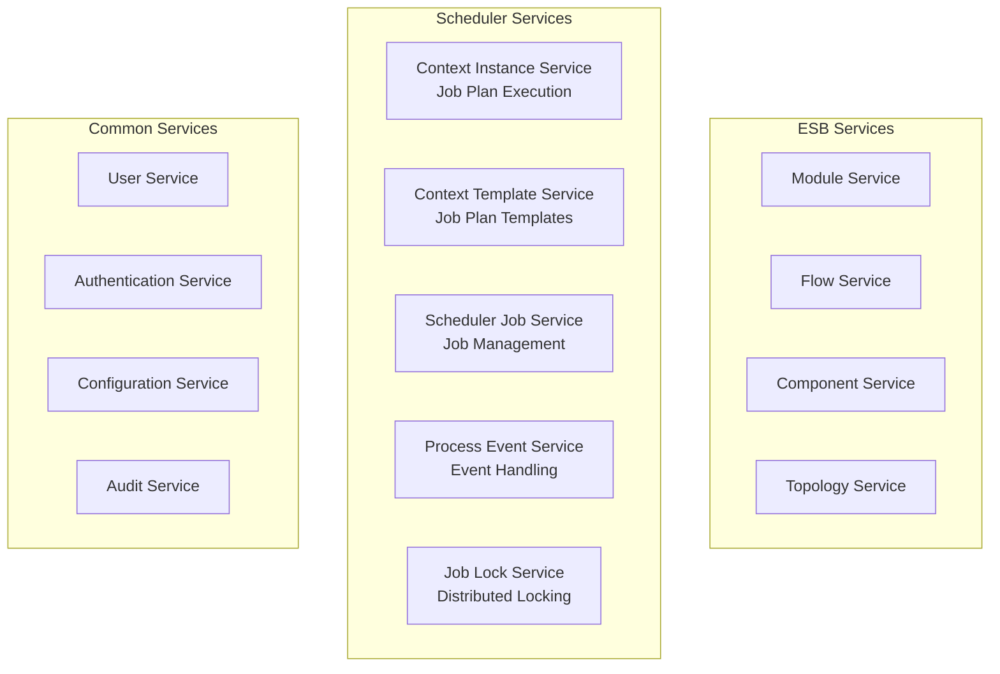

#### Scheduler Service Components

**Context Management:**
- **Context Templates** - Job plan definitions (blueprints)
- **Context Instances** - Runtime job plan executions
- **Context Parameters** - Dynamic configuration injection

**Job Orchestration:**
- Job dependency management
- Lock group coordination
- State machine transitions
- Event-driven execution

---

### 4. Data Access Layer

The dashboard uses a hybrid persistence strategy:

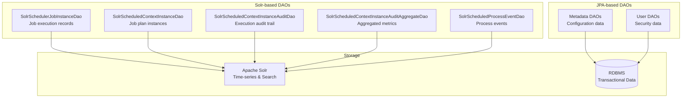

#### Why Solr for Scheduler Data?

1. **Time-series optimization** - Excellent for job execution history
2. **Full-text search** - Fast filtering and querying
3. **Faceted search** - Status aggregations and counts
4. **Scalability** - Handles millions of job records
5. **Real-time indexing** - Near-instant query updates

---

## ESB Architecture Deep Dive

### Integration Module Model

The Ikasan ESB organizes integration logic into a hierarchical structure:

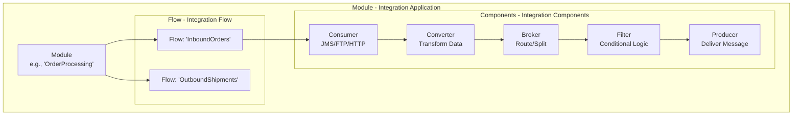

### Module, Flow, and Component Hierarchy

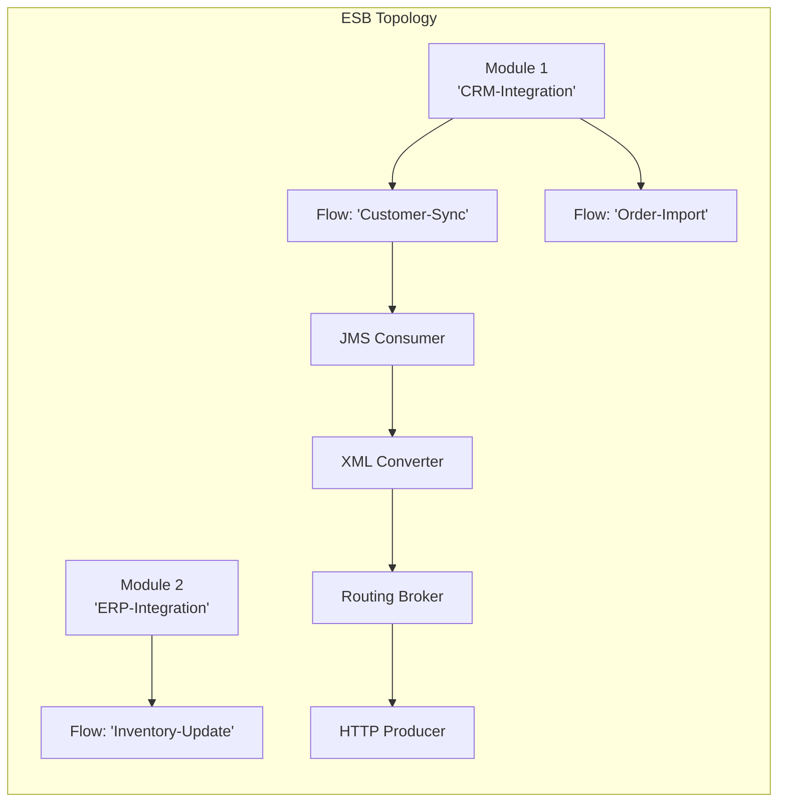

### ESB Component Types

```mermaid
graph TB
    subgraph "Component Categories"
        Consumers[Consumers<br/>Entry Points]
        Transformers[Transformers<br/>Data Manipulation]
        Routers[Routers<br/>Flow Control]
        Producers[Producers<br/>Exit Points]
    end

    subgraph "Consumer Types"
        JMSConsumer[JMS Consumer]
        FTPConsumer[FTP Consumer]
        HTTPConsumer[HTTP Consumer]
        ScheduledConsumer[Scheduled Consumer]
        EmailConsumer[Email Consumer]
        SFTPConsumer[SFTP Consumer]
    end

    subgraph "Transformer Types"
        XSLTConverter[XSLT Converter]
        JSONConverter[JSON Converter]
        XMLConverter[XML Converter]
        JavaConverter[Java Converter]
    end

    subgraph "Producer Types"
        JMSProducer[JMS Producer]
        FTPProducer[FTP Producer]
        HTTPProducer[HTTP Producer]
        EmailProducer[Email Producer]
        DBProducer[Database Producer]
    end

    Consumers --> JMSConsumer
    Consumers --> FTPConsumer
    Consumers --> HTTPConsumer
    Consumers --> ScheduledConsumer
    Consumers --> EmailConsumer
    Consumers --> SFTPConsumer

    Transformers --> XSLTConverter
    Transformers --> JSONConverter
    Transformers --> XMLConverter
    Transformers --> JavaConverter

    Producers --> JMSProducer
    Producers --> FTPProducer
    Producers --> HTTPProducer
    Producers --> EmailProducer
    Producers --> DBProducer
```

### Flow State Management

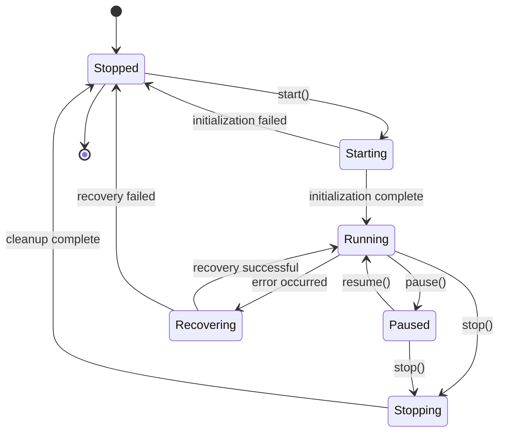

**Flow States:**
- **Stopped** - Flow is not running, no message processing
- **Starting** - Flow is initializing components
- **Running** - Flow is actively processing messages
- **Paused** - Flow is suspended, messages queued
- **Stopping** - Flow is shutting down gracefully
- **Recovering** - Flow is in error recovery mode
- **Stale** - Flow heartbeat lost (module unreachable)

### Real-time Flow Monitoring

The dashboard provides real-time flow state updates via broadcasters:

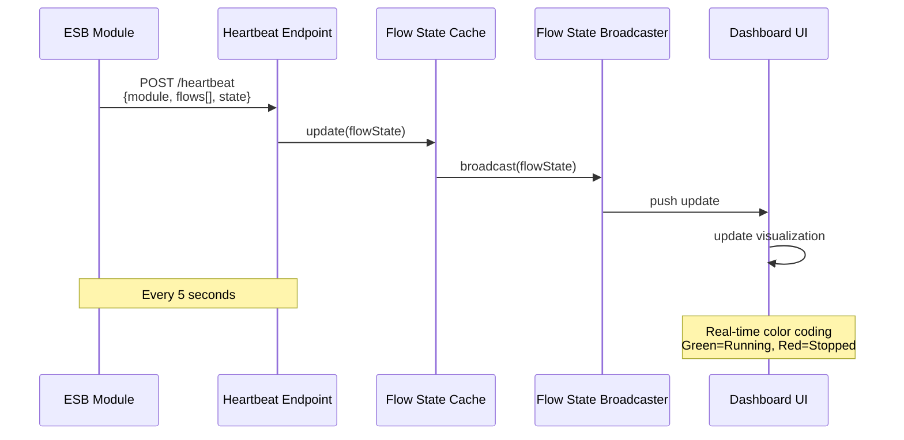

### ESB Data Flow

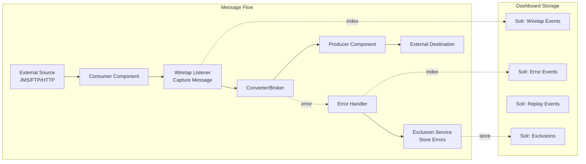

### Module Control Operations

The dashboard provides full operational control over ESB modules:

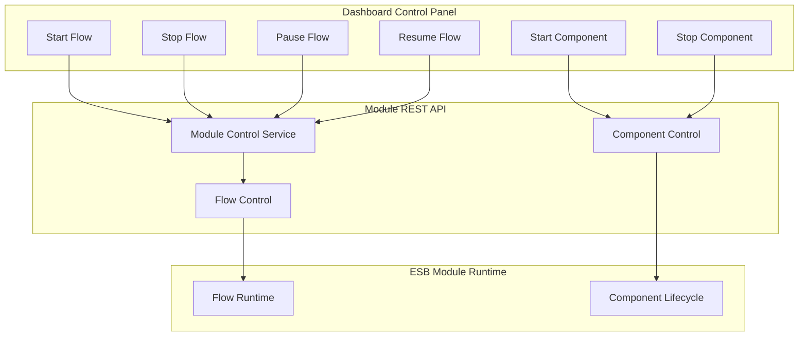

### Configuration Management

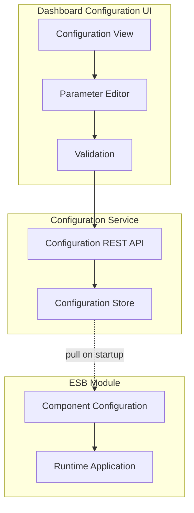

### Business Stream Visualization

Business Streams provide high-level integration topology visualization:

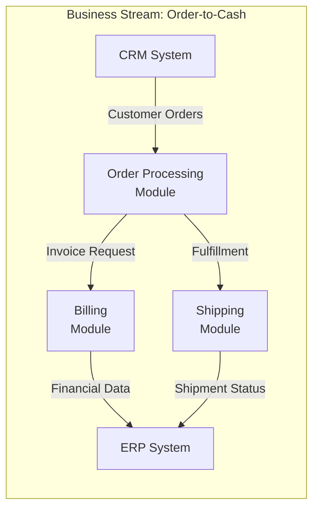

### Wiretap and Replay

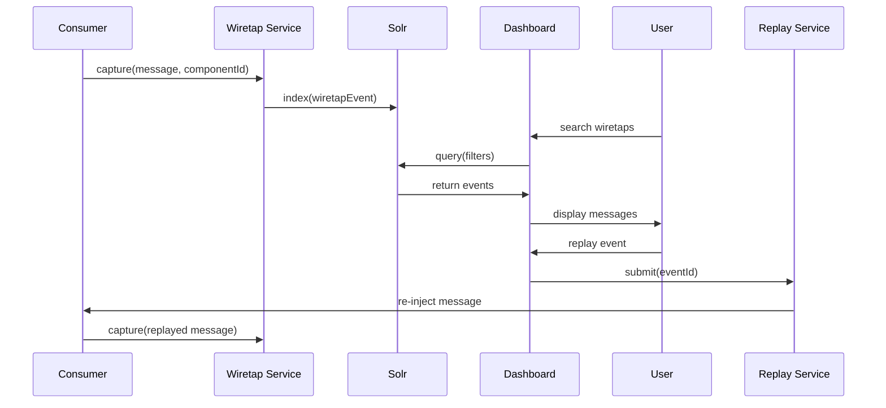

**Wiretap Features:**
- **Message capture** - Capture payloads at any component
- **Payload inspection** - View XML/JSON/Text messages
- **Metadata** - Timestamps, component IDs, correlation IDs
- **Search** - Filter by time, module, flow, component, payload content
- **TTL management** - Configurable retention periods

**Replay Features:**
- **Event resubmission** - Replay failed or successful messages
- **Bulk replay** - Replay multiple events
- **Time-based replay** - Replay events from time range
- **Selective replay** - Replay specific exclusions

### Error Handling and Exclusions

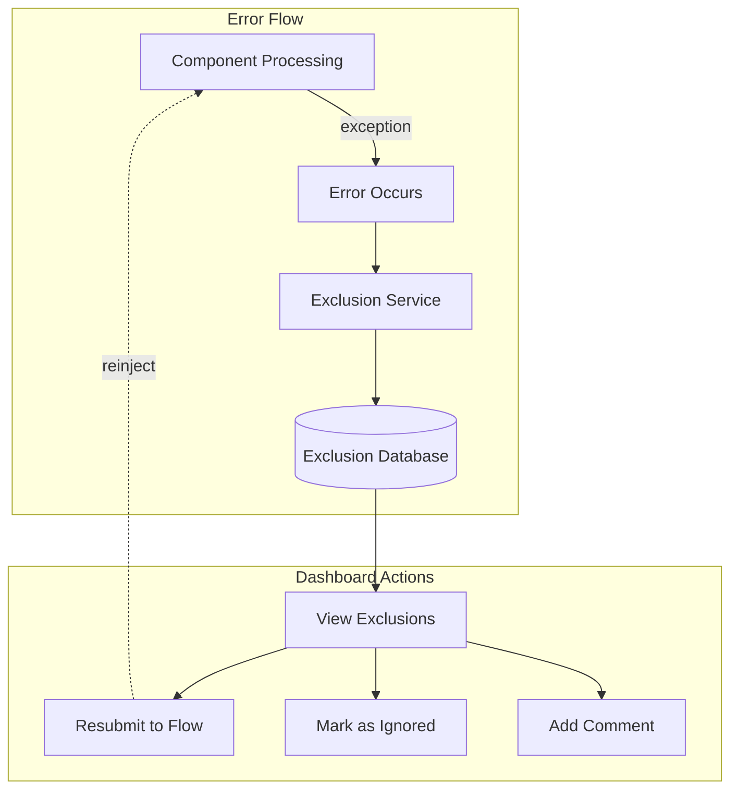

---

## Scheduler Architecture Deep Dive

### Job Orchestration Model

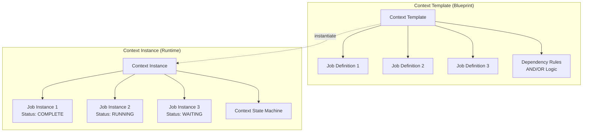

### Job Types

The scheduler supports multiple job types:

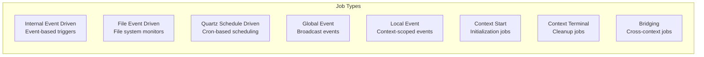

### Job State Machine

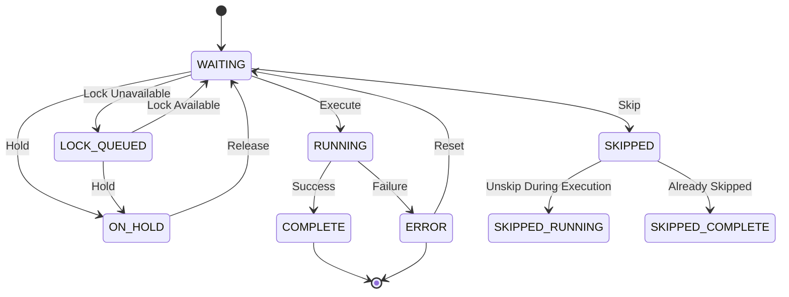

### Lock Group Management

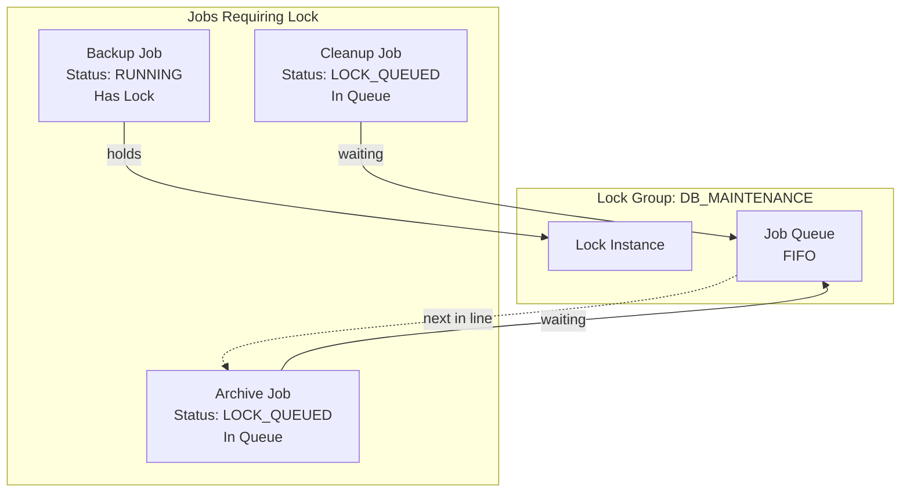

**Lock Group Features:**
- **Exclusive locks** - Only one job executes at a time
- **Shared locks** - Multiple jobs can execute concurrently
- **Queue management** - FIFO ordering for waiting jobs
- **Distributed coordination** - Cross-context lock support
- **Held job handling** - Jobs ON_HOLD remain held even when locks available (IKASAN-2694)

---

## Data Flow Architecture

### Scheduler Job Execution Flow

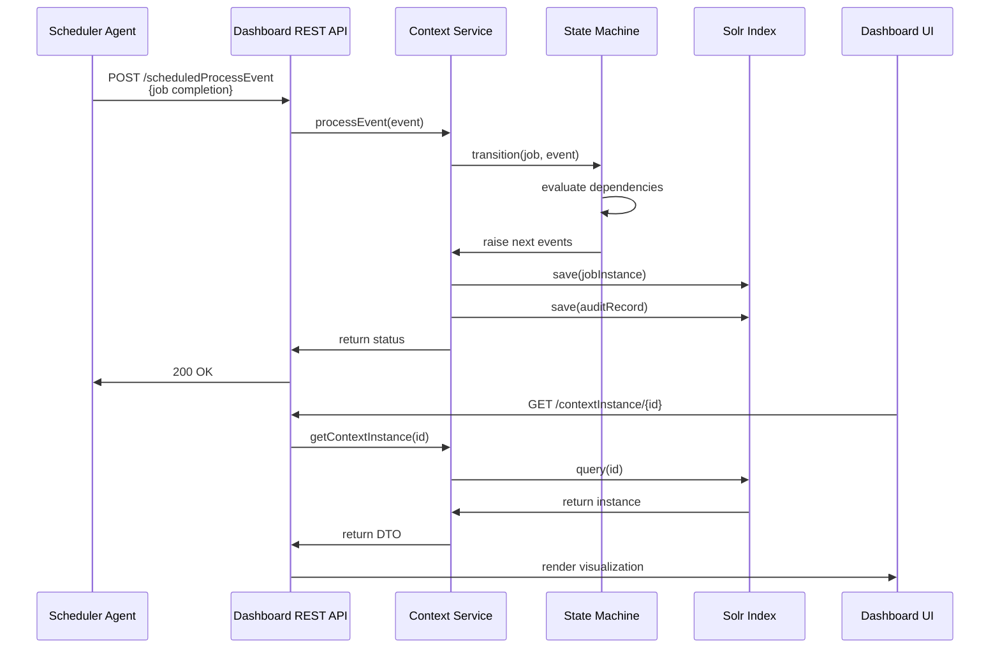

### Real-time Job Monitoring

```mermaid
graph LR
    subgraph "Data Collection"
        Agents[Scheduler Agents<br/>Job Execution]
        Events[Process Events<br/>Job Status Updates]
    end

    subgraph "Ingestion"
        REST[REST Endpoints]
        Queue[Event Queue<br/>BigQueue]
    end

    subgraph "Processing"
        StateMachine[Context State Machine]
        Logic[Job Logic Engine]
    end

    subgraph "Storage"
        SolrJobs[Job Instances<br/>Solr Collection]
        SolrAudit[Audit Records<br/>Solr Collection]
    end

    subgraph "Visualization"
        Dashboard[Dashboard UI]
        DAG[DAG Visualization]
        Gantt[Timeline View]
    end

    Agents --> Events
    Events --> REST
    REST --> Queue
    Queue --> StateMachine
    StateMachine --> Logic
    Logic --> SolrJobs
    Logic --> SolrAudit

    SolrJobs --> Dashboard
    SolrAudit --> DAG
    SolrAudit --> Gantt
```

---

## Solr Data Model

### Core Collections

#### 1. Scheduler Job Instance Collection

**Document Structure:**
```json
{
  "id": "jobName_contextInstanceId_childContextName_INTERNAL_EVENT_DRIVEN_JOB_INSTANCE",
  "type": "INTERNAL_EVENT_DRIVEN_JOB_INSTANCE",
  "payload_content": "{...serialized job...}",
  "status": "COMPLETE",
  "module_name": "jobName",
  "flow_name": "contextName",
  "child_context_name": "childContextName",
  "component_name": "contextInstanceId",
  "created_date_time": 1709683200000,
  "updated_date_time": 1709683300000,
  "start_time": 1709683200000,
  "end_time": 1709683300000,
  "target_residing_context_only": false,
  "participates_in_lock": true,
  "modified_by": "admin",
  "manually_submitted_by": null
}
```

**Query Patterns:**
- By context instance ID → all jobs in a job plan execution
- By status → filter jobs by WAITING/RUNNING/COMPLETE/ERROR
- By time windows → historical job execution queries
- By lock participation → identify locked jobs

#### 2. Context Instance Collection

**Document Structure:**
```json
{
  "id": "contextInstanceId_scheduledContextInstance",
  "type": "scheduledContextInstance",
  "payload_content": "{...serialized context...}",
  "status": "RUNNING",
  "module_name": "contextName",
  "component_name": "contextInstanceId",
  "created_date_time": 1709683200000,
  "updated_date_time": 1709683300000,
  "start_time": 1709683200000,
  "end_time": null,
  "contains_repeating_jobs": true
}
```

#### 3. Audit Aggregate Collection

**Document Structure:**
```json
{
  "id": "scheduledContextInstanceAuditAggregateId_UUID",
  "type": "scheduledContextInstanceAuditAggregate",
  "payload_content": "{...audit data...}",
  "flow_name": "contextInstanceId",
  "module_name": "contextName",
  "component_name": "scheduledProcessEventName",
  "event": "jobName1 jobName2",
  "is_repeating_job": true,
  "status": "COMPLETE",
  "job_type": "INTERNAL_EVENT_DRIVEN"
}
```

**Aggregation Queries:**
- Repeating job status counts
- Job type distribution
- Execution frequency analysis

---

## Security Architecture

```mermaid
graph TB
    subgraph "Authentication"
        LoginForm[Login Form]
        LDAP[LDAP Provider]
        Local[Local DB Auth]
    end

    subgraph "Authorization"
        Roles[Role Management<br/>ADMIN/USER/READONLY]
        Permissions[Permissions<br/>ESB/Scheduler/Admin]
        RBAC[Spring Security RBAC]
    end

    subgraph "Session Management"
        Sessions[Active Sessions]
        Timeout[Session Timeout]
        Concurrent[Concurrent Session Control]
    end

    LoginForm --> LDAP
    LoginForm --> Local

    LDAP --> Roles
    Local --> Roles

    Roles --> Permissions
    Permissions --> RBAC

    RBAC --> Sessions
    Sessions --> Timeout
    Sessions --> Concurrent
```

**Security Features:**
- Spring Security integration
- LDAP/AD authentication support
- Role-based access control (RBAC)
- Session management and monitoring
- CORS configuration for REST APIs
- Secure REST endpoints

---

## Deployment Architecture

```mermaid
graph TB
    subgraph "Production Deployment"
        LB[Load Balancer]

        subgraph "Dashboard Cluster"
            D1[Dashboard Instance 1<br/>Spring Boot + Vaadin]
            D2[Dashboard Instance 2<br/>Spring Boot + Vaadin]
        end

        subgraph "Search Cluster"
            S1[Solr Node 1]
            S2[Solr Node 2]
            S3[Solr Node 3]
        end

        subgraph "Database"
            DB[(PostgreSQL<br/>High Availability)]
        end

        subgraph "ESB Environment"
            ESB1[ESB Module 1]
            ESB2[ESB Module 2]
        end

        subgraph "Scheduler Environment"
            Agent1[Scheduler Agent 1]
            Agent2[Scheduler Agent 2]
            Agent3[Scheduler Agent 3]
        end
    end

    LB --> D1
    LB --> D2

    D1 --> S1
    D1 --> S2
    D1 --> S3

    D2 --> S1
    D2 --> S2
    D2 --> S3

    D1 --> DB
    D2 --> DB

    ESB1 -.->|REST| D1
    ESB1 -.->|REST| D2
    ESB2 -.->|REST| D1
    ESB2 -.->|REST| D2

    Agent1 -.->|REST| D1
    Agent1 -.->|REST| D2
    Agent2 -.->|REST| D1
    Agent2 -.->|REST| D2
    Agent3 -.->|REST| D1
    Agent3 -.->|REST| D2
```

**Deployment Characteristics:**
- Horizontally scalable dashboard instances
- Solr SolrCloud for distributed search
- High-availability database
- Stateless REST APIs
- Session replication support

---

## Technology Stack

### Frontend
- **Vaadin Flow 24.x** - Server-side UI framework
- **TypeScript/JavaScript** - Custom components
- **Vis.js** - Graph visualization
- **D3.js** - Data visualization
- **Vite** - Build tool

### Backend
- **Spring Boot 3.x** - Application framework
- **Spring Security** - Authentication/Authorization
- **Spring Data JPA** - ORM layer
- **Quartz Scheduler** - Job scheduling engine
- **Jackson** - JSON serialization

### Data Layer
- **Apache Solr 9.x** - Search and analytics
- **PostgreSQL / H2** - Relational database
- **HikariCP** - Connection pooling

### Integration
- **REST APIs** - Inter-service communication
- **BigQueue** - Event queue management
- **Jackson ObjectMapper** - Serialization

---

## Module Structure

```
ikasan-dashboard/
├── ikasaneip/
│   ├── visualisation/
│   │   ├── dashboard/              # Main Vaadin dashboard application
│   │   │   ├── src/main/java/
│   │   │   │   └── org/ikasan/dashboard/
│   │   │   │       ├── Application.java           # Spring Boot entry point
│   │   │   │       └── ui/
│   │   │   │           ├── layout/               # Main layout components
│   │   │   │           ├── scheduler/            # Scheduler views/widgets
│   │   │   │           ├── visualisation/        # ESB visualization
│   │   │   │           ├── administration/       # Admin views
│   │   │   │           ├── search/              # Search functionality
│   │   │   │           └── security/            # Login/security
│   │   │   └── frontend/                         # Frontend resources
│   │   ├── dashboard-dist/          # Distribution packaging
│   │   └── vis.js/                  # Graph visualization library
│   │
│   ├── job-orchestration/
│   │   ├── core/                    # Scheduler core engine
│   │   │   └── machine/             # State machine implementation
│   │   ├── model/                   # Domain models
│   │   ├── rest/                    # REST API controllers
│   │   └── provision/               # Job plan provisioning
│   │
│   ├── solr/
│   │   └── solr-client/             # Solr DAOs and models
│   │       ├── dao/                 # Data access objects
│   │       │   ├── SolrSchedulerJobInstanceDaoImpl.java
│   │       │   ├── SolrScheduledContextInstanceDaoImpl.java
│   │       │   ├── SolrScheduledContextInstanceAuditDaoImpl.java
│   │       │   └── SolrScheduledContextInstanceAuditAggregateDaoImpl.java
│   │       └── model/               # Solr-specific models
│   │
│   └── rest/
│       ├── rest-dashboard/          # Dashboard REST endpoints
│       ├── rest-module-client/      # ESB module client
│       └── rest-scheduler-agent-client/  # Scheduler agent client
```

---

## Key Design Patterns

### 1. State Machine Pattern
- **Context State Machine** - Manages job plan execution lifecycle
- **Job State Machine** - Controls individual job transitions
- **Event-driven** - State changes triggered by process events

### 2. DAO Pattern
- Abstraction layer for data persistence
- Solr-specific implementations for time-series data
- JPA implementations for transactional data

### 3. Service Layer Pattern
- Business logic encapsulation
- Transaction management
- API orchestration

### 4. MVC Pattern (Server-side)
- Vaadin Flow components (View)
- Spring controllers (Controller)
- Domain services (Model)

### 5. Observer Pattern
- Event listeners for job state changes
- UI updates via server push
- Real-time dashboard refresh

---

## Performance Considerations

### Solr Optimization
- **Indexed fields**: status, contextInstanceId, jobName, timestamps
- **Faceted queries**: Fast status aggregations
- **Pagination**: Large result set handling
- **Caching**: Query result caching

### UI Performance
- **Server-side rendering**: Reduces client-side processing
- **Lazy loading**: Grid components with virtual scrolling
- **Push updates**: WebSocket-based real-time updates
- **Component caching**: Reusable UI components

### Concurrency
- **Thread-safe state machine**: Synchronized state transitions
- **Lock-free reads**: Optimistic concurrency for queries
- **Event queue**: Asynchronous event processing
- **Connection pooling**: Database connection management

---

## API Integration

### Scheduler Agent → Dashboard

**Job Completion Event:**
```http
POST /api/scheduledProcessEvent
Content-Type: application/json

{
  "agentName": "agent1",
  "jobName": "backupJob",
  "contextName": "dailyMaintenance",
  "contextInstanceId": "uuid-12345",
  "returnCode": 0,
  "successful": true,
  "fireTime": 1709683200000,
  "completionTime": 1709683300000
}
```

### Dashboard → Scheduler Agent

**Job Submission:**
```http
POST /api/submitJob
Content-Type: application/json

{
  "agentName": "agent1",
  "jobName": "backupJob",
  "contextInstanceId": "uuid-12345",
  "parameters": {
    "database": "production",
    "retentionDays": "30"
  }
}
```

---

## Monitoring & Observability

### Dashboard Metrics
- Active context instances
- Job execution rates
- Error rates by job type
- Lock contention statistics
- Agent health status

### Audit Trail
- User actions (login, configuration changes)
- Job submissions and cancellations
- System events (startup, shutdown)
- Configuration changes

### Logging
- Structured logging (JSON format)
- Log levels per package
- Correlation IDs for request tracing
- Audit logs for compliance

---

## Future Enhancements

1. **GraphQL API** - More flexible querying
2. **Elasticsearch Integration** - Alternative to Solr
3. **Prometheus Metrics** - Enhanced monitoring
4. **Kubernetes Deployment** - Cloud-native deployment
5. **Real-time Collaboration** - Multi-user job plan editing
6. **ML-based Predictions** - Job failure prediction
7. **Mobile Dashboard** - Responsive mobile UI

---

## References

- **Vaadin Flow Documentation**: https://vaadin.com/docs/latest/flow
- **Spring Boot Reference**: https://spring.io/projects/spring-boot
- **Apache Solr Guide**: https://solr.apache.org/guide
- **Ikasan GitHub**: https://github.com/ikasanEIP/ikasan-dashboard

---

**Document Version**: 1.0
**Last Updated**: 2026-03-06
**Maintained By**: Ikasan Development Team
