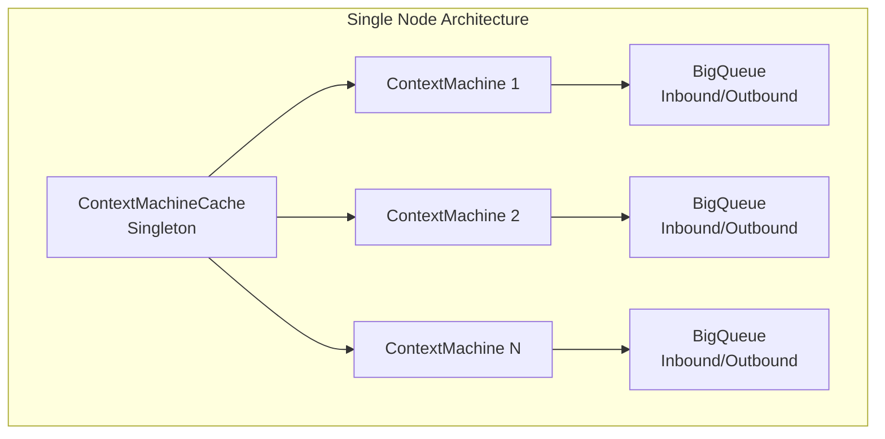
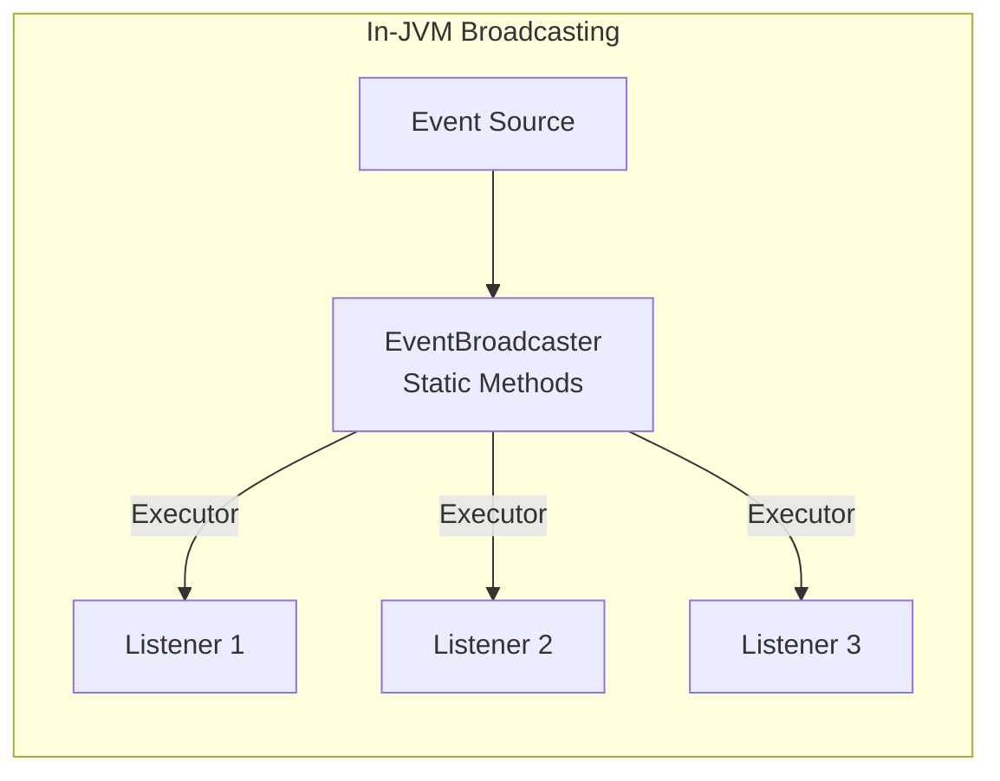
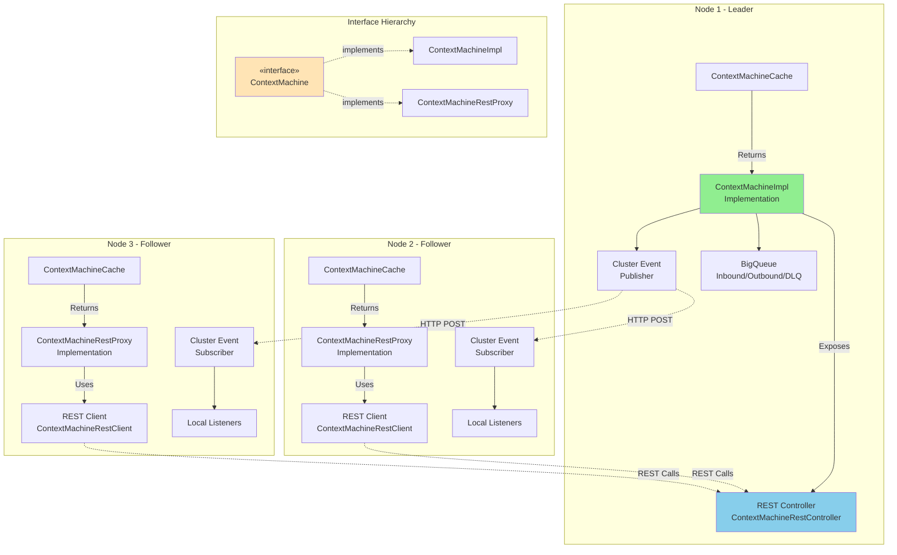
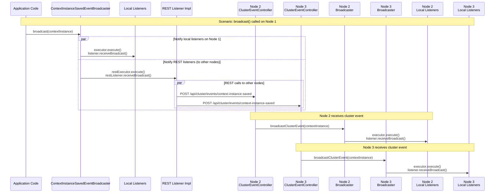
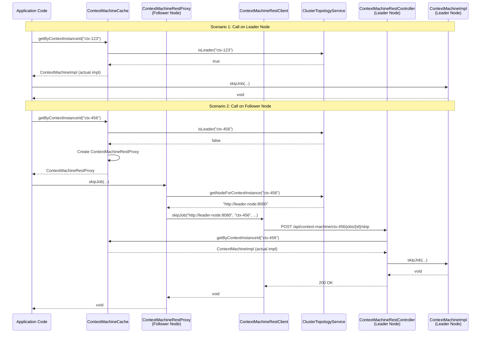
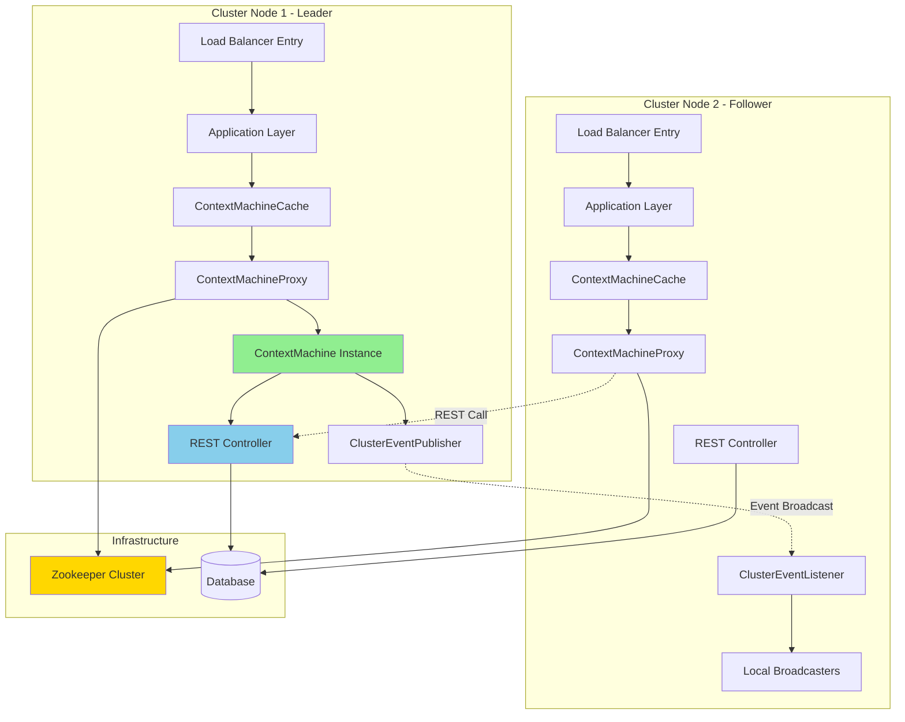

# Ikasan Job Orchestration - Cluster-Wide Architecture

## Overview

This document outlines the architectural design and implementation plan for extending the Ikasan Job Orchestration module to support distributed cluster environments. The solution addresses two primary requirements:

1. **ContextMachine REST Proxy**: Enable remote access to singleton ContextMachine instances running on leader nodes
2. **Cluster-Wide Event Broadcasting**: Distribute broadcaster events across all nodes in the cluster

## Table of Contents

- [Current Architecture](#current-architecture)
- [Problem Statement](#problem-statement)
- [Proposed Solution](#proposed-solution)
- [Implementation Plan](#implementation-plan)
- [API Specifications](#api-specifications)
- [Configuration](#configuration)
- [Testing Strategy](#testing-strategy)

---

## Current Architecture

### ContextMachine Singleton Pattern

The `ContextMachine` is currently designed as a singleton that manages the lifecycle and state transitions of context instances. It maintains:

- Job instance state machines
- Internal/external event processing queues
- Job lock management
- Context instance lifecycle management



### Current Broadcaster Architecture

Broadcasters currently use weak references and in-JVM executor services to notify listeners:



**Broadcasters in Module:**
- `ContextInstanceDlqEventBroadcaster`
- `ContextInstanceSavedEventBroadcaster`
- `ContextInstanceStateChangeEventBroadcaster`
- `ContextTemplateEnableDisableEventBroadcaster`
- `ContextTemplateSavedEventBroadcaster`
- `ContextViewUpdateEventBroadcaster`
- `JobLockCacheEventBroadcaster`
- `NewSchedulerJobEventBroadcaster`
- `SchedulerJobStateChangeEventBroadcaster`

---

## Problem Statement

### Challenge 1: ContextMachine Accessibility in Clustered Environments

In a clustered deployment with leader election:

- **Only one node** (the leader) hosts the active ContextMachine for a given context instance
- **All nodes** have a `ContextMachineCache` that needs to access ContextMachine methods
- Direct method calls fail when the ContextMachine is not on the local node

### Challenge 2: Event Broadcasting Across Cluster

- Events raised on one node need to be broadcast to listeners on **all nodes**
- Current in-JVM broadcasting doesn't support multi-node scenarios
- Listeners are registered on all nodes but only receive events from their local node

---

## Proposed Solution

### Architecture Overview

The solution uses the **Strategy Pattern** with interface-based polymorphism:

- **`ContextMachine` Interface**: Defines all ContextMachine operations
- **`ContextMachineImpl` Implementation**: Runs on leader nodes with actual state machine logic
- **`ContextMachineRestProxy` Implementation**: Runs on follower nodes, delegates to leader via REST
- **`ContextMachineCache`**: Serves the appropriate implementation based on node role



### Solution Components

#### 1. ContextMachine Interface

**Module:** `ikasan-job-orchestration-core`

**File:** `org.ikasan.job.orchestration.core.machine.ContextMachine`

The interface that defines all ContextMachine operations (45+ methods):

```java
public interface ContextMachine {
    void init() throws IOException;
    void teardown() throws IOException;
    void raiseEvent(ContextualisedScheduledProcessEvent event) throws IOException;
    ContextInstanceStatus getContextInstanceStatus();
    void skipJob(String jobIdentifier, String childContextName, boolean skipFlag);
    // ... and 40+ more methods
}
```

**Status:** ✅ **Already Implemented**

#### 2. ContextMachineImpl Implementation

**Module:** `ikasan-job-orchestration-core`

**File:** `org.ikasan.job.orchestration.core.machine.ContextMachineImpl`

The concrete implementation that runs on **leader nodes only**:

```java
public class ContextMachineImpl implements ContextMachine {
    // Actual state machine logic
    // BigQueue management
    // Job orchestration
    // Event processing
}
```

**Status:** ✅ **Already Implemented** (now implements interface)

#### 3. ContextMachine REST Service Layer

**Module:** `ikasan-job-orchestration-rest/rest-context-machine`

**Components:**
- `ContextMachineRestController` - Exposes REST endpoints, delegates to local ContextMachine
- `ContextMachineRestClient` - REST client for making remote calls
- `ContextMachineRestProxy` - Implementation of ContextMachine that delegates via REST

#### 2. Cluster-Wide Event Broadcasting

Implement a distributed event broadcasting mechanism:

**Module:** `ikasan-job-orchestration-broadcast`

**Components:**
- `ClusterEventBroadcaster` - Publishes events to all cluster nodes
- `ClusterEventListener` - Receives events from other nodes
- `ClusterEventRestClient` - REST client for event distribution
- `ClusterEventRestController` - REST endpoint for receiving events

---

## Implementation Plan

### Phase 1: Cluster-Wide Event Broadcasting

#### 1.1 Enhanced Broadcaster Architecture



#### 1.2 Cluster Event Broadcasting Components

**Module:** `ikasan-job-orchestration-broadcast`

Add cluster-aware broadcasting:

```java
public class ContextInstanceSavedEventBroadcaster {
    static Executor executor = Executors.newSingleThreadExecutor(new BroadcasterThreadFactory("ContextInstanceSavedEventBroadcaster"));
    static Executor restExecutor = Executors.newSingleThreadExecutor(new BroadcasterThreadFactory("ContextInstanceSavedEventRestBroadcaster"));

    private static WeakHashMap<ContextInstanceSavedEventBroadcastRestListener, Object> restListeners =
        new WeakHashMap<>();
    private static WeakHashMap<ContextInstanceSavedEventBroadcastListener, Object> listeners =
        new WeakHashMap<>();

    public static synchronized void broadcast(final ContextInstance contextInstance) {
        // Broadcast to local listeners (existing behavior)
        for (final ContextInstanceSavedEventBroadcastListener listener: listeners.keySet()) {
            executor.execute(() -> listener.receiveBroadcast(contextInstance));
        }
        
        // Broadcast to rest listeners
        for (final ContextInstanceSavedEventBroadcastListener listener: restListeners.keySet()) {
            restExecutor.execute(() -> restListeners.receiveBroadcast(contextInstance));
        }
    }

    // Called when receiving event from another node
    public static synchronized void broadcastClusterEvent(final ContextInstance contextInstance) {
        // Only notify local listeners (don't republish to cluster)
        for (final ContextInstanceSavedEventBroadcastListener listener: listeners.keySet()) {
            executor.execute(() -> listener.receiveBroadcast(contextInstance));
        }
    }

    public static synchronized void register(ContextInstanceSavedEventBroadcastListener listener) {
        listeners.put(listener, null);
    }

    public static synchronized void unregister(ContextInstanceSavedEventBroadcastListener listener) {
        listeners.remove(listener);
    }

    public static synchronized void register(ContextInstanceSavedEventBroadcastRestListener listener) {
        restListeners.put(listener, null);
    }

    public static synchronized void unregister(ContextInstanceSavedEventBroadcastRestListener listener) {
        restListeners.remove(listener);
    }
}
```
#### 1.3 Broadcaster Interfaces 

```java
public interface ContextInstanceSavedEventBroadcastListener {
    void receiveBroadcast(ContextInstance var1);
}

// marker interface for REST listener
public interface ContextInstanceSavedEventRestBroadcastListener extends ContextInstanceSavedEventBroadcastListener {
}
```
#### 1.4 Broadcaster Interface REST Client Implementation

```java
// marker interface for REST listener
public class ContextInstanceSavedEventRestBroadcastListenerImpl implements ContextInstanceSavedEventRestBroadcastListener {
    public void receiveBroadcast(ContextInstance var1) {
        // implement REST client code here that calls the endpoint in 1.5 below running on other nodes
    }
}
```

#### 1.5 Cluster Event REST API

**Endpoint:** `/api/cluster/events`

```java
@RestController
@RequestMapping("/api/cluster/events")
public class ClusterEventController {

    @PostMapping("/context-instance-saved")
    public ResponseEntity<Void> handleContextInstanceSaved(
            @RequestBody ContextInstance contextInstance) {

        // Dispatch to local listeners only
        ContextInstanceSavedEventBroadcaster.broadcaseClusterEvent(contextInstance);
        return ResponseEntity.ok().build();
    }
}
```

### Phase 2: REST Service Layer for ContextMachine

#### 2.1 Create REST Module Structure

```
ikasan-job-orchestration/
├── core/
│   └── src/main/java/.../core/machine/
│       ├── ContextMachine.java          ✅ DONE (interface)
│       └── ContextMachineImpl.java      ✅ DONE (implements interface)
├── rest/
│   ├── rest-context-machine/
│   │   ├── src/main/java/.../rest/
│   │   │   ├── controller/
│   │   │   │   └── ContextMachineRestController.java
│   │   │   ├── client/
│   │   │   │   └── ContextMachineRestClient.java
│   │   │   ├── proxy/
│   │   │   │   └── ContextMachineRestProxy.java      (implements ContextMachine)
│   │   │   ├── dto/
│   │   │   │   ├── ContextInstanceStatusDTO.java
│   │   │   │   ├── EventRaiseRequestDTO.java
│   │   │   │   └── ContextResetRequestDTO.java
│   │   │   └── config/
│   │   │       └── ContextMachineRestConfiguration.java
│   │   └── pom.xml
```

#### 2.2 Define REST API Contract

**Base Path:** `/api/context-machine/{contextInstanceId}`

| Method | Endpoint | Description |
|--------|----------|-------------|
| **Lifecycle Management** | | |
| POST | `/init` | Initialize the context machine |
| POST | `/teardown` | Teardown context machine and cleanup resources |
| POST | `/reset` | Reset context instance with options |
| POST | `/propagate` | Propagate context instance to agents |
| **Status & Information** | | |
| GET | `/status` | Get context instance status |
| GET | `/context` | Get full context instance |
| GET | `/context-status/{contextName}` | Get context status by name |
| GET | `/job/{jobIdentifier}/status` | Get specific job status |
| GET | `/job/{jobIdentifier}/status/{contextName}` | Get job status by context name |
| GET | `/dry-run/enabled` | Check if dry run mode is enabled |
| GET | `/serves-agent/{agentName}` | Check if context serves an agent |
| **Queue Operations** | | |
| GET | `/queues/inbound/name` | Get inbound queue name |
| GET | `/queues/outbound/name` | Get outbound queue name |
| GET | `/queues/dlq/name` | Get dead letter queue name |
| GET | `/queues/dlq/messages` | Get messages from dead letter queue |
| POST | `/queues/dlq/resubmit/{messageId}` | Resubmit message from DLQ |
| **Event Management** | | |
| POST | `/events/raise` | Raise a contextualized scheduled process event |
| POST | `/events/received` | Notify that an event was received |
| POST | `/events/global/broadcast` | Broadcast global events |
| POST | `/events/local/broadcast` | Broadcast local event |
| GET | `/events/can-run` | Get events that can run for given context event |
| POST | `/events/queued/add` | Add queued scheduler job initiation event |
| POST | `/events/queued/release` | Release all queued jobs |
| **Job Control** | | |
| POST | `/jobs/{jobIdentifier}/skip` | Skip a specific job |
| POST | `/jobs/{jobIdentifier}/hold` | Hold a specific job |
| POST | `/jobs/{jobIdentifier}/release` | Release a held job |
| POST | `/jobs/{jobIdentifier}/reset` | Reset a specific job |
| POST | `/jobs/{jobIdentifier}/acknowledge-error` | Acknowledge job error |
| POST | `/jobs/skip-all` | Skip all jobs in context |
| POST | `/jobs/kill-running` | Kill all running jobs |
| POST | `/jobs/quartz/disable` | Disable quartz-based jobs |
| POST | `/jobs/quartz/enable` | Enable quartz-based jobs |
| **Context Execution** | | |
| POST | `/execution/run-until-manual-end` | Run context until manually ended |
| POST | `/execution/save` | Save context state |
| **Dry Run** | | |
| PUT | `/dry-run/parameters` | Set dry run parameters |
| **Listeners** | | |
| POST | `/listeners/state-change/add` | Add state change event listener |
| DELETE | `/listeners/state-change/remove` | Remove state change listener |
| POST | `/listeners/job-state-change/add` | Add job state change listener |
| DELETE | `/listeners/job-state-change/remove` | Remove job state change listener |
| POST | `/listeners/dlq/add` | Add DLQ event listener |
| DELETE | `/listeners/dlq/remove` | Remove DLQ listener |
| POST | `/listeners/job-initiation/set` | Set job initiation event listener |
| **Notification** | | |
| POST | `/notification/register` | Register to notification monitors |
| POST | `/notification/unregister` | Unregister from notification monitors |
| **Configuration** | | |
| PUT | `/config/executor-timeout` | Set executor wait timeout |
| PUT | `/config/blacklist-retries` | Set blacklisted message max retries |

#### 2.3 Implement ContextMachineRestProxy

The `ContextMachineRestProxy` implements `ContextMachine` and delegates all calls to the leader node via REST:

```java
/**
 * REST-based implementation of ContextMachine.
 * This implementation is used on FOLLOWER nodes and delegates all operations
 * to the actual ContextMachine running on the LEADER node via REST calls.
 */
public class ContextMachineRestProxy implements ContextMachine {

    private final String contextInstanceId;
    private final ContextMachineRestClient restClient;
    private final ClusterTopologyService clusterTopology;

    public ContextMachineRestProxy(String contextInstanceId,
                                   ContextMachineRestClient restClient,
                                   ClusterTopologyService clusterTopology) {
        this.contextInstanceId = contextInstanceId;
        this.restClient = restClient;
        this.clusterTopology = clusterTopology;
    }

    @Override
    public void init() throws IOException {
        String leaderNode = clusterTopology.getNodeForContextInstance(contextInstanceId);
        restClient.init(leaderNode, contextInstanceId);
    }

    @Override
    public ContextInstanceStatus getContextInstanceStatus() {
        String leaderNode = clusterTopology.getNodeForContextInstance(contextInstanceId);
        return restClient.getContextInstanceStatus(leaderNode, contextInstanceId);
    }

    @Override
    public void raiseEvent(ContextualisedScheduledProcessEvent event) throws IOException {
        String leaderNode = clusterTopology.getNodeForContextInstance(contextInstanceId);
        restClient.raiseEvent(leaderNode, contextInstanceId, event);
    }

    @Override
    public void skipJob(String jobIdentifier, String childContextName, boolean skipFlag) {
        String leaderNode = clusterTopology.getNodeForContextInstance(contextInstanceId);
        restClient.skipJob(leaderNode, contextInstanceId, jobIdentifier, childContextName, skipFlag);
    }

    // ... all other ContextMachine methods delegate to REST client
}
```

**Key Design Points:**
- Each `ContextMachineRestProxy` instance is bound to a specific `contextInstanceId`
- All method calls are delegated to the leader node via `ContextMachineRestClient`
- The `ClusterTopologyService` determines which node hosts the actual ContextMachine
- No state is maintained locally - this is a pure delegation proxy

#### 2.4 Update ContextMachineCache

The `ContextMachineCache` is updated to serve the appropriate implementation based on node role:

```java
public class ContextMachineCache {

    private final ConcurrentHashMap<String, ContextMachine> contextInstanceCache;
    private final ContextMachineRestClient restClient;
    private final ClusterTopologyService clusterTopology;
    private final boolean clusterEnabled;

    /**
     * Gets a ContextMachine by contextInstanceId.
     * Returns:
     * - ContextMachine (actual implementation) if running on LEADER node
     * - ContextMachineRestProxy (REST delegation) if running on FOLLOWER node
     */
    public ContextMachine getByContextInstanceId(String contextInstanceId) {
        return contextInstanceCache.computeIfAbsent(contextInstanceId, id -> {
            if (!clusterEnabled || clusterTopology.isLeader(id)) {
                // This node is the leader - return null to indicate cache miss
                // The actual ContextMachine will be created and added via put()
                return null;
            } else {
                // This node is a follower - create REST proxy
                return new ContextMachineRestProxy(id, restClient, clusterTopology);
            }
        });
    }

    /**
     * Adds a ContextMachineImpl to the cache.
     * Called ONLY on LEADER nodes when creating an actual ContextMachineImpl instance.
     */
    public synchronized void put(ContextMachineImpl contextMachine) {
        String contextInstanceId = contextMachine.getContext().getId();

        // Register this node as the leader for this context instance
        if (clusterEnabled) {
            clusterTopology.registerContextInstance(contextInstanceId, getCurrentNodeUrl());
        }

        // Store the actual implementation
        this.contextInstanceCache.put(contextInstanceId, contextMachine);

        // Register to notification monitors
        if (!InstanceStatus.PREPARED.equals(contextMachine.getContext().getStatus())) {
            contextMachine.registerToNotificationMonitors();
        }
    }

    /**
     * Removes a ContextMachine from the cache.
     */
    public synchronized void remove(String contextInstanceId) {
        ContextMachine removed = contextInstanceCache.remove(contextInstanceId);

        if (removed instanceof ContextMachineImpl) {
            // Actual implementation being removed - unregister from cluster
            if (clusterEnabled) {
                clusterTopology.unregisterContextInstance(contextInstanceId);
            }
        }
        // If it was a REST proxy, no cleanup needed
    }
}
```

**Key Changes:**
- Cache now holds `ContextMachine` (interface) instead of concrete `ContextMachineImpl`
- `getByContextInstanceId()` returns different implementations based on node role:
  - **Leader**: Returns actual `ContextMachineImpl` instance (created elsewhere and added via `put()`)
  - **Follower**: Lazily creates `ContextMachineRestProxy` instances
- `put()` is only called on leader nodes to register actual implementations
- Transparent to existing code - all callers work with `ContextMachine` interface

#### 2.5 Cluster Topology Service

Maintains cluster membership and ContextMachine location information:

```java
public interface ClusterTopologyService {

    /**
     * Get the node URL hosting the given context instance
     */
    String getNodeForContextInstance(String contextInstanceId);

    /**
     * Register that this node hosts the context instance
     */
    void registerContextInstance(String contextInstanceId, String nodeUrl);

    /**
     * Unregister context instance from this node
     */
    void unregisterContextInstance(String contextInstanceId);

    /**
     * Get all active nodes in the cluster
     */
    List<String> getAllNodes();

    /**
     * Check if this node is the leader for a context instance
     */
    boolean isLeader(String contextInstanceId);
}
```

**Implementation Options:**
- **Option A (Recommended):** Use existing Zookeeper integration for service discovery
- **Option B:** Database-backed registry with periodic refresh
- **Option C:** Hazelcast distributed map for cluster coordination

#### 2.6 Complete Call Flow

Here's how a method call flows through the system:



**Key Points:**
1. **Leader Node**: Direct method invocation on actual `ContextMachineImpl`
2. **Follower Node**: REST call transparently proxied to leader
3. **Transparent to Caller**: Application code doesn't know if it's calling local or remote
4. **Interface-Based**: All interactions through `ContextMachine` interface

### Phase 3: Configuration and Integration

#### 3.1 Application Properties

```properties
# Cluster Configuration
ikasan.cluster.enabled=true
ikasan.cluster.mode=zookeeper  # or 'database' or 'hazelcast'

# Zookeeper Configuration (if using zookeeper mode)
ikasan.cluster.zookeeper.connect-string=localhost:2181
ikasan.cluster.zookeeper.namespace=/ikasan/job-orchestration
ikasan.cluster.zookeeper.session-timeout=30000

# Node Configuration
ikasan.cluster.node.id=${HOSTNAME:localhost}
ikasan.cluster.node.url=http://${HOSTNAME}:8080

# Event Broadcasting
ikasan.cluster.events.enabled=true
ikasan.cluster.events.retry.max-attempts=3
ikasan.cluster.events.retry.backoff-ms=1000
ikasan.cluster.events.timeout-ms=5000

# REST Client Configuration
ikasan.context-machine.rest.connection-timeout=5000
ikasan.context-machine.rest.read-timeout=30000
ikasan.context-machine.rest.max-connections=50
```

#### 3.2 Spring Boot Auto-Configuration

```java
@Configuration
@ConditionalOnProperty(name = "ikasan.cluster.enabled", havingValue = "true")
public class ClusterAutoConfiguration {

    @Bean
    @ConditionalOnProperty(name = "ikasan.cluster.mode", havingValue = "zookeeper")
    public ClusterTopologyService zookeeperTopologyService(
            @Value("${ikasan.cluster.zookeeper.connect-string}") String connectString,
            @Value("${ikasan.cluster.zookeeper.namespace}") String namespace) {
        return new ZookeeperClusterTopologyService(connectString, namespace);
    }

    @Bean
    public ContextMachineRestClient contextMachineRestClient(
            RestTemplate restTemplate,
            ClusterTopologyService topologyService) {
        return new ContextMachineRestClient(restTemplate, topologyService);
    }

    @Bean
    public ContextMachineProxy contextMachineProxy(
            ContextMachineCache localCache,
            ContextMachineRestClient restClient,
            ClusterTopologyService clusterTopology) {
        return new ContextMachineProxy(localCache, restClient, clusterTopology);
    }

    @Bean
    @ConditionalOnProperty(name = "ikasan.cluster.events.enabled", havingValue = "true")
    public ClusterEventPublisher clusterEventPublisher(
            RestTemplate restTemplate,
            ClusterTopologyService topologyService) {
        return new ClusterEventPublisher(restTemplate, topologyService);
    }

    @PostConstruct
    public void initializeBroadcasters() {
        // Initialize all broadcasters with cluster publisher
        ClusterAwareContextInstanceSavedEventBroadcaster.setClusterPublisher(
            clusterEventPublisher
        );
        // ... initialize other broadcasters
    }
}
```

---

## API Specifications

### ContextMachine REST API - Complete Reference

#### Lifecycle Management

##### Initialize Context Machine

```http
POST /api/context-machine/{contextInstanceId}/init
```

**Response:** `200 OK` or `500 Internal Server Error`

##### Teardown Context Machine

```http
POST /api/context-machine/{contextInstanceId}/teardown
```

**Response:** `200 OK`

Cleans up all resources including queues, executors, and listeners.

##### Reset Context Instance

```http
POST /api/context-machine/{contextInstanceId}/reset
Content-Type: application/json

{
  "holdCommandJobs": false,
  "initiateWithSameParameters": true,
  "initialisationParameters": {
    "param1": "value1"
  }
}
```

**Response:** `200 OK`

##### Propagate Context to Agents

```http
POST /api/context-machine/{contextInstanceId}/propagate
```

**Response:** `200 OK`

Sends the context instance to all configured agents.

---

#### Status & Information

##### Get Context Instance Status

```http
GET /api/context-machine/{contextInstanceId}/status
```

**Response:**
```json
{
  "contextInstanceId": "ctx-123",
  "contextName": "DailyBatch",
  "status": "RUNNING",
  "startTime": "2024-01-15T10:00:00Z",
  "jobs": [
    {
      "jobId": "job-1",
      "jobName": "DataExtract",
      "status": "COMPLETE",
      "startTime": "2024-01-15T10:00:00Z",
      "endTime": "2024-01-15T10:05:00Z"
    }
  ]
}
```

##### Get Full Context Instance

```http
GET /api/context-machine/{contextInstanceId}/context
```

**Response:**
```json
{
  "id": "ctx-123",
  "name": "DailyBatch",
  "contextName": "DailyBatch",
  "status": "RUNNING",
  "startTime": "2024-01-15T10:00:00Z",
  "scheduledProcessEvents": [...],
  "jobs": [...],
  "parameters": {...}
}
```

##### Get Context Status by Name

```http
GET /api/context-machine/{contextInstanceId}/context-status/{contextName}
```

**Response:**
```json
{
  "status": "RUNNING"
}
```

##### Get Job Status

```http
GET /api/context-machine/{contextInstanceId}/job/{jobIdentifier}/status
```

**Path Parameters:**
- `contextInstanceId` - Context instance ID
- `jobIdentifier` - Job identifier (format: `jobName` or `jobName:childContextName`)

**Response:**
```json
{
  "status": "COMPLETE"
}
```

##### Check Dry Run Mode

```http
GET /api/context-machine/{contextInstanceId}/dry-run/enabled
```

**Response:**
```json
{
  "enabled": true
}
```

##### Check if Serves Agent

```http
GET /api/context-machine/{contextInstanceId}/serves-agent/{agentName}
```

**Response:**
```json
{
  "serves": true
}
```

---

#### Queue Operations

##### Get Queue Names

```http
GET /api/context-machine/{contextInstanceId}/queues/inbound/name
GET /api/context-machine/{contextInstanceId}/queues/outbound/name
GET /api/context-machine/{contextInstanceId}/queues/dlq/name
```

**Response:**
```json
{
  "queueName": "ikasan-queue-ctx-123-inbound"
}
```

##### Get DLQ Messages

```http
GET /api/context-machine/{contextInstanceId}/queues/dlq/messages
```

**Response:**
```json
{
  "messages": [
    {
      "messageId": "msg-123",
      "timestamp": "2024-01-15T10:00:00Z",
      "payload": "{...}",
      "error": "Processing failed"
    }
  ]
}
```

##### Resubmit DLQ Message

```http
POST /api/context-machine/{contextInstanceId}/queues/dlq/resubmit/{messageId}
```

**Response:**
```json
{
  "success": true,
  "messageId": "msg-123"
}
```

---

#### Event Management

##### Raise Event

```http
POST /api/context-machine/{contextInstanceId}/events/raise
Content-Type: application/json

{
  "eventType": "SCHEDULED_PROCESS",
  "contextInstanceId": "ctx-123",
  "schedulerJobIdentifier": "job-1",
  "parameters": {
    "key": "value"
  }
}
```

**Response:** `200 OK`

##### Event Received Notification

```http
POST /api/context-machine/{contextInstanceId}/events/received
Content-Type: application/json

{
  "bigQueueMessage": "{...}"
}
```

**Response:** `200 OK`

##### Broadcast Global Events

```http
POST /api/context-machine/{contextInstanceId}/events/global/broadcast
Content-Type: application/json

{
  "schedulerJobInitiationEvent": {...},
  "ignoreEnvironmentGroup": false,
  "forceSending": false
}
```

**Response:** `200 OK`

##### Broadcast Local Event

```http
POST /api/context-machine/{contextInstanceId}/events/local/broadcast
Content-Type: application/json

{
  "schedulerJobInitiationEvent": {...}
}
```

**Response:** `200 OK`

##### Get Events That Can Run

```http
GET /api/context-machine/{contextInstanceId}/events/can-run
Content-Type: application/json

{
  "contextualisedScheduledProcessEvent": {...}
}
```

**Response:**
```json
{
  "events": [
    {
      "eventId": "evt-1",
      "jobIdentifier": "job-1",
      "canRun": true
    }
  ]
}
```

##### Add Queued Event

```http
POST /api/context-machine/{contextInstanceId}/events/queued/add
Content-Type: application/json

{
  "eventId": "evt-1",
  "jobIdentifier": "job-1",
  "scheduledTime": "2024-01-15T10:00:00Z"
}
```

**Response:** `200 OK`

##### Release Queued Jobs

```http
POST /api/context-machine/{contextInstanceId}/events/queued/release
```

**Response:** `200 OK`

---

#### Job Control

##### Skip Job

```http
POST /api/context-machine/{contextInstanceId}/jobs/{jobIdentifier}/skip
Content-Type: application/json

{
  "childContextName": "ChildContext1",
  "skipFlag": true
}
```

**Response:** `200 OK`

##### Hold Job

```http
POST /api/context-machine/{contextInstanceId}/jobs/{jobIdentifier}/hold
Content-Type: application/json

{
  "childContextName": "ChildContext1"
}
```

**Response:** `200 OK`

##### Release Job

```http
POST /api/context-machine/{contextInstanceId}/jobs/{jobIdentifier}/release
Content-Type: application/json

{
  "childContextName": "ChildContext1"
}
```

**Response:** `200 OK`

##### Reset Job

```http
POST /api/context-machine/{contextInstanceId}/jobs/{jobIdentifier}/reset
Content-Type: application/json

{
  "childContextName": "ChildContext1"
}
```

**Response:** `200 OK`

##### Acknowledge Job Error

```http
POST /api/context-machine/{contextInstanceId}/jobs/{jobIdentifier}/acknowledge-error
Content-Type: application/json

{
  "schedulerJobInstance": {...}
}
```

**Response:** `200 OK`

##### Skip All Jobs

```http
POST /api/context-machine/{contextInstanceId}/jobs/skip-all
Content-Type: application/json

{
  "childContextName": "ChildContext1",
  "skipFlag": true
}
```

**Response:** `200 OK`

##### Kill Running Jobs

```http
POST /api/context-machine/{contextInstanceId}/jobs/kill-running
```

**Response:** `200 OK`

Forces termination of all currently running jobs.

##### Disable Quartz Jobs

```http
POST /api/context-machine/{contextInstanceId}/jobs/quartz/disable
```

**Response:** `200 OK`

##### Enable Quartz Jobs

```http
POST /api/context-machine/{contextInstanceId}/jobs/quartz/enable
```

**Response:** `200 OK`

---

#### Context Execution

##### Run Until Manual End

```http
POST /api/context-machine/{contextInstanceId}/execution/run-until-manual-end
```

**Response:** `200 OK`

Runs the context continuously until manually stopped.

##### Save Context

```http
POST /api/context-machine/{contextInstanceId}/execution/save
```

**Response:** `200 OK`

Persists the current context state.

---

#### Dry Run

##### Set Dry Run Parameters

```http
PUT /api/context-machine/{contextInstanceId}/dry-run/parameters
Content-Type: application/json

{
  "enabled": true,
  "skipActualExecution": true,
  "parameters": {...}
}
```

**Response:** `200 OK`

---

#### Listeners

##### Add/Remove State Change Listener

```http
POST /api/context-machine/{contextInstanceId}/listeners/state-change/add
DELETE /api/context-machine/{contextInstanceId}/listeners/state-change/remove
Content-Type: application/json

{
  "listenerId": "listener-123",
  "callbackUrl": "http://node2:8080/callbacks/state-change"
}
```

**Response:** `200 OK`

##### Add/Remove Job State Change Listener

```http
POST /api/context-machine/{contextInstanceId}/listeners/job-state-change/add
DELETE /api/context-machine/{contextInstanceId}/listeners/job-state-change/remove
Content-Type: application/json

{
  "listenerId": "listener-456",
  "callbackUrl": "http://node2:8080/callbacks/job-state-change"
}
```

**Response:** `200 OK`

##### Add/Remove DLQ Listener

```http
POST /api/context-machine/{contextInstanceId}/listeners/dlq/add
DELETE /api/context-machine/{contextInstanceId}/listeners/dlq/remove
Content-Type: application/json

{
  "listenerId": "listener-789",
  "callbackUrl": "http://node2:8080/callbacks/dlq"
}
```

**Response:** `200 OK`

##### Set Job Initiation Listener

```http
POST /api/context-machine/{contextInstanceId}/listeners/job-initiation/set
Content-Type: application/json

{
  "callbackUrl": "http://node2:8080/callbacks/job-initiation"
}
```

**Response:** `200 OK`

---

#### Notification

##### Register/Unregister Notification Monitors

```http
POST /api/context-machine/{contextInstanceId}/notification/register
POST /api/context-machine/{contextInstanceId}/notification/unregister
```

**Response:** `200 OK`

---

#### Configuration

##### Set Executor Timeout

```http
PUT /api/context-machine/{contextInstanceId}/config/executor-timeout
Content-Type: application/json

{
  "timeoutSeconds": 60
}
```

**Response:** `200 OK`

##### Set Blacklist Retries

```http
PUT /api/context-machine/{contextInstanceId}/config/blacklist-retries
Content-Type: application/json

{
  "maxRetries": 5
}
```

**Response:** `200 OK`

---

### Cluster Event Broadcasting API

#### Broadcast Event to Cluster

```http
POST /api/cluster/events/{eventType}
Content-Type: application/json

{
  "sourceNode": "node-1",
  "timestamp": "2024-01-15T10:00:00Z",
  "payload": { ... }
}
```

**Response:** `202 Accepted`

---

## Data Transfer Objects (DTOs)

### ContextInstanceStatusDTO

```java
public class ContextInstanceStatusDTO {
    private String contextInstanceId;
    private String contextName;
    private InstanceStatus status;
    private Instant startTime;
    private Instant endTime;
    private List<JobInstanceStatusDTO> jobs;
    private Map<String, String> parameters;

    // Getters and setters
}
```

### EventRaiseRequestDTO

```java
public class EventRaiseRequestDTO {
    private String eventType;
    private String contextInstanceId;
    private String schedulerJobIdentifier;
    private Map<String, Object> parameters;

    // Getters and setters
}
```

### ClusterEventDTO

```java
public class ClusterEventDTO<T> {
    private String sourceNode;
    private String eventId;
    private Instant timestamp;
    private ClusterEventType eventType;
    private T payload;

    // Getters and setters
}
```

---

## Configuration

### Deployment Scenarios

#### Scenario 1: Single Node (Development)

```yaml
ikasan:
  cluster:
    enabled: false
```

All operations remain local. No REST proxying or cluster broadcasting.

#### Scenario 2: Multi-Node Cluster with Zookeeper

```yaml
ikasan:
  cluster:
    enabled: true
    mode: zookeeper
    zookeeper:
      connect-string: zk1:2181,zk2:2181,zk3:2181
      namespace: /ikasan/job-orchestration
    node:
      id: ${HOSTNAME}
      url: http://${HOSTNAME}:8080
    events:
      enabled: true
```

Full cluster capabilities enabled with Zookeeper-based coordination.

#### Scenario 3: Multi-Node Cluster with Database Registry

```yaml
ikasan:
  cluster:
    enabled: true
    mode: database
    database:
      refresh-interval-ms: 5000
    node:
      id: ${HOSTNAME}
      url: http://${HOSTNAME}:8080
    events:
      enabled: true
```

Uses database table for cluster coordination (simpler but less performant).

---

## Testing Strategy

### Unit Tests

1. **ContextMachineProxy Tests**
   - Test local routing when ContextMachine is present
   - Test remote routing when ContextMachine is absent
   - Test error handling for unreachable nodes

2. **ClusterEventPublisher Tests**
   - Test event serialization/deserialization
   - Test retry logic on failure
   - Test event filtering to prevent loops

3. **Broadcaster Tests**
   - Test local listener notification
   - Test cluster event publication
   - Test cluster event reception

### Integration Tests

1. **Multi-Node Simulation**
   - Start 3 Spring Boot test contexts
   - Create ContextMachine on node 1
   - Access from nodes 2 and 3 via proxy
   - Verify correct routing

2. **Event Broadcasting**
   - Broadcast event from node 1
   - Verify listeners on nodes 2 and 3 receive it
   - Verify no event loops

3. **Failover Testing**
   - Stop leader node
   - Verify context instance migration
   - Verify proxy redirects to new leader

### Performance Tests

1. **REST Overhead Measurement**
   - Compare local vs remote call latency
   - Measure throughput with concurrent requests

2. **Event Broadcasting Scale**
   - Test with 10+ nodes
   - Measure event propagation time
   - Identify bottlenecks

---

## Migration Path

### Backward Compatibility

The solution maintains backward compatibility through feature flags:

```java
public class ContextMachineCache {

    private ContextMachineProxy proxy;
    private boolean clusterEnabled;

    public ContextMachine getByContextInstanceId(String contextInstanceId) {
        if (clusterEnabled && proxy != null) {
            // Use proxy (supports local and remote)
            return proxy.getContextMachine(contextInstanceId);
        } else {
            // Legacy behavior (local only)
            return contextInstanceByContextInstanceIdCache.get(contextInstanceId);
        }
    }
}
```

### Gradual Rollout

1. **Phase 1:** Deploy with cluster disabled, verify existing functionality
2. **Phase 2:** Enable cluster mode in test environment
3. **Phase 3:** Enable event broadcasting in test environment
4. **Phase 4:** Production rollout with monitoring

---

## Monitoring and Observability

### Metrics to Collect

1. **ContextMachine Proxy Metrics**
   - Local call count
   - Remote call count
   - Remote call latency (p50, p95, p99)
   - Remote call errors

2. **Cluster Event Metrics**
   - Events published per type
   - Events received per type
   - Event propagation latency
   - Failed event deliveries

3. **Cluster Topology Metrics**
   - Active nodes count
   - ContextMachine distribution across nodes
   - Leader election count

### Logging

```java
logger.info("ContextMachineProxy: Routing call to remote node. " +
    "contextInstanceId={}, method={}, targetNode={}",
    contextInstanceId, methodName, targetNode);

logger.warn("ClusterEventPublisher: Failed to deliver event to node. " +
    "eventType={}, targetNode={}, attempt={}/{}",
    eventType, targetNode, attempt, maxAttempts);
```

### Health Checks

```java
@Component
public class ClusterHealthIndicator implements HealthIndicator {

    @Override
    public Health health() {
        int activeNodes = topologyService.getAllNodes().size();
        int contextInstances = topologyService.getAllContextInstances().size();

        return Health.up()
            .withDetail("activeNodes", activeNodes)
            .withDetail("contextInstances", contextInstances)
            .withDetail("isLeader", topologyService.isLeader())
            .build();
    }
}
```

---

## Security Considerations

### REST API Security

1. **Authentication:** Use JWT tokens or mutual TLS for node-to-node communication
2. **Authorization:** Verify calling node is part of the cluster
3. **Encryption:** Use HTTPS for all REST communication

```java
@Configuration
public class ClusterSecurityConfig {

    @Bean
    public RestTemplate secureRestTemplate(
            @Value("${ikasan.cluster.ssl.keystore}") String keystore,
            @Value("${ikasan.cluster.ssl.truststore}") String truststore) {

        SSLContext sslContext = SSLContextBuilder
            .create()
            .loadKeyMaterial(...)
            .loadTrustMaterial(...)
            .build();

        return new RestTemplateBuilder()
            .requestFactory(() -> new HttpComponentsClientHttpRequestFactory(
                HttpClients.custom()
                    .setSSLContext(sslContext)
                    .build()
            ))
            .build();
    }
}
```

---

## Open Questions and Future Enhancements

### Questions for Discussion

1. **ContextMachine State Persistence:** Should we persist ContextMachine state to enable faster failover recovery?

2. **Event Ordering Guarantees:** Do we need guaranteed ordering for cluster events? If so, should we use a message queue instead of REST?

3. **Partial Cluster Failures:** How should we handle scenarios where some nodes are unreachable?

4. **Event Storm Prevention:** Should we implement rate limiting on event broadcasting?

### Future Enhancements

1. **gRPC Alternative:** Evaluate gRPC for better performance than REST

2. **Event Streaming:** Replace synchronous REST broadcasting with Kafka/RabbitMQ for better scalability

3. **Read-Only Replicas:** Allow read-only ContextMachine replicas on follower nodes for faster status queries

4. **Automatic Load Balancing:** Distribute ContextMachine instances across nodes based on resource utilization

---

## Appendix

### Module Structure

```
ikasan-job-orchestration/
├── broadcast/              # Event broadcasting (existing + enhancements)
├── core/                   # Core ContextMachine (existing)
├── rest/
│   ├── rest-context-machine/    # NEW: REST API for ContextMachine
│   └── rest-cluster-events/     # NEW: REST API for cluster events
├── cluster/
│   ├── cluster-topology/        # NEW: Cluster coordination
│   └── cluster-zookeeper/       # NEW: Zookeeper implementation
├── service/                # Service layer (existing)
└── test/                   # Integration tests (existing)
```

### Technology Stack

| Component | Technology | Justification |
|-----------|-----------|---------------|
| REST Framework | Spring Boot REST | Already in use, well understood |
| HTTP Client | RestTemplate/WebClient | Spring ecosystem integration |
| Service Discovery | Apache Zookeeper | Proven, already used for leader election |
| Serialization | Jackson JSON | Already in use |
| Async Processing | CompletableFuture | Java standard, non-blocking |
| Testing | JUnit 5, Mockito, TestContainers | Standard testing stack |

### Reference Architecture Diagram



---

## Conclusion

This architecture provides a robust, scalable solution for enabling cluster-wide access to ContextMachine instances and distributed event broadcasting using the **Strategy Pattern** with interface-based polymorphism.

### Key Design Principles

1. **Interface Segregation**: `ContextMachine` interface defines the contract
2. **Strategy Pattern**: Different implementations (`ContextMachineImpl` vs `ContextMachineRestProxy`) based on node role
3. **Transparent Delegation**: `ContextMachineCache` serves the right implementation without caller knowledge
4. **Single Responsibility**: Each component has a clear, focused purpose
5. **Backward Compatibility**: Existing code works unchanged with the interface

### Implementation Status

✅ **Completed:**
- `ContextMachine` interface extracted (45+ methods)
- `ContextMachineImpl` updated to implement interface

🚧 **To Be Implemented:**

**Phase 1 (Cluster-wide event broadcasting):**
- Cluster-wide event broadcasting components
- `ClusterEventPublisher` - Publish events to all cluster nodes
- `ClusterEventListener` - Receive events from other nodes
- `ClusterEventRestClient` - REST client for event distribution
- `ClusterEventRestController` - REST endpoint for receiving events

**Phase 2 (ContextMachine REST Service Layer):**
- `ContextMachineRestProxy` - REST-based implementation for follower nodes
- `ContextMachineRestController` - REST endpoints on leader nodes
- `ContextMachineRestClient` - REST client for remote calls
- `ContextMachineCache` updates - Serve different implementations based on node role
- `ClusterTopologyService` - Track which nodes host which context instances

### Benefits of This Design

1. **Simplicity**: Clean interface-based design, easy to understand
2. **Testability**: Can mock `ContextMachine` for unit tests
3. **Performance**: Direct calls on leader, REST only when needed
4. **Scalability**: Distributes ContextMachines across cluster nodes
5. **Maintainability**: Clear separation of concerns, single source of truth (interface)
6. **Extensibility**: Easy to add new implementations (e.g., gRPC proxy)

**Next Steps:**
1. Review and approve this design document ✅
2. Create JIRA tickets for implementation phases
3. Implement cluster-wide event broadcasting (Phase 1)
4. Implement `ContextMachineRestProxy` and REST infrastructure (Phase 2)
5. Update `ContextMachineCache` to serve different implementations (Phase 2)
6. Set up integration tests with multi-node cluster
7. Performance testing and optimization

---

**Document Version:** 2.0
**Last Updated:** 2026-04-05
**Authors:** Ikasan Development Team
**Status:** Design Approved - Implementation in Progress
