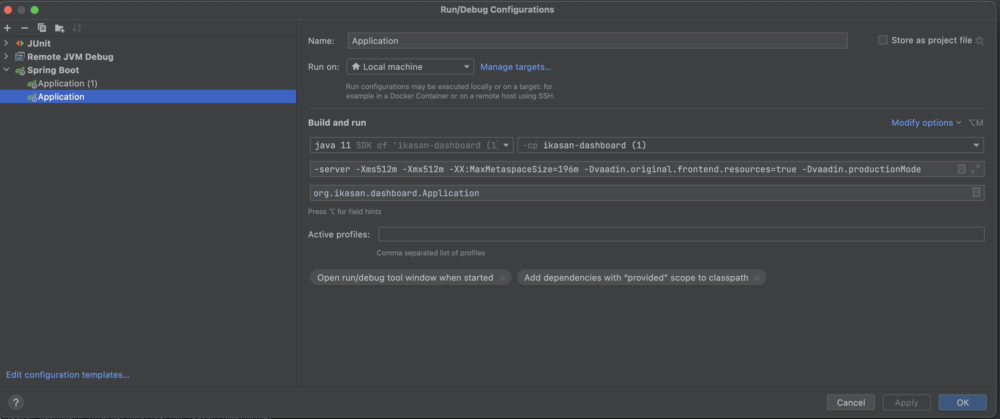

# Provisioning Same Context for Local Development Environment
1. From Ikasan Core deploy a scheduler-agent to your local machine - https://github.com/ikasanEIP/ikasan/tree/3.3.x/ikasaneip/ootb/module/scheduler-agent \
Alternatively you can build Ikasan Core locally and deploy the distribution to your local machine into a working directory.
The distribution zip (e.g. scheduler-agent-distribution-3.3.0-scheduler-SNAPSHOT-dist.zip) can be found in target directory of ikasan core i.e. *ikasaneip/ootb/module/scheduler-agent/distribution/target*
2. Configure the scheduler agent to point at your local dashboard. For example: 
    ```
    module.name=scheduler-agent
    module.jar.name=scheduler-agent
    
    # standard dirs
    persistence.dir=./persistence
    lib.dir=./lib
    
    # Logging levels across packages (optional)
    logging.level.root=WARN
    logging.level.org.ikasan=INFO
    
    # Blue console servlet settings (optional)
    server.error.whitelabel.enabled=false
    
    module.java.command=java -agentlib:jdwp=transport=dt_socket,server=y,suspend=n,address=*:8765 -server -Xms512m -Xmx512m -XX:MaxMetaspaceSize=196m -Dspring.jta.logDir=${persistence.dir}/${module.name}-ObjectStore -Dorg.apache.activemq.SERIALIZABLE_PACKAGES=* -Dmodule.name=
    ${module.name} -jar ${lib.dir}/${module.name}-*.jar
    
    server.tomcat.max-swallow-size=10MB
    
    # Web Bindings
    h2.db.port=19082
    server.port=19080
    server.address=localhost
    server.servlet.context-path=/scheduler-agent
    server.tomcat.additional-tld-skip-patterns=xercesImpl.jar,xml-apis.jar,serializer.jar
    spring.autoconfigure.exclude=org.springframework.boot.autoconfigure.orm.jpa.HibernateJpaAutoConfiguration,org.springframework.boot.autoconfigure.quartz.QuartzAutoConfiguration,org.springframework.boot.autoconfigure.security.servlet.SecurityFilterAutoConfiguration,,me.snowdrop.boot.narayana.autoconfigure.NarayanaConfiguration,org.springframework.boot.autoconfigure.context.MessageSourceAutoConfiguration
    
    spring.liquibase.change-log=classpath:db-changelog-scheduler-agent.xml
    spring.liquibase.enabled=true
    
    # health probs and remote management (optional)
    management.endpoints.enabled-by-default=false
    management.endpoint.info.enabled=true
    management.endpoint.health.enabled=true
    management.endpoint.logfile.enabled=true
    management.endpoints.web.exposure.include=info,health,logfile
    management.endpoint.shutdown.enabled=true
    #management.endpoints.web.base-path=/rest
    
    #management.endpoint.health.probes.enabled=true
    management.endpoint.health.show-details=always
    management.endpoint.health.show-components=always
    management.health.jms.enabled=false
    
    # Ikasan persistence store
    datasource.username=sa
    datasource.password=sa
    datasource.driver-class-name=org.h2.Driver
    datasource.xadriver-class-name=org.h2.jdbcx.JdbcDataSource
    datasource.url=jdbc:h2:tcp://localhost:${h2.db.port}/${persistence.dir}/${module.name}-db/esb;IFEXISTS=FALSE
    #datasource.url=jdbc:h2:mem:testdb;DB_CLOSE_DELAY=-1
    datasource.dialect=org.hibernate.dialect.H2Dialect
    datasource.show-sql=false
    datasource.hbm2ddl.auto=none
    datasource.validationQuery=select 1
    
    # Dashboard data extraction settings
    ikasan.dashboard.extract.enabled=true
    ikasan.dashboard.extract.base.url=http://localhost:9090
    ikasan.dashboard.extract.username=admin
    ikasan.dashboard.extract.password=admin
    
    ikasan.exceptions.retry-configs.[0].className=org.ikasan.spec.component.endpoint.EndpointException
    ikasan.exceptions.retry-configs.[0].delayInMillis=5000
    ikasan.exceptions.retry-configs.[0].maxRetries=-1
    
    ikasan.exceptions.excludedClasses[0]=org.ikasan.spec.component.transformation.TransformationException
    
    big.queue.consumer.inboundQueueName=module-inbound-context-queue
    big.queue.consumer.outboundQueueName=module-outbound-context-queue
    big.queue.consumer.queueDir=/sandbox/mick/bigquque
    
    module.rest.connection.readTimeout=300000
    module.rest.connection.connectTimeout=300000
    module.rest.connection.connectionRequestTimeout=300000
    
    scheduler.agent.log.folder=./target/logs
    scheduler.agent.log.folder.parenthesis=/
    
    # Housekeep Log Files Flow
    housekeep.scheduled.consumer.cron=20 20 03 * * ?
    housekeep.log.files.process.log-folder=${scheduler.agent.log.folder}
    housekeep.log.files.process.ttl.days=25
    housekeep.log.files.process.should-archive=false
    housekeep.log.files.process.should-move=false
    housekeep.log.files.process.move-folder=
    
    job.monitoring.broker.timeout.minutes=240
    
    context.instance.recovery.active=false
    ```
3. Set your java home property and other properties as required in the ```simple-env.sh``` or ```simple-env.bat``` file. 
4. Start the agent via ```./ikasan-simple.sh start``` or ```ikasan-simple.bat start```
5. Look at [Running the Ikasan Dashboard from Intellij](#running-the-ikasan-dashboard-from-intellij) to get the dashboard running. \
If you are using a clean environment you will need to get the Ikasan Dashboard running and restart the agent so that it registers itself with the dashboard. \
This is required to be able to provision the jobs outlined in the next points.
6. In the Ikasan Dashboard project enable the unit test - [ContextProvisionHelperTest.java](./src/test/java/org/ikasan/job/orchestration/provision/context/ContextProvisionHelperTest.java)
7. Run the test method.
    ```
    public void provision_jobs()
   ```
8. All sample context data is found [here](./src/test/resources/data/full-context).

# Running the Ikasan Dashboard from Intellij
1. Make sure that a directory ```/opt/data/ikasan``` exists on your local machine. This is required for Ikasan Dashboard database.
2. Ensure that Solr and H2 are started on your local machine. This can be done by copying the Ikasan Dashboard distribution jar e.g. ```ikasan-dashboard-distrbution-3.3.0-scheduler-SNAPSHOT``` 
from the *ikasaneip/visualisation/dashboard/target* directory into a working directory.
3. Unzip the directory and cd into the snapshot of the directory.
4. You can start solr using the command ```./ikasan.sh start-solr```
5. You can start h2 using the command ```./ikasan.sh start-h2```
6. You can stop solr and h2 running ```./ikasan.sh stop```

A sample ```ikasan.sh``` looks like the following: 
```
#!/bin/bash
#set -u

SCRIPT_DIR=$(pwd)


# Ikasan Module settings

MODULE_NAME=`cat config/application.properties|grep "module.name"|head -1|cut -d'=' -f2`
MODULE_JVM_OPTS="-server -Xms512m -Xmx512m -XX:MaxMetaspaceSize=196m -Dorg.apache.activemq.SERIALIZABLE_PACKAGES=* -agentlib:jdwp=transport=dt_socket,server=y,suspend=n,address=*:5005"
MODULE_OTHER_OPTS=""
MODULE_JAVA_OPTS="$MODULE_JVM_OPTS  $MODULE_OTHER_OPTS"

APPLICATION_JAR=${MODULE_NAME}*.jar

# H2 Persistence settings
H2_VERSION=1.4.200
H2_MODULE_NAME=h2-$MODULE_NAME
H2_JVM_OPTS="-server -Xms256m -Xmx256m -XX:MaxMetaspaceSize=128m"
H2_PORT=`cat config/application.properties|grep "h2.db.port"|head -1|cut -d'=' -f2`
# check the port was parsed
[ ${#H2_PORT} -lt 1 ] && echo "Cannot locate h2.db.port in config/application.properties" && exit 1

# solr settings
SOLR_MODULE_NAME=solr-$MODULE_NAME

JAVA=$JAVA_HOME/bin/java

cd $SCRIPT_DIR
mkdir -p logs

# Prints command usage.
function usage
{
    /bin/cat <<-_BASIC_INFO_
    Usage: run.sh <action>
        <action>  Specify action name,
              'start (start all) | start-h2 (start just h2) | start-solr (start just solr) | stop (stop all) | ps (list processes)'.
_BASIC_INFO_
}

# start the Ikasan module
function start_module
{
    check_module
    if [[ ${#modulepid} -lt 1 ]];then
      echo "Starting Module"
      nohup $JAVA $MODULE_JAVA_OPTS -Dmodule.name=$MODULE_NAME -jar ${SCRIPT_DIR}/lib/$APPLICATION_JAR > ${SCRIPT_DIR}/logs/application.log 2>&1 &
    else
      echo "Module already running on PID $modulepid, will not start"
    fi
}

# start the standalone H2 DB
function start_h2
{
    check_h2
    if [[ ${#h2pid} -lt 1 ]];then
      echo "Starting H2"
      nohup $JAVA -cp ${SCRIPT_DIR}/lib/h2-$H2_VERSION.jar $H2_JVM_OPTS -Dmodule.name=$H2_MODULE_NAME org.h2.tools.Server -ifNotExists -tcp -tcpAllowOthers -tcpPort $H2_PORT > ${SCRIPT_DIR}/logs/h2-server.log 2>&1 &
    else
      echo "H2 already running on PID $h2pid, will not start"
    fi
}

# start solr
function start_solr
{
    check_solr
    if [[ ${#solrpid} -lt 1 ]];then
      echo "Starting solr"
      ${SCRIPT_DIR}/solr/bin/solr start -Dmodule.name=$SOLR_MODULE_NAME &
    else
      echo "solr already running on PID $solrpid, will not start"
    fi
}

function check_module
{
    modulepid=`ps aux|grep module.name=$MODULE_NAME|grep -v grep| awk '{print $2}'`
    if [[ ${#modulepid} -gt 0 ]];then
      echo "$MODULE_NAME running on PID $modulepid"
    else
      echo "$MODULE_NAME not running"
    fi
}

function check_h2
{
    h2pid=`ps aux|grep module.name=$H2_MODULE_NAME|grep -v grep| awk '{print $2}'`
    if [[ ${#h2pid} -gt 0 ]];then
      echo "$H2_MODULE_NAME running on PID $h2pid"
    else
      echo "$H2_MODULE_NAME not running"
    fi
}

function check_solr
{
    solrpid=`ps aux|grep module.name=$SOLR_MODULE_NAME|grep -v grep| awk '{print $2}'`
    if [[ ${#solrpid} -gt 0 ]];then
      echo "$SOLR_MODULE_NAME running on PID $solrpid"
    else
      echo "$SOLR_MODULE_NAME not running"
    fi
}

function stop_module
{
    check_module
    if [[ ${#modulepid} -gt 0 ]];then
      echo "Stopping $MODULE_NAME on PID $modulepid"
      kill $modulepid
    fi
}

function stop_h2
{
    check_h2
    if [[ ${#h2pid} -gt 0 ]];then
      echo "Stopping $H2_MODULE_NAME on PID $h2pid"
      kill $h2pid
    fi
}

function stop_solr
{
    check_solr
    if [[ ${#solrpid} -gt 0 ]];then
      echo "Stopping $SOLR_MODULE_NAME on PID $solrpid"
      ${SCRIPT_DIR}/solr/bin/solr stop
    fi
}

ACTION=$1
case "$ACTION" in
    start) # starts solr, H2, and Module
        start_solr
        check_solr
        start_h2
        check_h2
        start_module
        ;;
    start-h2) # starts H2 only
        start_h2
        ;;
    start-solr) # starts solr only
        start_solr
        ;;
    stop) # stops Module, H2, and solr
        stop_module
        while [[ ${#modulepid} -gt 0 ]];do
          echo "Waiting for $MODULE_NAME to shut down before stopping $H2_MODULE_NAME"
          sleep 5
          check_module
        done
        stop_h2
        stop_solr
        while [[ ${#solrpid} -gt 0 ]];do
          echo "Waiting for $SOLR_MODULE_NAME to shut down"
          sleep 5
          check_solr
        done
        ;;
    ps)
        check_module
        check_h2
        check_solr
        ;;
    *)
        usage
        exit 1
        ;;
esac
```

A sample ```application.properties``` looks like:
```aidl
# Logging levels across packages (optional)
logging.level.root=WARN
logging.level.org.ikasan=INFO
logging.file=logs/application.log

module.name=scheduler-agent
server.port=9090

# This is a workaround for https://github.com/vaadin/spring/issues/381
h2.db.port=9091
spring.servlet.multipart.enabled=false

solr.url=http://localhost:8983/solr
solr.username=ikasan
solr.password=1ka5an
solr.joblockcacheaudit.retention.days=30
solr.retention.days=30
solr.save.context.instance.audits=true
solr.save.joblockcache.audits=true

error.notification.duration=5000

# Ikasan persistence store
datasource.username=sa
datasource.password=sa
datasource.driver-class-name=org.h2.Driver
datasource.xadriver-class-name=org.h2.jdbcx.JdbcDataSource
datasource.url=jdbc:h2:tcp://localhost:${h2.db.port}/./persistence/${module.name}-db/esb;IFEXISTS=FALSE

datasource.dialect=org.hibernate.dialect.H2Dialect
datasource.show-sql=false
datasource.hbm2ddl.auto=none
datasource.validationQuery=select 1
datasource.min.pool.size=5
datasource.max.pool.size=20

spring.liquibase.change-log=classpath:db-changelog.xml
spring.liquibase.enabled=true

jwt.secret=javainuse

vaadin.compatibilityMode=false
vaadin.original.frontend.resources=true

vaadin.i18n.provider=org.ikasan.dashboard.internationalisation.IkasanI18NProvider

render.search.images=true

rest.module.username=admin
rest.module.password=admin

scheduled.job.context.queue.directory=../data/big-queue

spring.liquibase.change-log=classpath:db-changelog.xml
spring.liquibase.enabled=true

spring.autoconfigure.exclude=org.springframework.boot.autoconfigure.mongo.MongoAutoConfiguration,org.springframework.boot.autoconfigure.orm.jpa.HibernateJpaAutoConfiguration,org.springframework.boot.autoconfigure.quartz.QuartzAutoConfiguration,org.springframework.boot.autoconfigure.security.servlet.SecurityFilterAutoConfiguration,org.springframework.boot.autoconfigure.thymeleaf.ThymeleafAutoConfiguration,org.ikasan.rest.module.SwaggerConfig,org.springframework.boot.actuate.autoconfigure.solr.SolrHealthContributorAutoConfiguration,org.springframework.boot.actuate.autoconfigure.ldap.LdapHealthContributorAutoConfiguration

spring.config.import=optional:configserver:
```
7. Starting the dashboard in intellij will require the following VM properties to be set to run the dashboard via the [Spring Boot Application](.src/main/java/org/ikasan/dashboard/Application.java)
```-server -Xms512m -Xmx512m -XX:MaxMetaspaceSize=196m -Dvaadin.original.frontend.resources=true -Dvaadin.productionMode```


