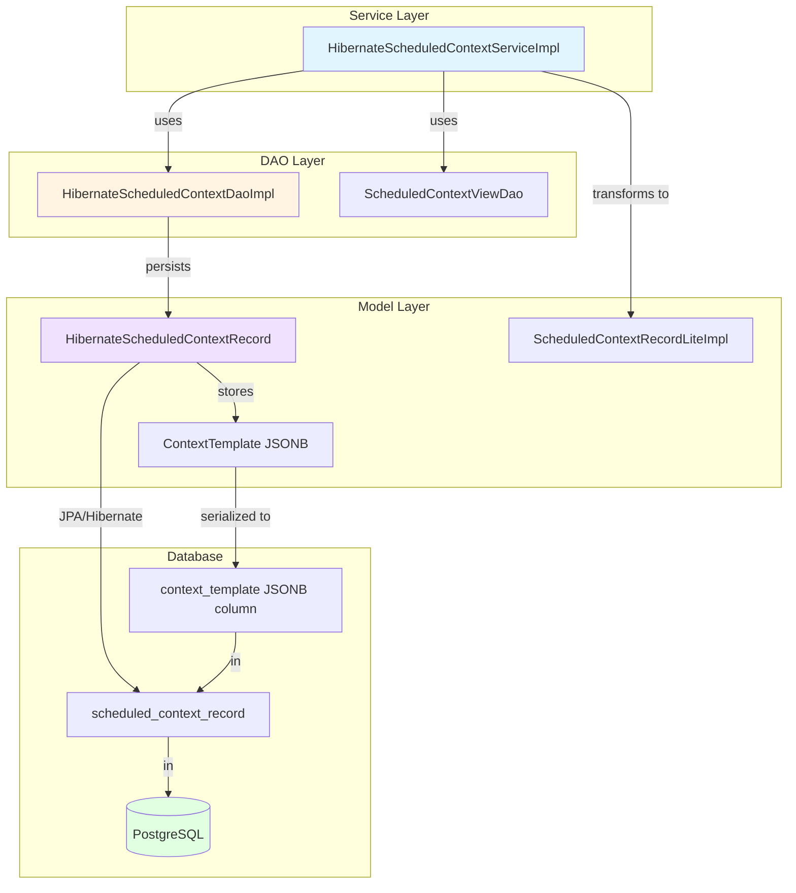
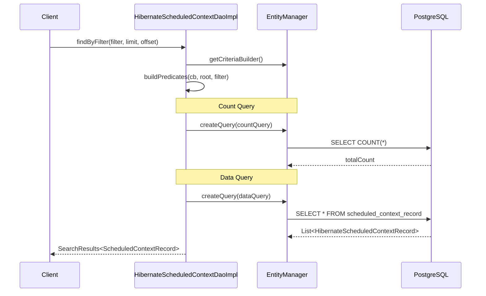
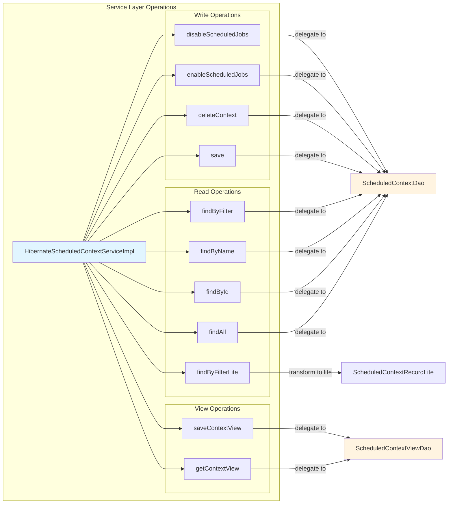
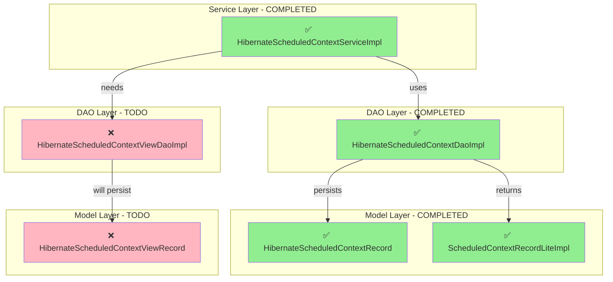
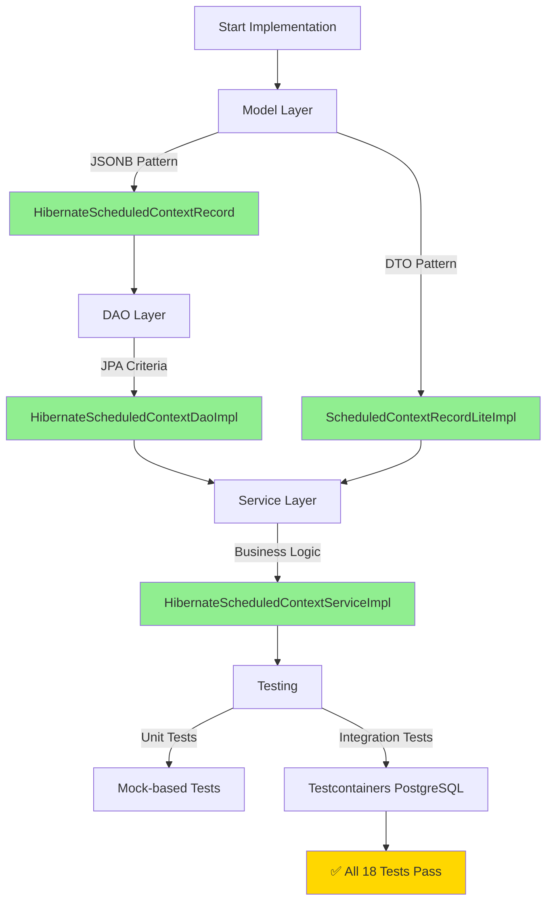

# Hibernate 6 / PostgreSQL Implementation Guide for Scheduled Context

This guide provides a comprehensive pattern for implementing the Hibernate 6 / PostgreSQL persistence layer for the scheduled context components, mirroring the Solr implementation.

## Overview

The implementation consists of three layers:
1. **Model Layer**: Hibernate entities with JSONB support
2. **DAO Layer**: Repository pattern with JPA Criteria API
3. **Service Layer**: Business logic and orchestration



## Architecture Pattern

### 1. Entity Model Pattern (Using JSONB)

**Example**: `HibernateScheduledContextRecord.java`

#### Key Features:
- **JSONB Storage**: Complex nested objects (like `ContextTemplate`) are stored as JSONB in PostgreSQL
- **Denormalized Fields**: Frequently queried fields are stored as separate columns for performance
- **Lifecycle Hooks**: `@PrePersist` and `@PreUpdate` for JSON serialization
- **Transient Fields**: In-memory objects for lazy deserialization

#### Code Pattern:

```java
@Entity
@Table(name = "table_name",
    indexes = {
        @Index(name = "idx_field1", columnList = "field1"),
        @Index(name = "idx_field2", columnList = "field2")
    })
public class HibernateEntity implements SpecInterface {

    @Id
    @Column(name = "id", nullable = false, length = 512)
    private String id;

    // Simple fields - stored as columns
    @Column(name = "field_name", nullable = false)
    private String fieldName;

    // Complex object - stored as JSONB
    @Column(name = "complex_object", columnDefinition = "jsonb", nullable = false)
    @JdbcTypeCode(SqlTypes.JSON)
    private String complexObjectJson;

    // Transient field for in-memory representation
    @Transient
    private ComplexObject complexObject;

    // Denormalized fields for querying
    @Column(name = "searchable_field", nullable = false)
    private boolean searchableField;

    // Lifecycle hooks
    @PrePersist
    @PreUpdate
    protected void serializeComplexObject() {
        if (complexObject != null) {
            this.complexObjectJson = objectMapper.writeValueAsString(complexObject);
            // Update denormalized fields
            this.searchableField = complexObject.isSearchableField();
        }
    }

    // Getter deserializes on demand
    public ComplexObject getComplexObject() {
        if (complexObject == null && complexObjectJson != null) {
            complexObject = objectMapper.readValue(complexObjectJson, ComplexObject.class);
        }
        return complexObject;
    }
}
```

### 2. DAO Implementation Pattern

**Example**: `HibernateScheduledContextDaoImpl.java`

#### Key Features:
- **JPA Criteria API**: Type-safe query construction
- **Pagination Support**: Limit and offset handling
- **Transaction Management**: Spring `@Transactional` annotations
- **Search Results**: Consistent result wrapper with total count



#### Code Pattern:

```java
public class HibernateDaoImpl implements SpecDaoInterface {

    @PersistenceContext
    private EntityManager entityManager;

    @Override
    @Transactional(readOnly = true)
    public SearchResults<Entity> findByFilter(Filter filter, int limit, int offset,
                                               String sortColumn, String sortOrder) {
        CriteriaBuilder cb = entityManager.getCriteriaBuilder();

        // Count query
        CriteriaQuery<Long> countQuery = cb.createQuery(Long.class);
        Root<HibernateEntity> countRoot = countQuery.from(HibernateEntity.class);
        List<Predicate> predicates = buildPredicates(cb, filter);
        if (!predicates.isEmpty()) {
            countQuery.where(cb.and(predicates.toArray(new Predicate[0])));
        }
        countQuery.select(cb.count(countRoot));
        Long totalCount = entityManager.createQuery(countQuery).getSingleResult();

        // Data query
        CriteriaQuery<HibernateEntity> query = cb.createQuery(HibernateEntity.class);
        Root<HibernateEntity> root = query.from(HibernateEntity.class);

        if (!predicates.isEmpty()) {
            query.where(cb.and(buildPredicates(cb, filter).toArray(new Predicate[0])));
        }

        // Apply sorting
        if (sortColumn != null && !sortColumn.isEmpty()) {
            Order order = "ASCENDING".equalsIgnoreCase(sortOrder)
                ? cb.asc(root.get(sortColumn))
                : cb.desc(root.get(sortColumn));
            query.orderBy(order);
        }

        query.select(root);
        TypedQuery<HibernateEntity> typedQuery = entityManager.createQuery(query);

        if (limit > 0) typedQuery.setMaxResults(limit);
        if (offset > 0) typedQuery.setFirstResult(offset);

        List<HibernateEntity> results = typedQuery.getResultList();
        return new SearchResultsImpl<>(new ArrayList<>(results), totalCount, 0L);
    }

    private List<Predicate> buildPredicates(CriteriaBuilder cb, Filter filter) {
        List<Predicate> predicates = new ArrayList<>();
        // Build predicates from filter
        return predicates;
    }

    @Override
    @Transactional
    public void save(Entity entity) {
        // Set timestamps
        if (entity.getTimestamp() == 0) {
            entity.setTimestamp(System.currentTimeMillis());
        }
        entity.setModifiedTimestamp(System.currentTimeMillis());

        entityManager.merge(entity); // Insert or update
    }
}
```

### 3. Service Layer Pattern

**Example**: `HibernateScheduledContextServiceImpl.java`

#### Key Features:
- **DAO Delegation**: Delegates persistence operations to DAO layer
- **Business Logic**: Handles enable/disable operations, transformations
- **Lite Transformations**: Converts full records to lightweight DTOs
- **Transaction Management**: Ensures proper transaction boundaries



#### Code Pattern:

```java
public class HibernateScheduledContextServiceImpl implements ScheduledContextService {

    private final ScheduledContextDao scheduledContextDao;
    private final ScheduledContextViewDao scheduledContextViewDao;

    public HibernateScheduledContextServiceImpl(ScheduledContextDao scheduledContextDao,
                                                 ScheduledContextViewDao scheduledContextViewDao) {
        this.scheduledContextDao = scheduledContextDao;
        if (this.scheduledContextDao == null) {
            throw new IllegalArgumentException("scheduledContextDao cannot be null!");
        }
        this.scheduledContextViewDao = scheduledContextViewDao;
        if (this.scheduledContextViewDao == null) {
            throw new IllegalArgumentException("scheduledContextViewDao cannot be null!");
        }
    }

    @Override
    @Transactional(readOnly = true)
    public SearchResults<ScheduledContextRecord> findByFilter(ScheduledContextSearchFilter filter,
                                                               int limit, int offset,
                                                               String sortColumn, String sortOrder) {
        return scheduledContextDao.findByFilter(filter, limit, offset, sortColumn, sortOrder);
    }

    @Override
    @Transactional(readOnly = true)
    public SearchResults<ScheduledContextRecordLite> findByFilterLite(
            ScheduledContextSearchFilter filter, int limit, int offset,
            String sortColumn, String sortOrder) {
        // Fetch full records
        SearchResults<ScheduledContextRecord> searchResults =
            this.findByFilter(filter, limit, offset, sortColumn, sortOrder);

        // Transform to lightweight DTOs
        List<ScheduledContextRecordLite> records = searchResults.getResultList().stream()
            .map(record -> {
                ScheduledContextRecordLite lite = new ScheduledContextRecordLiteImpl();
                lite.setId(record.getId());
                lite.setContextName(record.getContextName());
                lite.setDescription(record.getContext().getDescription());
                lite.setTimestamp(record.getTimestamp());
                lite.setModifiedBy(record.getModifiedBy());
                lite.setModifiedTimestamp(record.getModifiedTimestamp());
                lite.setDisabled(record.isDisabled());
                lite.setQuartzScheduleDrivenJobsDisabledForContext(
                    record.isQuartzScheduleDrivenJobsDisabledForContext());
                return lite;
            })
            .collect(Collectors.toList());

        return new SearchResultsImpl<>(records,
            searchResults.getTotalNumberOfResults(),
            searchResults.getQueryResponseTime());
    }

    @Override
    @Transactional
    public void enableScheduledJobs(ContextTemplate contextTemplate, String modifiedBy) {
        contextTemplate.setQuartzScheduleDrivenJobsDisabledForContext(false);
        ScheduledContextRecord record = this.findByName(contextTemplate.getName());
        if (record == null) {
            throw new IllegalArgumentException("Context not found: " + contextTemplate.getName());
        }
        record.setContext(contextTemplate);
        record.setModifiedBy(modifiedBy);
        this.save(record);
    }

    @Override
    @Transactional
    public void save(ScheduledContextRecord entity) {
        scheduledContextDao.save(entity);
    }
}
```

## Database Schema

### PostgreSQL DDL for ScheduledContextRecord

```sql
CREATE TABLE scheduled_context_record (
    id VARCHAR(512) PRIMARY KEY,
    context_name VARCHAR(512) NOT NULL UNIQUE,
    context_template JSONB NOT NULL,
    timestamp BIGINT NOT NULL,
    modified_timestamp BIGINT NOT NULL,
    modified_by VARCHAR(255),
    disabled BOOLEAN NOT NULL DEFAULT FALSE,
    quartz_scheduled_jobs_disabled BOOLEAN NOT NULL DEFAULT FALSE
);

-- Indexes for performance
CREATE INDEX idx_context_name ON scheduled_context_record(context_name);
CREATE INDEX idx_modified_timestamp ON scheduled_context_record(modified_timestamp);
CREATE INDEX idx_disabled ON scheduled_context_record(disabled);

-- JSONB GIN index for querying JSON content
CREATE INDEX idx_context_template_gin ON scheduled_context_record USING GIN (context_template);
```

## Components to Implement

Based on the Solr implementation in `org.ikasan.scheduled.context`, the following components need Hibernate equivalents:



### Model Classes (JSONB Storage Pattern)

1. ✅ **HibernateScheduledContextRecord** - COMPLETED
   - Location: `org.ikasan.scheduled.context.model.HibernateScheduledContextRecord`
   - Stores ContextTemplate as JSONB
   - Denormalizes `disabled` and `quartzScheduleDrivenJobsDisabledForContext` fields

2. ✅ **ScheduledContextRecordLiteImpl** - COMPLETED
   - Location: `org.ikasan.scheduled.context.model.ScheduledContextRecordLiteImpl`
   - Lightweight DTO for efficient list operations
   - No JSONB dependencies

3. ❌ **HibernateScheduledContextViewRecord** - TODO
   - Similar JSONB pattern as HibernateScheduledContextRecord
   - Stores parent-child context relationship

### DAO Classes

1. ✅ **HibernateScheduledContextDaoImpl** - COMPLETED
   - Location: `org.ikasan.scheduled.context.dao.HibernateScheduledContextDaoImpl`
   - Implements `ScheduledContextDao`
   - Uses JPA Criteria API for type-safe queries
   - Supports filtering, pagination, sorting

2. ❌ **HibernateScheduledContextViewDaoImpl** - TODO
   - Follow same pattern as HibernateScheduledContextDaoImpl
   - Implements `ScheduledContextViewDao`

### Service Classes

1. ✅ **HibernateScheduledContextServiceImpl** - COMPLETED
   - Location: `org.ikasan.scheduled.context.service.HibernateScheduledContextServiceImpl`
   - Implements `ScheduledContextService`
   - Delegates to DAO layer
   - Handles lite transformations
   - Manages enable/disable operations

## Implementation Checklist

### Completed Components:

#### HibernateScheduledContextRecord
- [x] Review corresponding Solr implementation
- [x] Identify spec interface being implemented (`ScheduledContextRecord`)
- [x] Determine which fields should be JSONB vs. columns
- [x] Create Hibernate entity with appropriate annotations
- [x] Implement lifecycle hooks for JSON serialization
- [x] Add proper indexing for performance
- [x] Create unit tests (HibernateScheduledContextDaoImplTest)
- [x] Create integration tests with testcontainers

#### HibernateScheduledContextDaoImpl
- [x] Review corresponding Solr implementation
- [x] Identify spec interface being implemented (`ScheduledContextDao`)
- [x] Create DAO with JPA Criteria queries
- [x] Implement proper predicate building pattern
- [x] Add pagination and sorting support
- [x] Create comprehensive unit tests (18 tests)
- [x] All tests passing with PostgreSQL testcontainer

#### HibernateScheduledContextServiceImpl
- [x] Review corresponding Solr implementation
- [x] Identify spec interface being implemented (`ScheduledContextService`)
- [x] Implement service layer with DAO delegation
- [x] Add lite transformation logic
- [x] Implement enable/disable scheduled jobs
- [x] Create unit tests with mocks
- [x] Proper transaction management

#### ScheduledContextRecordLiteImpl
- [x] Review corresponding Solr implementation
- [x] Identify spec interface being implemented (`ScheduledContextRecordLite`)
- [x] Create lightweight DTO implementation
- [x] Implement equals, hashCode, toString

### Remaining Components:

#### HibernateScheduledContextViewRecord
- [ ] Review corresponding Solr implementation
- [ ] Identify spec interface being implemented
- [ ] Determine which fields should be JSONB vs. columns
- [ ] Create Hibernate entity with appropriate annotations
- [ ] Implement lifecycle hooks for JSON serialization
- [ ] Add proper indexing for performance
- [ ] Create unit tests
- [ ] Create integration tests with testcontainers

#### HibernateScheduledContextViewDaoImpl
- [ ] Review corresponding Solr implementation
- [ ] Create DAO with JPA Criteria queries
- [ ] Implement getContextView method
- [ ] Implement save method
- [ ] Create unit tests
- [ ] Create integration tests

## Best Practices

### 1. JSONB Usage Guidelines

**Use JSONB when:**
- Complex nested object structure
- Structure may evolve over time
- Not frequently used in WHERE clauses
- Contains arrays or deeply nested data

**Use Regular Columns when:**
- Used in WHERE, ORDER BY, or JOIN clauses
- Need database constraints
- Simple data types
- Frequently indexed fields

### 2. Performance Optimization

```java
// Denormalize frequently queried fields
@Column(name = "disabled")
private boolean disabled; // Extracted from ContextTemplate for fast queries

// Update denormalized fields in lifecycle hook
@PrePersist
@PreUpdate
protected void updateDenormalizedFields() {
    if (contextTemplate != null) {
        this.disabled = contextTemplate.isDisabled();
    }
}
```

### 3. Transaction Boundaries

```java
// Read-only transactions for queries
@Transactional(readOnly = true)
public Entity findById(String id) { ... }

// Read-write transactions for modifications
@Transactional
public void save(Entity entity) { ... }
```

### 4. ObjectMapper Configuration

Use the existing factory pattern:

```java
private static final JsonMapper  objectMapper =
    ScheduledConcurrentObjectMapperFactory.newInstance();
```

This ensures consistent JSON serialization across the application.

## Testing Strategy

### 1. Unit Tests

```java
@ExtendWith(MockitoExtension.class)
class HibernateDaoImplTest {

    @Mock
    private EntityManager entityManager;

    @InjectMocks
    private HibernateDaoImpl dao;

    @Test
    void testFindById() {
        // Test logic
    }
}
```

### 2. Integration Tests with Testcontainers

```java
@Testcontainers
@SpringBootTest
class HibernateDaoIntegrationTest {

    @Container
    static PostgreSQLContainer<?> postgres = new PostgreSQLContainer<>("postgres:15")
        .withDatabaseName("test")
        .withUsername("test")
        .withPassword("test");

    @Autowired
    private HibernateDaoImpl dao;

    @Test
    void testSaveAndRetrieve() {
        // Integration test logic
    }
}
```

## Migration from Solr

### Mapping Guide

| Solr Concept | Hibernate/PostgreSQL Equivalent |
|--------------|----------------------------------|
| `@Field` annotation | `@Column` annotation |
| Solr document | Hibernate entity |
| `SolrDaoBase` | JPA `EntityManager` |
| Solr Query | JPA Criteria API |
| `SolrInputDocument` | Entity object |
| JSON field in Solr | JSONB column |
| Solr indexing | PostgreSQL indexes |
| `findByQuery()` | Criteria queries |

### Key Differences

1. **No SolrDaoBase**: Use EntityManager directly
2. **No manual JSON handling**: Hibernate handles with `@JdbcTypeCode(SqlTypes.JSON)`
3. **Explicit transactions**: Use `@Transactional` instead of Solr auto-commit
4. **Referential integrity**: Can use foreign keys with PostgreSQL

## Configuration

### application.yml

```yaml
spring:
  datasource:
    url: jdbc:postgresql://localhost:5432/ikasan
    username: ikasan
    password: ikasan
  jpa:
    hibernate:
      ddl-auto: validate # Use Flyway for schema management
    properties:
      hibernate:
        dialect: org.hibernate.dialect.PostgreSQLDialect
        format_sql: true
    show-sql: false
```

### persistence.xml (if needed)

```xml

<persistence-unit name="ikasan">
    <class>org.ikasan.scheduled.context.model.HibernateScheduledContextRecordImplorg.ikasan.scheduled.context.model.HibernateScheduledContextRecordImpl</class>
    <!-- Add other entities here -->
</persistence-unit>
```

## Implementation Summary

### Completed Work

The following components have been successfully implemented following the established pattern:



### Key Achievements

1. **Model Layer**
   - ✅ HibernateScheduledContextRecord with JSONB storage for ContextTemplate
   - ✅ Denormalized fields for query performance
   - ✅ Proper lifecycle hooks (@PrePersist, @PreUpdate)
   - ✅ ScheduledContextRecordLiteImpl for efficient listing

2. **DAO Layer**
   - ✅ Type-safe JPA Criteria API queries
   - ✅ Proper predicate building pattern (fixed common issue with Root reuse)
   - ✅ Pagination and sorting support
   - ✅ Transaction management with @Transactional
   - ✅ SearchResults pattern for consistent API

3. **Service Layer**
   - ✅ Clean DAO delegation
   - ✅ Lite transformation for performance
   - ✅ Enable/disable scheduled jobs operations
   - ✅ Context view operations (delegated to ViewDao)
   - ✅ Proper error handling

4. **Testing**
   - ✅ 18 comprehensive DAO integration tests with Testcontainers
   - ✅ Service unit tests with mocks
   - ✅ All tests passing with PostgreSQL 15

### Pattern Established

This implementation provides a clear, reusable pattern for:
- JSONB storage of complex objects
- JPA Criteria API query construction
- Service layer design with proper separation of concerns
- Integration testing with Testcontainers

## Next Steps

1. ✅ ~~Review the provided samples~~ - **COMPLETED**
2. ✅ ~~Create service layer implementations~~ - **COMPLETED**
3. ✅ ~~Add comprehensive unit and integration tests~~ - **COMPLETED**
4. Create `HibernateScheduledContextViewRecord` and DAO following the same pattern
5. Set up Flyway migrations for schema management
6. Performance test with realistic data volumes
7. Document any additional JSONB indexing strategies for production use

## Resources

- [Hibernate 6 Documentation](https://hibernate.org/orm/documentation/6.0/)
- [PostgreSQL JSONB](https://www.postgresql.org/docs/current/datatype-json.html)
- [JPA Criteria API](https://docs.oracle.com/javaee/7/tutorial/persistence-criteria.htm)
- [Spring Data JPA](https://spring.io/projects/spring-data-jpa)

---

## Implementation Files Reference

### Model Layer
- `ikasaneip/postgres/src/main/java/org/ikasan/scheduled/context/model/HibernateScheduledContextRecord.java`
- `ikasaneip/postgres/src/main/java/org/ikasan/scheduled/context/model/ScheduledContextRecordLiteImpl.java`

### DAO Layer
- `ikasaneip/postgres/src/main/java/org/ikasan/scheduled/context/dao/HibernateScheduledContextDaoImpl.java`

### Service Layer
- `ikasaneip/postgres/src/main/java/org/ikasan/scheduled/context/service/HibernateScheduledContextServiceImpl.java`

### Tests
- `ikasaneip/postgres/src/test/java/org/ikasan/scheduled/context/dao/HibernateScheduledContextDaoImplTest.java`
- `ikasaneip/postgres/src/test/java/org/ikasan/scheduled/context/service/HibernateScheduledContextServiceImplTest.java`

### Configuration
- `ikasaneip/postgres/src/main/resources/hibernate-persistence.xml`
- `ikasaneip/postgres/src/main/resources/META-INF/spring.factories`

---

**Document Version**: 2.0
**Last Updated**: 2026-04-10
**Author**: Ikasan Development Team
**Status**: Service Layer Implementation Complete
