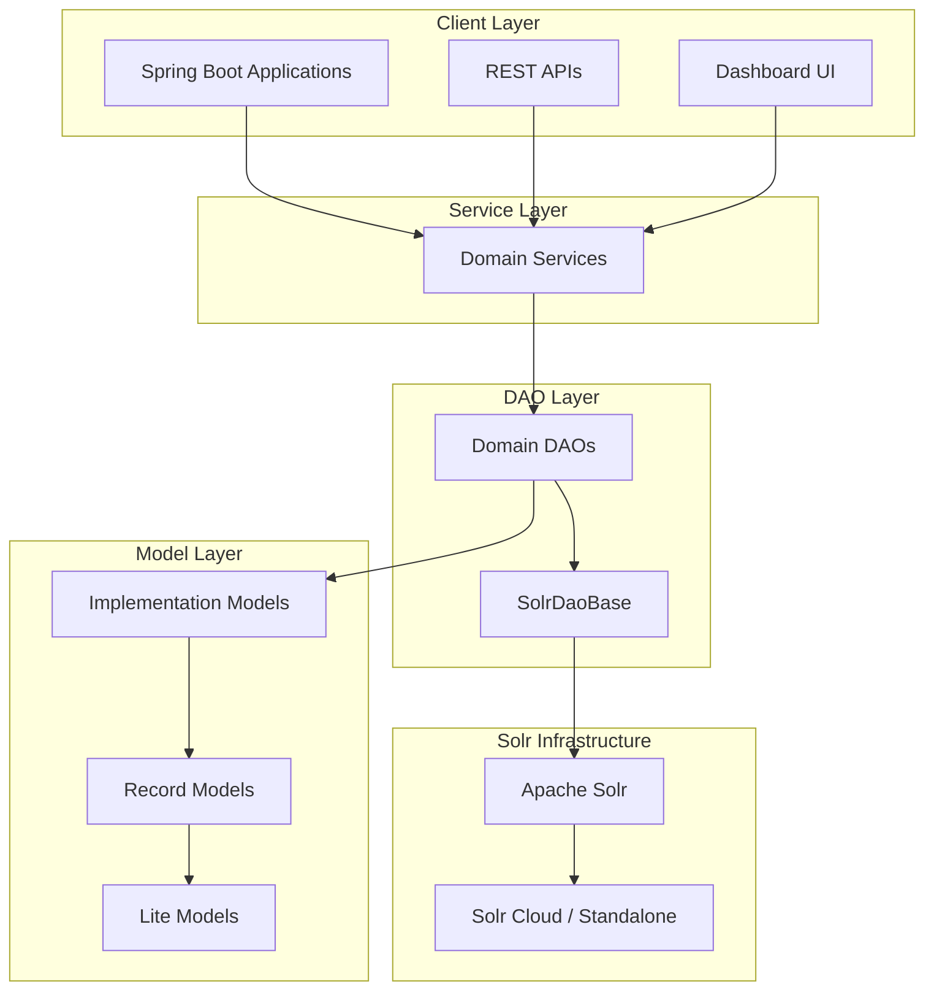
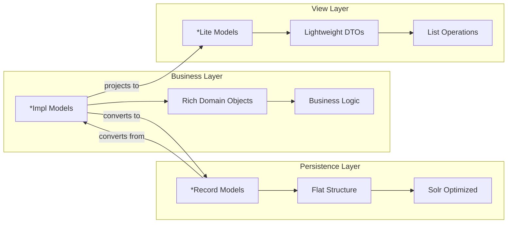
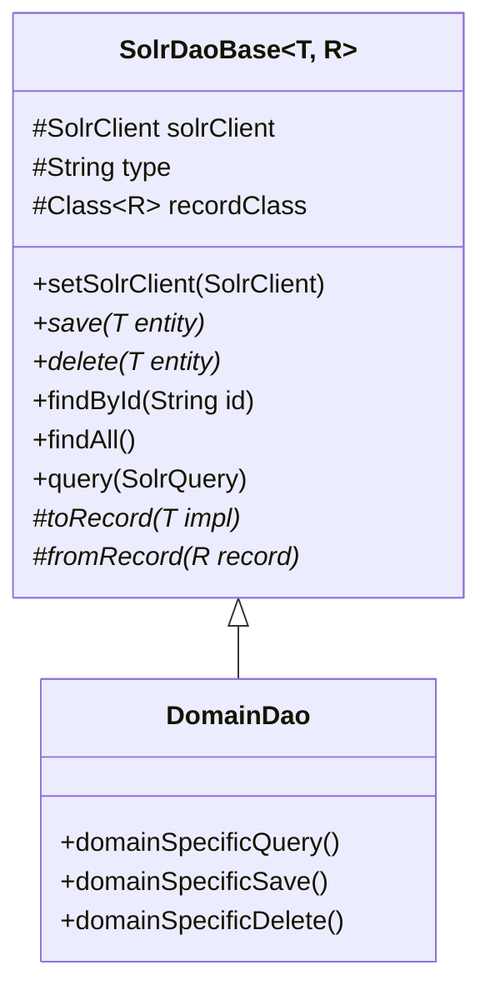
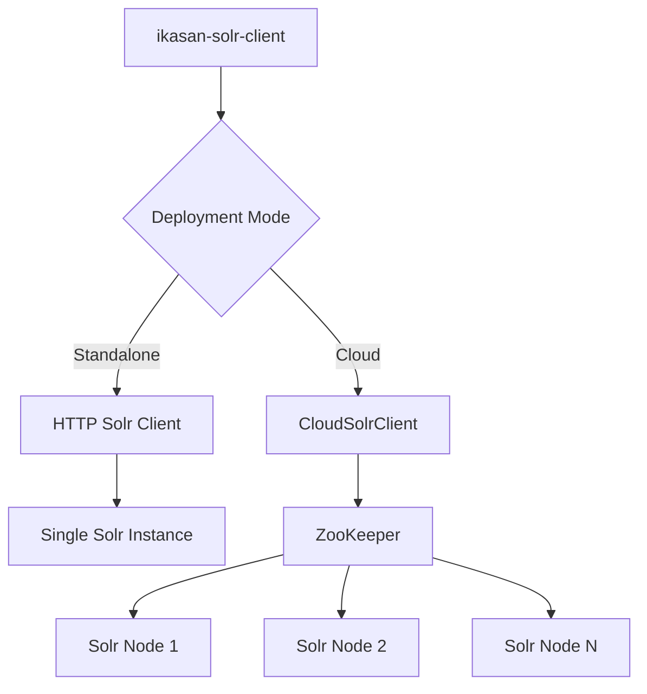
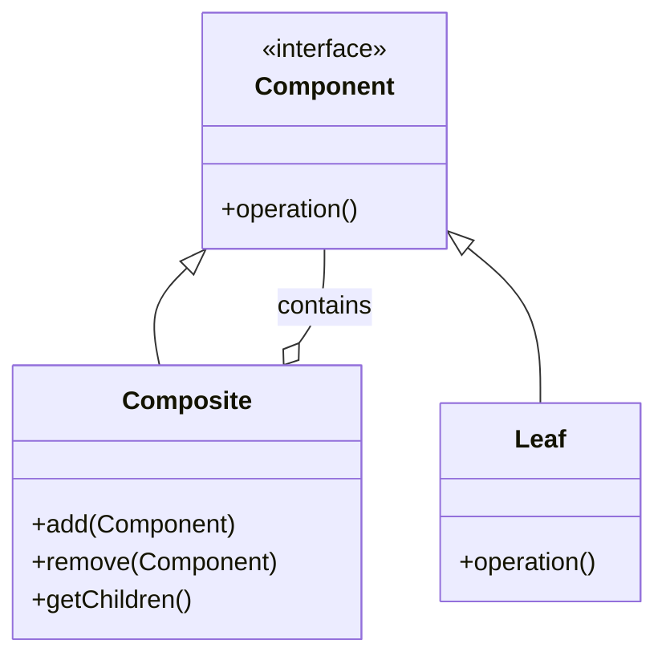
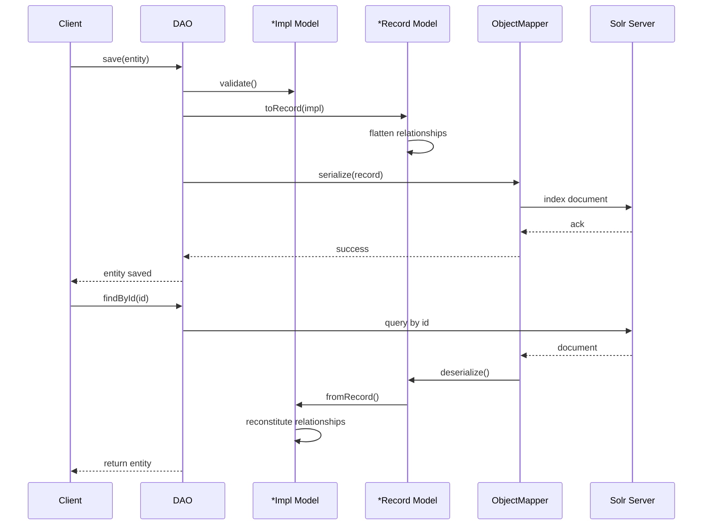
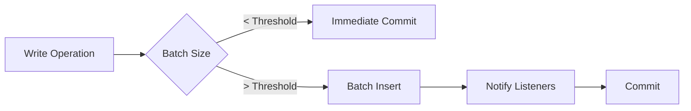
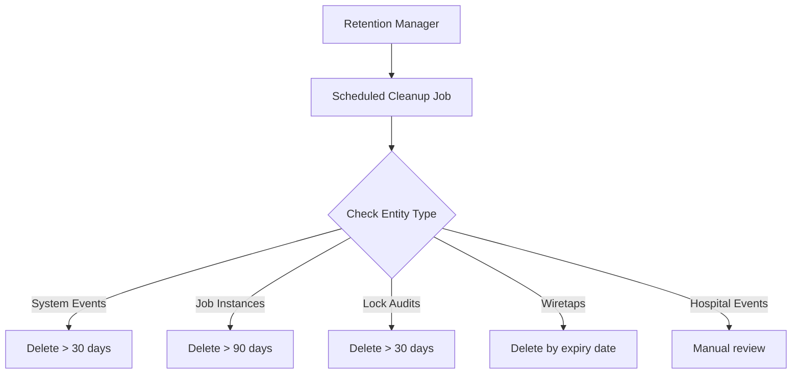

# Ikasan Solr Client Module

## Overview

The `ikasan-solr-client` module provides Apache Solr-based implementations for data persistence across the Ikasan Enterprise Integration Platform (EIP). This module serves as a comprehensive data access layer using Solr as the underlying document store, supporting multiple operational domains including security, system events, wiretaps, error reporting, exclusions, replays, hospital service, scheduled jobs, metrics, and business stream data.

**Packaging:** JAR
**Artifact ID:** ikasan-solr-client

## Architecture

The module follows a layered architecture with clear separation of concerns:



## Supported Domains

The module provides complete data access implementations for the following Ikasan domains:

| Domain | Description | Key Entities |
|--------|-------------|--------------|
| **Security** | User authentication, authorization, and access control | User, Role, Policy, Principal, AuthenticationMethod |
| **System Events** | Application and system event logging | SystemEvent, SystemEventAction |
| **Wiretaps** | Message capture and inspection for debugging | WiretapEvent, WiretapFlowEvent |
| **Error Reporting** | Error tracking, categorization, and resolution | ErrorOccurrence, ErrorCategorisation |
| **Hospital Service** | Failed message quarantine and retry | HospitalEvent, ExclusionEvent |
| **Replay** | Message replay and reprocessing | ReplayEvent, ReplayAudit |
| **Exclusions** | Event exclusion management | Exclusion, ExclusionEvent |
| **Scheduled Jobs** | Enterprise scheduler job management | SchedulerJob, JobInstance, JobContext, JobLock |
| **Metrics** | Performance and operational metrics | MetricEvent, ComponentInvocation |
| **Business Streams** | Business process tracking | BusinessStreamEvent |
| **Configuration** | Module and component configuration metadata | ModuleMetadata, ComponentMetadata |

## Key Features

### 1. **Dual Model Architecture**

Each domain uses a dual model approach optimized for both business logic and persistence:



**Implementation Models (`*Impl`)**: Rich domain objects with business logic, relationships, and validation  
**Record Models (`*Record`)**: Flat structures optimized for Solr persistence with denormalized data  
**Lite Models (`*Lite`)**: Lightweight projections for list views and reduced payload sizes

### 2. **Base DAO Pattern**

All DAOs extend `SolrDaoBase` providing consistent CRUD operations:



### 3. **Spring Boot Auto-Configuration**

The `SolrClientAutoConfiguration` class automatically configures all beans:

- SolrClient (Standalone or Cloud mode)
- All domain-specific DAOs
- Service beans
- Utility components

Simply import the configuration:

```java
@Import(SolrClientAutoConfiguration.class)
```

### 4. **Flexible Deployment**

Supports both Solr deployment modes:



### 5. **Composite Pattern for Hierarchical Data**

Domains with hierarchical relationships use the GOF Composite Pattern for natural relationship management:



This pattern is used across multiple domains where hierarchical relationships exist.

## Module Structure

```
org.ikasan
├── security/                    # User, role, policy, principal management
│   ├── dao/                    # Data Access Objects
│   ├── model/                  # Domain models (*Impl, *Record, *Lite)
│   └── util/                   # Utilities and converters
├── systemevent/                # System event logging and querying
│   ├── dao/
│   ├── model/
│   └── service/
├── wiretap/                    # Message wiretap capture
│   ├── dao/
│   ├── model/
│   └── service/
├── error/reporting/            # Error occurrence tracking
│   ├── dao/
│   ├── model/
│   └── service/
├── hospital/                   # Failed message quarantine
│   ├── dao/
│   ├── model/
│   └── service/
├── replay/                     # Message replay functionality
│   ├── dao/
│   ├── model/
│   └── service/
├── exclusion/                  # Event exclusion management
│   ├── dao/
│   ├── model/
│   └── service/
├── scheduled/                  # Enterprise scheduler
│   ├── context/               # Job context management
│   ├── instance/              # Job instance tracking
│   ├── job/                   # Job definitions
│   ├── joblock/               # Distributed job locking
│   ├── notification/          # Job notifications
│   └── profile/               # Job profiles
├── metrics/                    # Performance metrics
│   ├── dao/
│   ├── model/
│   └── service/
├── business/stream/            # Business process tracking
├── configuration/metadata/     # Configuration metadata
├── module/metadata/            # Module metadata
├── solr/                       # Core Solr utilities
│   ├── dao/
│   ├── model/
│   ├── service/
│   └── util/
└── spec/solr/                  # Base interfaces
    ├── SolrDaoBase.java
    ├── SolrServiceBase.java
    ├── SolrConstants.java
    ├── BatchInsertEvent.java
    └── BatchInsertListener.java
```

## Solr Document Organization

All domains share a single Solr collection with documents differentiated by type:

```mermaid
graph TD
    A[Solr Collection: ikasan] --> B[type: user]
    A --> C[type: securityRole]
    A --> D[type: securityPolicy]
    A --> E[type: ikasanPrincipal]
    A --> F[type: systemEvent]
    A --> G[type: wiretapEvent]
    A --> H[type: errorOccurrence]
    A --> I[type: hospitalEvent]
    A --> J[type: replayEvent]
    A --> K[type: exclusion]
    A --> L[type: schedulerJob]
    A --> M[type: jobInstance]
    A --> N[type: jobContext]
    A --> O[type: metric]
    A --> P[type: businessStream]
```



Each document type has:
- **Unique ID**: Generated from natural keys (e.g., `{name}-{type}`)
- **Type discriminator**: Field indicating entity type
- **Domain-specific fields**: Flattened for Solr indexing
- **Relationship identifiers**: Collections of related entity IDs

## Configuration

### Application Properties

```properties
# Solr Deployment Mode
solr.mode=standalone              # Options: standalone, cloud

# Standalone Mode Configuration
solr.url=http://localhost:8983/solr

# Cloud Mode Configuration
solr.cloud.zk.hosts=localhost:2181

# Authentication (Optional)
solr.username=
solr.password=

# Connection Settings
solr.connection.timeout.milli=15000
solr.socket.timeout.milli=15000

# Data Retention Policies
solr.retention.days=30                        # General events
solr.scheduler.instance.retention.days=90     # Job instances
solr.joblockcacheaudit.retention.days=30      # Lock audits

# Performance Settings
solr.metrics.query.limit=200

# Audit Settings
solr.save.context.instance.audits=true
solr.save.context.instance.audit.deltas=true
solr.save.joblockcache.audits=true

# Event Notifications
notify.scheduled.events.batch.insert.listeners=false

# Legacy Support
ikasan.enterprise.scheduler.use.legacy.job.status.count=false

# Scheduler Job Execution Environment
scheduler.job.execution.environment.label={}
```

### Spring Boot Integration

```java
@SpringBootApplication
@Import(SolrClientAutoConfiguration.class)
public class IkasanApplication {

    public static void main(String[] args) {
        SpringApplication.run(IkasanApplication.class, args);
    }
}
```

## Usage Patterns

### Basic CRUD Operations

```java
// Inject any domain DAO
@Autowired
private SolrWiretapDao wiretapDao;

// Create
WiretapEvent event = new WiretapFlowEvent(/* params */);
wiretapDao.save(event);

// Read
WiretapEvent retrieved = wiretapDao.findById(id);

// Update
retrieved.setExpiry(newExpiry);
wiretapDao.save(retrieved);

// Delete
wiretapDao.delete(retrieved);

// Query
List<WiretapEvent> events = wiretapDao.findWiretapEvents(
    moduleName, flowName, componentName, eventId,
    startDate, endDate, pageSize, offset
);
```

### Filtering and Pagination

```java
// Create a filter
WiretapFilter filter = new WiretapFilter();
filter.setModuleName("OrderProcessing");
filter.setFlowName("OrderFlow");

// Query with pagination
List<WiretapEvent> page1 = wiretapDao.findByFilter(filter, 50, 0);
List<WiretapEvent> page2 = wiretapDao.findByFilter(filter, 50, 50);

// Get total count
int totalCount = wiretapDao.getFilteredCount(filter);
```

### Batch Operations

```java
// Register batch listener
wiretapDao.addBatchInsertListener(event -> {
    logger.info("Batch insert completed: " + event.getBatchSize());
});

// Batch insert
List<WiretapEvent> events = createLargeEventList();
wiretapDao.batchSave(events);
```

### Hierarchical Data Management

```java
// Working with composite structures (e.g., scheduled jobs)
SchedulerJob job = new SchedulerJobImpl();
job.setJobName("DailyReport");

JobInstance instance = new JobInstanceImpl();
instance.setJobName("DailyReport");
instance.setStatus("RUNNING");

JobContext context = new JobContextImpl();
context.setJobName("DailyReport");
context.addParameter("outputPath", "/reports/daily");

// Save hierarchically
jobContextDao.save(context);
jobInstanceDao.save(instance);
schedulerJobDao.save(job);
```

## Data Flow

### Entity Persistence Flow



## Testing

The module includes comprehensive test coverage using embedded Solr:

### Test Structure

```java
public class SomeDaoImplTest extends SolrTestCaseJ4 {

    private SomeDaoImpl dao;
    private EmbeddedSolrServer server;

    @Before
    public void setup() throws Exception {
        // Create temporary Solr home
        Path tmppath = createTempDir();

        // Configure embedded Solr
        NodeConfig config = new NodeConfig.NodeConfigBuilder("testnode", tmppath)
            .setConfigSetBaseDirectory(
                Paths.get(TEST_HOME()).resolve("configsets").toString()
            )
            .build();

        // Start embedded server
        server = new EmbeddedSolrServer(config, "ikasan");

        // Create core
        CoreAdminRequest.Create createRequest = new CoreAdminRequest.Create();
        createRequest.setCoreName("ikasan");
        createRequest.setConfigSet("minimal");
        server.request(createRequest);

        // Initialize DAO
        dao = new SomeDaoImpl();
        dao.setSolrClient(server);
    }

    @Test
    public void testSaveAndRetrieve() throws Exception {
        // Test implementation
    }

    @After
    public void tearDown() throws Exception {
        if (server != null) {
            server.close();
        }
    }
}
```

### Test Resources

Each domain includes test configurations:
- `src/test/resources/solr/configsets/minimal/` - Minimal Solr schema
- `src/test/resources/simplelogger.properties` - Logging configuration

## Performance Considerations

### Indexing Strategy



- **Batch operations**: Use `batchSave()` for bulk inserts
- **Async indexing**: Optional asynchronous commit for high throughput
- **Soft commits**: Fast visibility with periodic hard commits

### Query Optimization

- **Pagination**: Always use limit/offset for large result sets
- **Lite models**: Use lightweight projections for list views
- **Field filtering**: Specify required fields in queries
- **Filter caching**: Solr caches frequently used filters
- **Composite DAOs**: Reuse child DAOs to minimize round trips

### Retention Management



Configurable retention policies prevent unbounded growth:
- System events: Default 30 days
- Job instances: Default 90 days
- Job lock audits: Default 30 days
- Other domains: Configurable via properties

## Error Handling

Consistent error handling across all DAOs:

- **IllegalArgumentException**: Invalid input parameters, null checks
- **SolrServerException**: Solr communication errors
- **IOException**: Network or I/O failures
- **RuntimeException**: Unexpected errors with detailed logging

All errors are logged with contextual information at appropriate levels (ERROR, WARN, DEBUG).

## Migration from RDBMS

For projects migrating from H2, MySQL, PostgreSQL, or other RDBMS:

### Migration Strategy

1. **Schema analysis**: Map RDBMS tables to Solr document types
2. **Data extraction**: Export existing data to JSON or CSV
3. **Transformation**: Convert relational data to denormalized documents
4. **Bulk import**: Use batch operations for initial load
5. **Validation**: Verify data integrity and relationships

### Key Differences

| Aspect | RDBMS | Solr |
|--------|-------|------|
| **Schema** | Rigid, normalized | Flexible, denormalized |
| **Relationships** | Foreign keys, joins | ID collections, no joins |
| **Transactions** | ACID | Eventual consistency |
| **Queries** | SQL | Solr Query Syntax |
| **Indexing** | B-tree | Inverted index |

### Example Mapping

```
RDBMS: Multiple related tables with foreign keys
  ↓
Solr: Single document type with denormalized data and ID collections
```

## Dependencies

### Core Dependencies

- **Apache Solr Client**: 9.x.x (solr-solrj)
- **Spring Framework**: 6.x (core, context, beans)
- **Spring Boot**: 3.x (autoconfigure)
- **Jackson**: 2.x (databind, annotations, core)
- **SLF4J**: Logging abstraction

### Ikasan Specifications

The module implements interfaces from multiple Ikasan specification modules:

- ikasan-spec-security
- ikasan-spec-replay
- ikasan-spec-wiretap
- ikasan-spec-exclusion
- ikasan-spec-error-reporting
- ikasan-spec-hospital
- ikasan-spec-systemevent
- ikasan-spec-metadata
- ikasan-spec-scheduled
- ikasan-spec-metrics

### Test Dependencies

- Apache Solr Test Framework: 9.x.x
- JUnit: 4.x
- Mockito: For unit testing
- Spring Boot Test: For integration testing

## Extending the Module

### Adding a New Domain

1. **Create model classes**:
   ```java
   // Implementation model
   public class MyEntityImpl implements MyEntity {
       // Rich domain model with business logic
   }

   // Record model
   public class MyEntityRecord {
       // Flat structure for Solr
   }

   // Lite model (optional)
   public class MyEntityLiteImpl implements MyEntityLite {
       // Lightweight projection
   }
   ```

2. **Create DAO**:
   ```java
   public class SolrMyEntityDaoImpl extends SolrDaoBase<MyEntity, MyEntityRecord> {

       public SolrMyEntityDaoImpl() {
           super("myEntity", MyEntityRecord.class);
       }

       @Override
       protected MyEntityRecord toRecord(MyEntity impl) {
           // Convert impl to record
       }

       @Override
       protected MyEntity fromRecord(MyEntityRecord record) {
           // Convert record to impl
       }
   }
   ```

3. **Register in auto-configuration**:
   ```java
   @Bean
   public SolrMyEntityDaoImpl myEntityDao(SolrClient solrClient) {
       SolrMyEntityDaoImpl dao = new SolrMyEntityDaoImpl();
       dao.setSolrClient(solrClient);
       return dao;
   }
   ```

4. **Create tests**:
   ```java
   public class SolrMyEntityDaoImplTest extends SolrTestCaseJ4 {
       // Test implementation
   }
   ```

## Related Modules

- **ikasan-solr-initialisation**: Bootstrap utility for loading baseline data
- **ikasan-dashboard**: Web UI consuming Solr services
- **ikasan-rest-dashboard**: REST API layer over Solr services
- **ikasan-job-orchestration**: Scheduled job execution engine

## Best Practices

1. **Use Lite models for listings**: Reduce payload size and improve performance
2. **Leverage batch operations**: For bulk inserts and updates
3. **Configure retention policies**: Prevent unbounded data growth
4. **Use filters over direct queries**: Better performance and caching
5. **Monitor Solr metrics**: Track query performance and indexing rates
6. **Test with embedded Solr**: Ensure consistent test behavior
7. **Follow the dual model pattern**: Separation of concerns between business and persistence

## Troubleshooting

### Common Issues

**Issue**: `SolrServerException: Connection refused`
- **Cause**: Solr server not running or incorrect URL
- **Solution**: Verify `solr.url` property and Solr server status

**Issue**: `IllegalArgumentException: Unknown collection 'ikasan'`
- **Cause**: Collection not created
- **Solution**: Create Solr collection with appropriate schema

**Issue**: Slow queries
- **Cause**: Large result sets without pagination
- **Solution**: Always use limit/offset parameters

**Issue**: Out of memory during batch operations
- **Cause**: Batch size too large
- **Solution**: Reduce batch size or increase JVM heap

## License

Distributed under the Modified BSD License. See parent project for full license text.

---

**Project**: Ikasan Enterprise Integration Platform  
**Module**: ikasan-solr-client  
**Version**: 5.0.0-SNAPSHOT  
**Last Updated**: 2026-04-02
