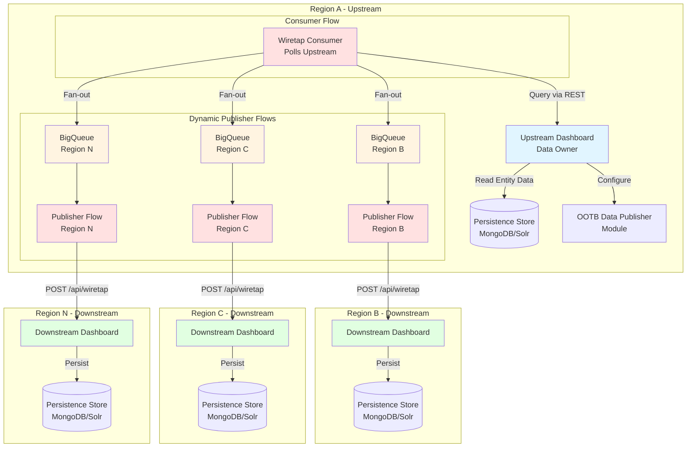
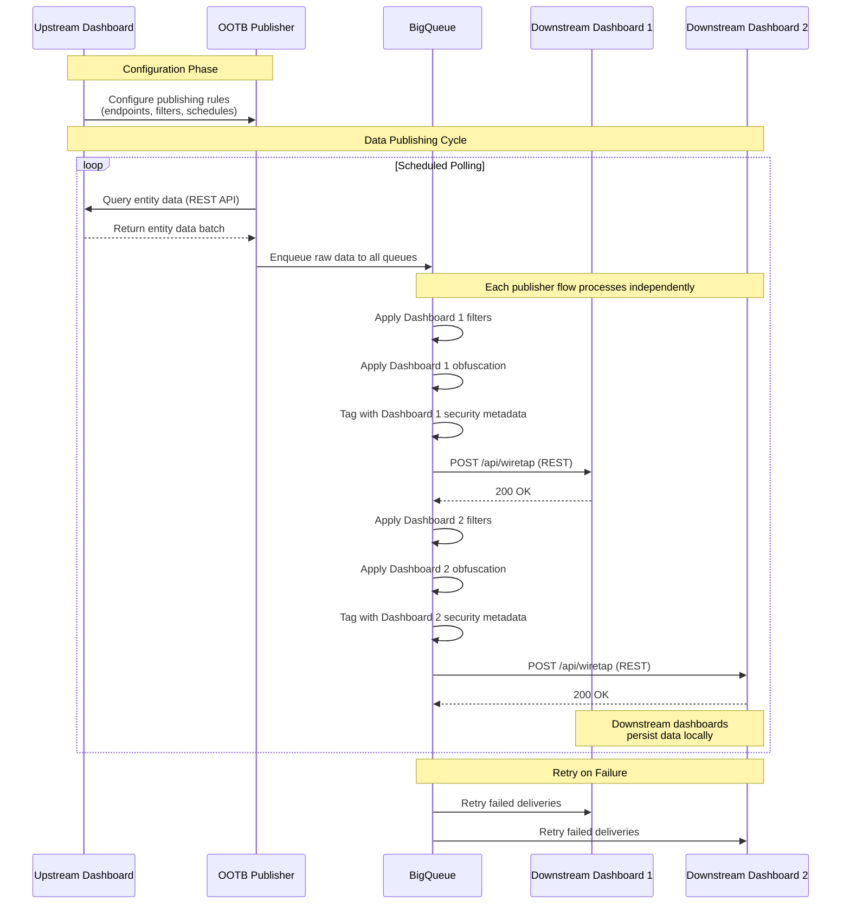

# Ikasan ESB Data Sharing Solution Design

## Overview

This document outlines the solution design for cross-regional dashboard data sharing within the Ikasan Enterprise Service Bus (ESB) platform. The solution enables multiple dashboard instances running in different regions to share critical operational and metadata across distributed deployments.

## Table of Contents

- [Introduction](#introduction)
- [Goals and Requirements](#goals-and-requirements)
- [Architecture Overview](#architecture-overview)
- [Components](#components)
- [Data Flow](#data-flow)
- [Entity Data Types](#entity-data-types)
- [REST API Specifications](#rest-api-specifications)
- [Data Filtering and Business Rules](#data-filtering-and-business-rules)
- [Data Security and Obfuscation](#data-security-and-obfuscation)
- [Reliability and Fault Tolerance](#reliability-and-fault-tolerance)
- [Configuration Management](#configuration-management)
- [Implementation Details](#implementation-details)
- [Future Considerations](#future-considerations)

---

## Introduction

The Ikasan ESB Data Sharing solution provides a framework for securely sharing operational and configuration data between dashboard instances deployed across different geographical regions. Each dashboard maintains its own independent persistence store (MongoDB or Solr), while the solution ensures consistent data visibility across all regions through a dedicated out-of-the-box (OOTB) publishing module.

### Key Principles

- **Data Ownership**: The upstream dashboard owns and controls the data
- **Decentralized Architecture**: Each dashboard has independent persistence
- **Reliable Delivery**: BigQueue ensures no data loss during transmission
- **Security First**: Data tagging and obfuscation capabilities
- **Flexible Filtering**: Business rule-based data filtering
- **Multi-Target**: Support for publishing to multiple downstream dashboards

---

## Goals and Requirements

### Primary Goal

Enable dashboards running in different regions to share relevant entity data with one another, supporting operational visibility and compliance across distributed Ikasan deployments.

### Functional Requirements

1. **Cross-Regional Data Sharing**
   - Share data between geographically distributed dashboard instances
   - Support multiple downstream dashboard targets
   - Maintain data consistency across regions

2. **Entity Data Support**
   - Wiretap data
   - Error reporting data
   - Hospital/Exclusion data
   - Replay data
   - Module metadata
   - Configuration metadata

3. **Data Persistence Independence**
   - Each dashboard maintains its own persistence store
   - Support for MongoDB and Solr data layers
   - No shared database dependencies

4. **Reliability and Fault Tolerance**
   - Guaranteed data delivery using BigQueue
   - Resilience to network failures
   - Data queuing and retry mechanisms

5. **Security and Compliance**
   - Data obfuscation capabilities
   - Security tagging for sensitive data
   - Downstream security enforcement
   - Audit trail support

6. **Flexible Data Control**
   - Business rule-based data filtering
   - Configurable publishing rules
   - Upstream dashboard configuration control

### Non-Functional Requirements

- **Performance**: Minimal impact on dashboard operations
- **Scalability**: Support for multiple regions and high data volumes
- **Maintainability**: Leverage existing Ikasan OOTB module patterns
- **Observability**: Monitoring and alerting capabilities

---

## Architecture Overview

The solution consists of three main components:

1. **Upstream Dashboard**: Data owner and source
2. **OOTB Data Publisher Module**: Independent publishing service
3. **Downstream Dashboard(s)**: Data consumers



### Architectural Principles

- **Separation of Concerns**: Publishing module is independent of dashboard
- **Loose Coupling**: REST API-based integration
- **Data Sovereignty**: Each region maintains its own data store
- **Fan-Out Pattern**: Single consumer flow fans out to N downstream publisher flows
- **Dynamic Flow Creation**: Publisher flows created dynamically based on configuration
- **Asynchronous Communication**: Queue-based delivery for reliability per destination

---

## Components

### 1. Upstream Dashboard (Data Owner)

**Location**: `ikasaneip/visualisation/dashboard`

**Responsibilities**:
- Source of truth for entity data
- Configuration of OOTB publisher module
- Provides REST APIs for data retrieval
- Enforces data ownership policies

**Key Features**:
- Existing persistence layer (MongoDB/Solr)
- REST API endpoints for data queries
- Configuration UI for publisher setup

### 2. OOTB Data Publisher Module

**Location**: `ikasaneip/ootb/module/data-publisher` (to be created)

**Reference**: [Ikasan OOTB Modules](https://github.com/ikasanEIP/ikasan/tree/5.0.x/ikasaneip/ootb)

**Responsibilities**:
- Query entity data from upstream dashboard (single consumer flow)
- Apply business rules and filters
- Obfuscate sensitive data
- Tag data with security metadata
- Dynamically create publisher flows for N downstream dashboards
- Reliable transmission to each downstream dashboard via dedicated BigQueue
- Configuration management and dynamic flow lifecycle

**Flow Architecture**:

The module consists of two types of flows:

1. **Consumer Flow** (Single instance per entity type)
   - Scheduled consumer that polls upstream dashboard
   - Retrieves raw entity data
   - Fans out to N BigQueue endpoints (one per downstream dashboard)
   - Single point of data retrieval to minimize load on upstream dashboard

2. **Publisher Flows** (N instances - dynamically created)
   - One flow per downstream dashboard configuration
   - Each flow has its own dedicated BigQueue for reliability
   - Applies downstream-specific filtering, obfuscation, and security tagging
   - Consumes from BigQueue and publishes to specific downstream dashboard
   - Created/destroyed dynamically based on configuration changes
   - Independent failure isolation per destination
   - Each downstream dashboard can have different business rules and obfuscation policies

**Dynamic Flow Creation**:

```java
// Flows are created dynamically when configuration changes
public interface FlowFactory {
    Flow createPublisherFlow(DownstreamDashboard config);
    void destroyPublisherFlow(String flowName);
    void updatePublisherFlow(DownstreamDashboard config);
}
```

**Key Components**:
- **Scheduled Consumer**: Polls upstream dashboard for new data (single consumer)
- **Multi-Producer Component**: Fans out raw data to N BigQueue endpoints
- **BigQueue Consumer** (per publisher flow): Consumes from dedicated queue
- **Filter Component** (per publisher flow): Applies downstream-specific business rules
- **Transformer Component** (per publisher flow): Applies downstream-specific obfuscation and security tagging
- **REST Producer** (per publisher flow): Publishes to specific downstream dashboard
- **Dynamic Flow Manager**: Creates/destroys publisher flows based on configuration

**Module Structure**:
```
ootb/
└── module/
    └── data-publisher/
        ├── src/main/java/
        │   └── org/ikasan/ootb/datapublisher/
        │       ├── flow/
        │       │   ├── WiretapConsumerFlow.java         # Single consumer flow
        │       │   ├── PublisherFlowFactory.java       # Creates N publisher flows
        │       │   └── DynamicFlowManager.java         # Manages flow lifecycle
        │       ├── component/
        │       │   ├── consumer/
        │       │   │   └── DataQueryConsumer.java      # Single upstream consumer
        │       │   ├── producer/
        │       │   │   ├── MultiBigQueueProducer.java  # Fan-out to N queues
        │       │   │   └── RestPublisherProducer.java  # REST producer per flow
        │       │   ├── filter/
        │       │   │   ├── DataFilterComponent.java
        │       │   │   └── BusinessRuleFilter.java
        │       │   └── transformer/
        │       │       ├── DataObfuscationComponent.java
        │       │       └── SecurityTaggingComponent.java
        │       ├── configuration/
        │       │   ├── DataPublisherConfiguration.java
        │       │   ├── ConfigurationChangeListener.java # Triggers flow recreation
        │       │   └── FlowConfigurationService.java
        │       └── DataPublisherModule.java
        └── pom.xml
```

**Flow Diagram**:

```
                    ┌─────────────────────────────────────────┐
                    │     OOTB Data Publisher Module          │
                    │                                         │
                    │  ┌───────────────────────────────────┐ │
                    │  │   Consumer Flow (Single)          │ │
                    │  │                                   │ │
                    │  │  ┌──────────────────────────┐    │ │
                    │  │  │ Scheduled Consumer       │    │ │
                    │  │  │ (Query Upstream)         │    │ │
                    │  │  └──────────┬───────────────┘    │ │
                    │  │             │                     │ │
                    │  │             ▼                     │ │
                    │  │  ┌──────────────────────────┐    │ │
                    │  │  │ Multi-BigQueue Producer  │    │ │
                    │  │  │ (Fan-out raw data)       │    │ │
                    │  │  └──┬───┬───┬──────────┬────┘    │ │
                    │  └─────┼───┼───┼──────────┼─────────┘ │
                    │        │   │   │          │           │
                    │  ┌─────▼───▼───▼──────────▼────┐      │
                    │  │  BigQueues (N instances)    │      │
                    │  │  - One per downstream       │      │
                    │  │  - Persistent storage       │      │
                    │  └─────┬───┬───┬──────────┬────┘      │
                    │        │   │   │          │           │
                    │  ┌─────▼───┼───┼──────────┼────┐      │
                    │  │ Publisher Flows (Dynamic)   │      │
                    │  │                             │      │
                    │  │ ┌─────────────────────┐    │      │
                    │  │ │ Flow 1: Region B    │    │      │
                    │  │ │ - BigQueue Consumer │    │      │
                    │  │ │ - Filter (B rules)  │    │      │
                    │  │ │ - Transform (B obf) │    │      │
                    │  │ │ - REST Producer     │────┼──────┼──> Dashboard B
                    │  │ └─────────────────────┘    │      │
                    │  │                             │      │
                    │  │ ┌─────────────────────┐    │      │
                    │  │ │ Flow 2: Region C    │    │      │
                    │  │ │ - BigQueue Consumer │    │      │
                    │  │ │ - Filter (C rules)  │    │      │
                    │  │ │ - Transform (C obf) │    │      │
                    │  │ │ - REST Producer     │────┼──────┼──> Dashboard C
                    │  │ └─────────────────────┘    │      │
                    │  │                             │      │
                    │  │ ┌─────────────────────┐    │      │
                    │  │ │ Flow N: Region N    │    │      │
                    │  │ │ - BigQueue Consumer │    │      │
                    │  │ │ - Filter (N rules)  │    │      │
                    │  │ │ - Transform (N obf) │    │      │
                    │  │ │ - REST Producer     │────┼──────┼──> Dashboard N
                    │  │ └─────────────────────┘    │      │
                    │  └─────────────────────────────┘      │
                    └─────────────────────────────────────────┘
```

### 3. BigQueue Endpoint

**Location**: [ikasaneip/component/endpoint/big-queue](https://github.com/ikasanEIP/ikasan/tree/5.0.x/ikasaneip/component/endpoint/big-queue)

**Responsibilities**:
- Persistent message queuing
- Guaranteed delivery semantics
- Fault tolerance and recovery
- Backpressure handling

### 4. Downstream Dashboard(s)

**Location**: `ikasaneip/visualisation/dashboard`

**Responsibilities**:
- Receive published data via REST APIs
- Persist data to local store
- Enforce security policies based on data tags
- Provide regional data visibility

**Key Features**:
- Existing REST API endpoints for data ingestion
- Security enforcement based on tags
- Local persistence (MongoDB/Solr)

---

## Data Flow

### High-Level Data Flow



### Detailed Data Flow Steps

1. **Configuration Phase**
   - Administrator configures OOTB publisher via upstream dashboard UI
   - Configuration includes:
     - Downstream dashboard endpoints
     - Entity types to publish
     - Business rule filters
     - Obfuscation rules
     - Security tagging rules
     - Polling schedule

2. **Data Query Phase**
   - OOTB publisher polls upstream dashboard on schedule
   - Queries entity data via REST API
   - Retrieves data in batches to avoid overwhelming system

3. **Data Processing Phase** (per downstream dashboard in publisher flows)
   - Apply downstream-specific business rule filters (e.g., error severity, module names)
   - Apply downstream-specific obfuscation for sensitive fields (e.g., PII, credentials)
   - Add downstream-specific security tags (e.g., `SENSITIVE`, `CONFIDENTIAL`, `PUBLIC`)

4. **Data Queuing Phase**
   - Raw data enqueued to BigQueue (before processing)
   - Separate queues per downstream dashboard
   - Persistent storage ensures no data loss

5. **Data Publishing Phase**
   - BigQueue consumer publishes to downstream dashboards
   - Uses existing REST API endpoints
   - Automatic retry on failure
   - Acknowledgment-based delivery

6. **Data Persistence Phase**
   - Downstream dashboard receives data
   - Enforces security based on tags
   - Persists to local MongoDB/Solr store
   - Makes data available to users

---

## Entity Data Types

### 1. Wiretap Data

**Source Module**: [ikasaneip/wiretap](https://github.com/ikasanEIP/ikasan/tree/5.0.x/ikasaneip/wiretap)

**Description**: Event payload snapshots captured during flow execution

**Key Attributes**:
- Module name
- Flow name
- Component name
- Event ID
- Payload
- Timestamp
- Expiry time

**Obfuscation Considerations**:
- Payload may contain PII
- Configurable field-level obfuscation

### 2. Error Reporting Data

**Source Module**: [ikasaneip/error-reporting](https://github.com/ikasanEIP/ikasan/tree/5.0.x/ikasaneip/error-reporting)

**Description**: Runtime errors and exceptions

**Key Attributes**:
- Module name
- Flow name
- Component name
- Error message
- Stack trace
- Timestamp
- User action

**Security Tagging**:
- Error severity levels
- Sensitive error categories

### 3. Hospital/Exclusion Data

**Source Module**: [ikasaneip/hospital](https://github.com/ikasanEIP/ikasan/tree/5.0.x/ikasaneip/hospital)

**Description**: Events that have been excluded from processing

**Key Attributes**:
- Module name
- Flow name
- Error URI
- Event payload
- Timestamp
- Error details

**Obfuscation Considerations**:
- Payload obfuscation
- Error message sanitization

### 4. Replay Data

**Source Module**: [ikasaneip/replay](https://github.com/ikasanEIP/ikasan/tree/5.0.x/ikasaneip/replay)

**Description**: Replay event history and metadata

**Key Attributes**:
- Replay ID
- Module name
- Flow name
- Event IDs
- Timestamp
- Status
- User

**Security Tagging**:
- Replay authorization levels
- Audit requirements

### 5. Module Metadata (Topology)

**Source Module**: [ikasaneip/topology](https://github.com/ikasanEIP/ikasan/tree/5.0.x/ikasaneip/topology)

**Description**: Module, flow, and component structure

**Key Attributes**:
- Module metadata
- Flow metadata
- Component configuration
- Module type
- Version information

**Publishing Priority**: High (required for dashboard functionality)

### 6. Configuration Metadata

**Source Module**: [ikasaneip/configuration-service](https://github.com/ikasanEIP/ikasan/tree/5.0.x/ikasaneip/configuration-service)

**Description**: Module and component configuration

**Key Attributes**:
- Configuration ID
- Module name
- Component name
- Configuration parameters
- Description

**Obfuscation Considerations**:
- Password fields
- API keys
- Connection strings

---

## REST API Specifications

### Upstream Dashboard - Data Query APIs

These APIs will be added to the `rest-dashboard` module for the OOTB publisher to query entity data.

#### 1. Query Wiretap Data

```
GET /api/data-sharing/wiretap
```

**Query Parameters**:
- `fromTimestamp` (long): Start timestamp
- `toTimestamp` (long): End timestamp
- `moduleNames` (string[]): Optional filter by module names
- `limit` (int): Maximum records to return
- `offset` (int): Pagination offset

**Response**:
```json
{
  "data": [
    {
      "id": "string",
      "moduleName": "string",
      "flowName": "string",
      "componentName": "string",
      "eventId": "string",
      "payload": "string",
      "timestamp": 1234567890,
      "expiry": 1234567890
    }
  ],
  "totalCount": 100,
  "hasMore": true
}
```

#### 2. Query Error Data

```
GET /api/data-sharing/errors
```

**Query Parameters**:
- `fromTimestamp` (long): Start timestamp
- `toTimestamp` (long): End timestamp
- `moduleNames` (string[]): Optional filter by module names
- `severityLevels` (string[]): Optional filter by severity
- `limit` (int): Maximum records to return
- `offset` (int): Pagination offset

**Response**:
```json
{
  "data": [
    {
      "uri": "string",
      "moduleName": "string",
      "flowName": "string",
      "componentName": "string",
      "errorMessage": "string",
      "errorDetail": "string",
      "timestamp": 1234567890,
      "userAction": "string"
    }
  ],
  "totalCount": 50,
  "hasMore": false
}
```

#### 3. Query Exclusion Data

```
GET /api/data-sharing/exclusions
```

#### 4. Query Replay Data

```
GET /api/data-sharing/replays
```

#### 5. Query Module Metadata

```
GET /api/data-sharing/topology
```

#### 6. Query Configuration Metadata

```
GET /api/data-sharing/configuration
```

### Downstream Dashboard - Data Ingestion APIs

These APIs already exist in the `rest-dashboard` module and will be used by the OOTB publisher to publish data.

#### 1. Publish Wiretap Data

```
POST /api/wiretap
```

**Request Body**:
```json
{
  "wiretaps": [
    {
      "moduleName": "string",
      "flowName": "string",
      "componentName": "string",
      "eventId": "string",
      "payload": "string",
      "timestamp": 1234567890,
      "expiry": 1234567890,
      "securityTags": ["SENSITIVE"]
    }
  ],
  "sourceRegion": "REGION_A"
}
```

**Response**:
```json
{
  "accepted": 10,
  "rejected": 0,
  "errors": []
}
```

#### 2. Publish Error Data

```
POST /api/error
```

#### 3. Publish Exclusion Data

```
POST /api/hospital/exclusions
```

#### 4. Publish Replay Data

```
POST /api/replay
```

#### 5. Publish Module Metadata

```
POST /api/topology/modules
```

#### 6. Publish Configuration Metadata

```
POST /api/configuration
```

---

## Data Filtering and Business Rules

### Filter Configuration

The OOTB publisher supports flexible filtering based on business rules applied **per downstream dashboard**. Each publisher flow has its own filter configuration.

```java
public interface DataFilter {
    boolean shouldPublish(EntityData data, FilterConfiguration config);
}
```

### Common Filter Rules

1. **Module Name Filter**
   - Include/exclude specific modules
   - Pattern matching support (wildcards)

2. **Time-Based Filter**
   - Only publish data newer than threshold
   - Sliding window configurations

3. **Severity Filter** (for errors)
   - Filter by error severity levels
   - Critical, High, Medium, Low

4. **Data Volume Filter**
   - Limit data volume per batch
   - Prioritization rules

5. **Custom Business Rules**
   - Pluggable filter implementations
   - Groovy script support for dynamic rules

### Filter Configuration Example (Per Downstream Dashboard)

```yaml
dataPublisher:
  destinations:
    - name: "Dashboard Region B"
      url: "https://dashboard-b.example.com"
      filters:
        wiretap:
          includeModules:
            - "order-processing-*"
            - "payment-service"
          excludeComponents:
            - "internal-logging"
          maxPayloadSize: 10240
        errors:
          minSeverity: "HIGH"
          includeModules:
            - "*"
    - name: "Dashboard Region C"
      url: "https://dashboard-c.example.com"
      filters:
        wiretap:
          includeModules:
            - "inventory-*"
          maxPayloadSize: 5120
        errors:
          minSeverity: "MEDIUM"
          includeModules:
            - "inventory-*"
```

---

## Data Security and Obfuscation

### Security Tagging

Data is tagged with security classifications that downstream dashboards enforce:

**Security Levels**:
- `PUBLIC`: No restrictions
- `INTERNAL`: Organization-wide access
- `CONFIDENTIAL`: Restricted access
- `SENSITIVE`: Highly restricted, requires special permissions

**Tag Application**:
```json
{
  "data": {
    "eventId": "evt-123",
    "payload": "...",
    "securityTags": ["SENSITIVE", "PII"]
  }
}
```

### Data Obfuscation

Data obfuscation is applied **per downstream dashboard** within each publisher flow. Different downstream dashboards can have different obfuscation policies based on their security requirements.

**Obfuscation Strategies**:

1. **Field-Level Obfuscation**
   - Mask specific payload fields
   - Pattern-based replacement

2. **Payload Truncation**
   - Limit payload size
   - Preserve structure, remove content

3. **Hash-Based Anonymization**
   - Replace sensitive values with hashes
   - Maintain referential integrity

4. **Tokenization**
   - Replace sensitive data with tokens
   - Token mapping stored securely

**Obfuscation Configuration (Per Downstream Dashboard)**:
```yaml
dataPublisher:
  destinations:
    - name: "Dashboard Region B"
      url: "https://dashboard-b.example.com"
      obfuscation:
        rules:
          - entityType: "WIRETAP"
            payloadPath: "$.customer.ssn"
            strategy: "MASK"
            pattern: "***-**-####"
          - entityType: "ERROR"
            payloadPath: "$.stackTrace"
            strategy: "TRUNCATE"
            maxLength: 500
    - name: "Dashboard Region C"
      url: "https://dashboard-c.example.com"
      obfuscation:
        rules:
          - entityType: "WIRETAP"
            payloadPath: "$.customer.ssn"
            strategy: "HASH"
          - entityType: "WIRETAP"
            payloadPath: "$.customer.email"
            strategy: "TOKENIZE"
```

### Downstream Security Enforcement

Downstream dashboards enforce security based on tags:

```java
public interface SecurityEnforcer {
    boolean canAccess(User user, EntityData data);
    EntityData applySecurityPolicy(EntityData data, User user);
}
```

**Enforcement Actions**:
- Deny access to unauthorized users
- Redact sensitive fields for lower privilege users
- Audit access to sensitive data

---

## Reliability and Fault Tolerance

### BigQueue Integration

**Key Features**:
- **Persistent Storage**: Messages survive restarts
- **FIFO Guarantee**: Order preservation
- **At-Least-Once Delivery**: No message loss
- **Backpressure Handling**: Queue depth monitoring

### Retry Strategy

```yaml
bigQueue:
  retry:
    maxAttempts: 5
    backoffMultiplier: 2
    initialDelay: 1000ms
    maxDelay: 60000ms
```

### Failure Scenarios

1. **Downstream Dashboard Unavailable**
   - Messages queued in BigQueue
   - Automatic retry with exponential backoff
   - Alert after max retries exceeded

2. **Network Partition**
   - Queue accumulation
   - Monitor queue depth
   - Automatic recovery when network restored

3. **Upstream Dashboard Unavailable**
   - OOTB publisher polling continues
   - Logs connection failures
   - Resumes when upstream available

4. **Data Corruption**
   - Validation before publishing
   - Dead letter queue for invalid messages
   - Manual intervention required

### Monitoring and Alerting

**Key Metrics**:
- Queue depth per downstream dashboard
- Message throughput (messages/second)
- Retry count and failure rate
- End-to-end latency
- Data volume published

**Alerts**:
- Queue depth exceeds threshold
- Repeated delivery failures
- Upstream query failures
- Data validation errors

---

## Configuration Management

### OOTB Publisher Configuration

**Configuration Source**: Upstream Dashboard

**Configuration UI** (in upstream dashboard):
- Manage downstream dashboard endpoints
- Configure entity type selections
- Define filter rules
- Set obfuscation policies
- Schedule polling intervals

**Configuration Model**:
```java
public class DataPublisherConfiguration {
    private List<DownstreamDashboard> destinations;
    private Map<EntityType, EntityPublishConfig> entityConfigs;
    private ScheduleConfig schedule;
    private SecurityConfig securityConfig;
}

public class DownstreamDashboard {
    private String name;
    private String baseUrl;
    private AuthenticationConfig authentication;
    private boolean enabled;
}

public class EntityPublishConfig {
    private boolean enabled;
    private FilterConfig filters;           // Applied per downstream dashboard
    private ObfuscationConfig obfuscation;  // Applied per downstream dashboard
    private SecurityTagConfig securityTags; // Applied per downstream dashboard
}
```

### Configuration REST API

**Endpoint**: `POST /api/ootb-publisher/configuration`

**Request**:
```json
{
  "destinations": [
    {
      "name": "Region B Dashboard",
      "baseUrl": "https://dashboard-region-b.example.com",
      "authentication": {
        "type": "BASIC",
        "username": "publisher",
        "password": "encrypted-password"
      },
      "enabled": true
    }
  ],
  "entityConfigs": {
    "WIRETAP": {
      "enabled": true,
      "filters": {
        "includeModules": ["order-*"]
      },
      "obfuscation": {
        "rules": [...]
      },
      "securityTags": ["INTERNAL"]
    }
  },
  "schedule": {
    "cronExpression": "0 */5 * * * ?"
  }
}
```

### Configuration Persistence

- Configuration stored in upstream dashboard database
- OOTB publisher polls for configuration updates
- Configuration versioning and audit trail
- Validation before applying changes

---

## Implementation Details

### Phase 1: Foundation (MVP)

**Objectives**:
- Create OOTB publisher module structure
- Implement basic data query APIs in upstream dashboard
- Integrate BigQueue endpoint
- Support single entity type (wiretap)
- Single downstream dashboard

**Deliverables**:
1. OOTB module skeleton
2. REST APIs for wiretap data query
3. Basic flow: Query → BigQueue → Publish
4. Configuration via properties file
5. Basic monitoring

**Estimated Effort**: 2-3 weeks

### Phase 2: Multi-Entity Support

**Objectives**:
- Support all six entity types
- Implement complete REST API suite
- Multi-destination routing

**Deliverables**:
1. REST APIs for all entity types
2. Multi-destination publisher
3. Entity-specific processing logic

**Estimated Effort**: 2-3 weeks

### Phase 3: Filtering and Security

**Objectives**:
- Implement business rule filtering
- Data obfuscation capabilities
- Security tagging

**Deliverables**:
1. Filter framework and common filters
2. Obfuscation engine
3. Security tagging component
4. Downstream security enforcement

**Estimated Effort**: 2 weeks

### Phase 4: Configuration UI

**Objectives**:
- Configuration management UI in upstream dashboard
- Dynamic configuration updates
- Configuration validation

**Deliverables**:
1. Configuration UI components
2. REST API for configuration management
3. Configuration persistence
4. Real-time configuration updates

**Estimated Effort**: 2 weeks

### Phase 5: Production Readiness

**Objectives**:
- Monitoring and alerting
- Performance optimization
- Documentation
- Testing

**Deliverables**:
1. Metrics and monitoring dashboard
2. Performance tuning
3. Comprehensive documentation
4. Integration tests
5. Load testing

**Estimated Effort**: 2 weeks

### Technology Stack

**Core Technologies**:
- Java 17
- Spring Boot
- Ikasan Framework
- BigQueue
- REST API (Spring MVC)

**Persistence**:
- MongoDB (primary)
- Solr (alternative)

**Monitoring**:
- Prometheus metrics
- Grafana dashboards
- Ikasan Dashboard monitoring

### Module Structure

```
ikasaneip/
├── ootb/
│   └── module/
│       └── data-publisher/
│           ├── src/
│           │   ├── main/
│           │   │   ├── java/
│           │   │   │   └── org/ikasan/ootb/datapublisher/
│           │   │   │       ├── module/
│           │   │   │       │   └── DataPublisherModule.java
│           │   │   │       ├── flow/
│           │   │   │       │   ├── WiretapPublisherFlow.java
│           │   │   │       │   ├── ErrorPublisherFlow.java
│           │   │   │       │   └── ...
│           │   │   │       ├── component/
│           │   │   │       │   ├── consumer/
│           │   │   │       │   │   └── DataQueryConsumer.java
│           │   │   │       │   ├── filter/
│           │   │   │       │   │   ├── BusinessRuleFilter.java
│           │   │   │       │   │   └── DataFilter.java
│           │   │   │       │   ├── transformer/
│           │   │   │       │   │   ├── ObfuscationTransformer.java
│           │   │   │       │   │   └── SecurityTagTransformer.java
│           │   │   │       │   └── producer/
│           │   │   │       │       └── RestPublisherProducer.java
│           │   │   │       ├── configuration/
│           │   │   │       │   ├── DataPublisherConfiguration.java
│           │   │   │       │   └── ConfigurationService.java
│           │   │   │       └── model/
│           │   │   │           ├── EntityData.java
│           │   │   │           └── PublishingContext.java
│           │   │   └── resources/
│           │   │       ├── application.properties
│           │   │       └── filter-rules.yaml
│           │   └── test/
│           └── pom.xml
└── visualisation/
    └── dashboard/
        └── src/main/java/
            └── org/ikasan/dashboard/rest/
                └── datasharing/
                    ├── DataSharingController.java
                    ├── WiretapQueryService.java
                    └── ...
```

### Key Implementation Classes

#### 1. DataPublisherModule

```java
@Module
public class DataPublisherModule {

    // Consumer Flow - Single instance per entity type
    @Bean
    public Flow wiretapConsumerFlow() {
        return flowBuilder
            .consumer("Wiretap Query Consumer", wiretapQueryConsumer())
            .producer("Multi-BigQueue Producer", multiBigQueueProducer())
            .build();
    }

    // Publisher Flows - Dynamically created per downstream dashboard
    public Flow createPublisherFlow(DownstreamDashboard config) {
        return flowBuilder
            .consumer("BigQueue Consumer", bigQueueConsumer(config))
            .filter("Business Rule Filter", businessRuleFilter(config.getFilters()))
            .converter("Obfuscation Transformer", obfuscationTransformer(config.getObfuscation()))
            .converter("Security Tag Transformer", securityTagTransformer(config.getSecurityTags()))
            .producer("REST Producer", restProducer(config.getUrl()))
            .build();
    }

    // Additional flows for other entity types...
}
```

#### 2. DataQueryConsumer

```java
public class DataQueryConsumer implements Consumer<List<EntityData>> {

    private final RestTemplate restTemplate;
    private final String upstreamDashboardUrl;

    @Override
    public List<EntityData> consume() {
        // Query upstream dashboard REST API
        // Return batch of entity data
    }
}
```

#### 3. BusinessRuleFilter (Per Downstream Dashboard)

```java
public class BusinessRuleFilter implements Filter<List<EntityData>> {

    private final FilterConfiguration filterConfig;  // Specific to downstream dashboard

    public BusinessRuleFilter(FilterConfiguration filterConfig) {
        this.filterConfig = filterConfig;
    }

    @Override
    public List<EntityData> filter(List<EntityData> data) {
        // Apply downstream-specific business rules
        // Return filtered data
    }
}
```

#### 4. ObfuscationTransformer (Per Downstream Dashboard)

```java
public class ObfuscationTransformer implements Converter<List<EntityData>, List<EntityData>> {

    private final ObfuscationConfig config;  // Specific to downstream dashboard

    public ObfuscationTransformer(ObfuscationConfig config) {
        this.config = config;
    }

    @Override
    public List<EntityData> convert(List<EntityData> data) {
        // Apply downstream-specific obfuscation rules
        // Return obfuscated data
    }
}
```

---

## Future Considerations

### Potential Enhancements

1. **Bi-Directional Sync**
   - Support for downstream dashboards publishing data back upstream
   - Conflict resolution strategies
   - Data reconciliation

2. **Delta Sync**
   - Only publish changed data
   - Reduce bandwidth and processing overhead
   - Change tracking mechanisms

3. **Data Aggregation**
   - Aggregate data from multiple regions
   - Cross-region analytics and reporting
   - Centralized monitoring dashboard

4. **Real-Time Streaming**
   - Move from polling to event-driven push
   - WebSocket or Server-Sent Events
   - Reduced latency

5. **Data Compression**
   - Compress payloads before transmission
   - Reduce network bandwidth
   - Configurable compression algorithms

6. **Advanced Security**
   - End-to-end encryption
   - Certificate-based authentication
   - Data signing and verification

7. **Data Lifecycle Management**
   - Automatic data expiration
   - Archival policies
   - GDPR compliance features

8. **Multi-Tenancy**
   - Tenant-aware data sharing
   - Isolated data streams per tenant
   - Tenant-specific security policies

### Scalability Considerations

- Horizontal scaling of OOTB publisher instances
- Load balancing across multiple publishers
- Sharding strategies for high-volume data
- Database optimization for query performance

### Monitoring Enhancements

- Real-time data flow visualization
- Predictive alerting based on trends
- Automated remediation for common issues
- Integration with enterprise monitoring tools

---

## Appendix

### Related Documentation

- [Ikasan Wiretap Module](https://github.com/ikasanEIP/ikasan/tree/5.0.x/ikasaneip/wiretap)
- [Ikasan Error Reporting](https://github.com/ikasanEIP/ikasan/tree/5.0.x/ikasaneip/error-reporting)
- [Ikasan Hospital/Exclusions](https://github.com/ikasanEIP/ikasan/tree/5.0.x/ikasaneip/hospital)
- [Ikasan Replay](https://github.com/ikasanEIP/ikasan/tree/5.0.x/ikasaneip/replay)
- [Ikasan Topology](https://github.com/ikasanEIP/ikasan/tree/5.0.x/ikasaneip/topology)
- [Ikasan Configuration Service](https://github.com/ikasanEIP/ikasan/tree/5.0.x/ikasaneip/configuration-service)
- [Ikasan OOTB Modules](https://github.com/ikasanEIP/ikasan/tree/5.0.x/ikasaneip/ootb)
- [Ikasan BigQueue](https://github.com/ikasanEIP/ikasan/tree/5.0.x/ikasaneip/component/endpoint/big-queue)

### Glossary

- **OOTB**: Out-of-the-box module, pre-built reusable Ikasan module
- **BigQueue**: Persistent message queue implementation
- **Entity Data**: Operational and metadata (wiretap, errors, etc.)
- **Upstream Dashboard**: Source dashboard that owns the data
- **Downstream Dashboard**: Consumer dashboard receiving published data
- **Obfuscation**: Process of hiding or masking sensitive data
- **Security Tagging**: Labeling data with security classifications

---

**Document Version**: 1.0
**Last Updated**: 2026-09-23
**Status**: Draft - Ready for Review
