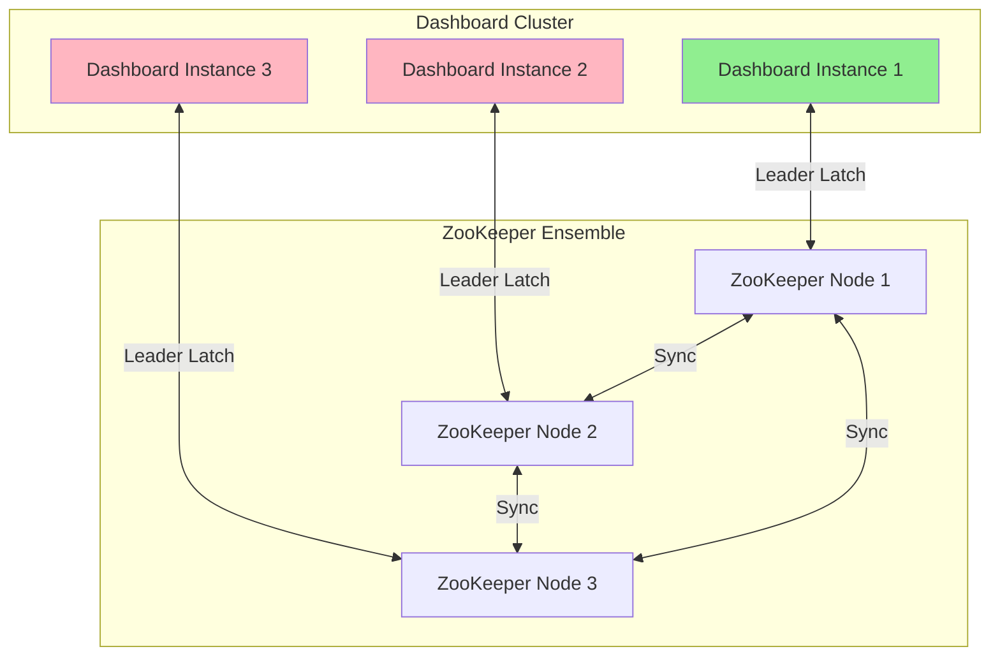
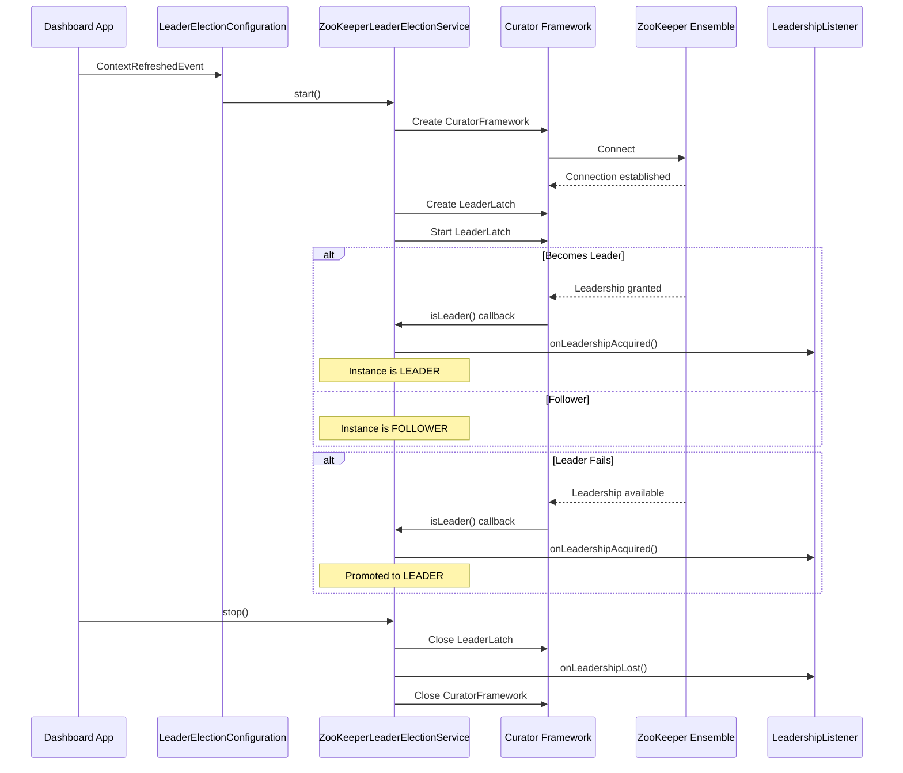
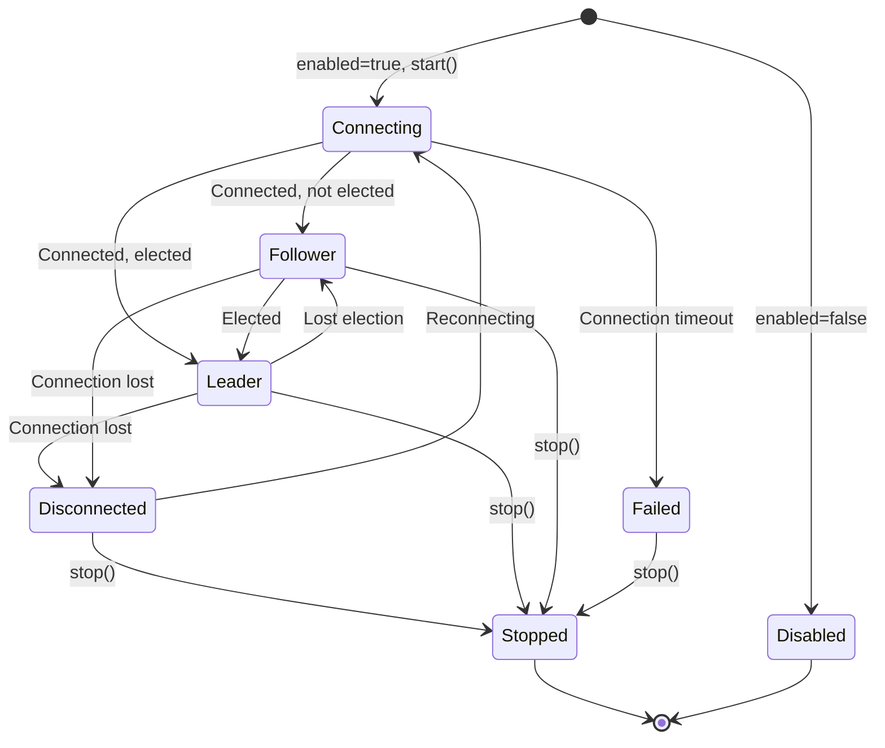
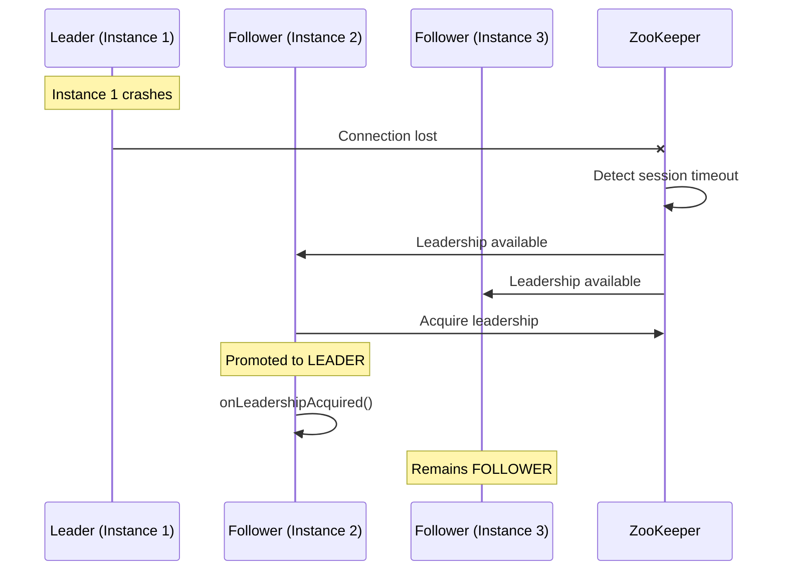
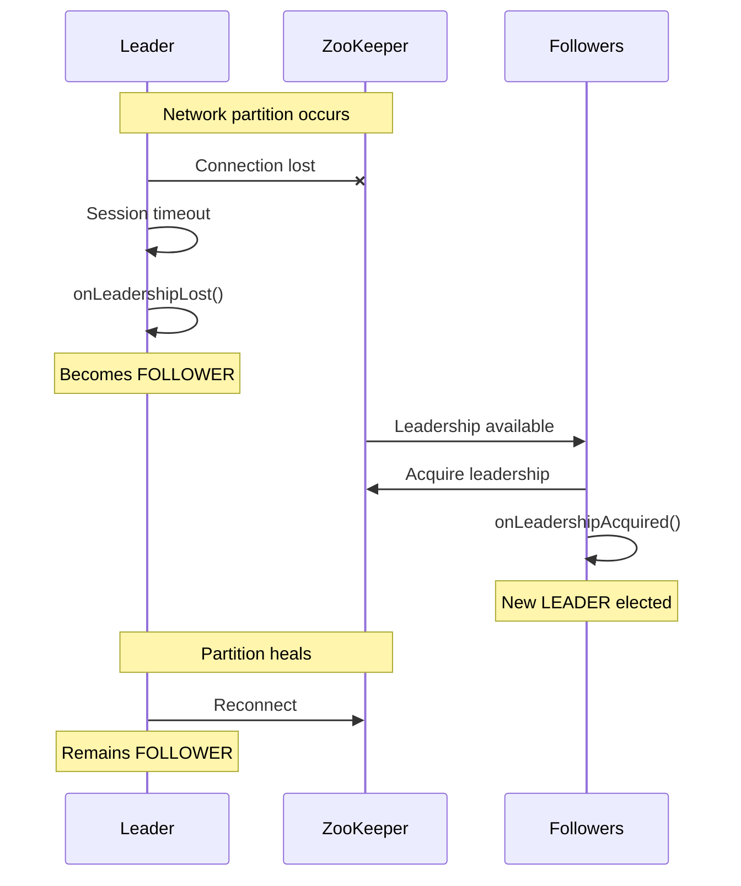

# ZooKeeper Leader Election Integration

## Overview

The Ikasan Dashboard supports clustered deployments with automatic leader election using Apache ZooKeeper. This ensures that only one dashboard instance acts as the leader at any given time, preventing conflicts in scheduled tasks and distributed operations.

## Architecture

### Core Components

The leader election feature is built using Apache Curator (version 5.5.0), which provides robust recipes for ZooKeeper-based distributed coordination.



### Component Structure

```
org.ikasan.dashboard.cluster/
├── config/
│   ├── LeaderElectionConfiguration.java       # Spring configuration
│   └── ZooKeeperLeaderElectionProperties.java  # Configuration properties
├── health/
│   └── LeaderElectionHealthIndicator.java      # Health endpoint
└── service/
    ├── LeaderElectionService.java              # Service interface
    ├── LeadershipListener.java                 # Event listener interface
    └── ZooKeeperLeaderElectionService.java     # ZooKeeper implementation
```

## Key Classes

### 1. LeaderElectionService

Interface defining the core leader election operations:

**Location:** `org.ikasan.dashboard.cluster.service.LeaderElectionService`

**Key Methods:**
- `start()` - Start participating in leader election
- `stop()` - Stop participating and release leadership
- `isLeader()` - Check if current instance is the leader
- `awaitLeadership()` - Block until leadership is acquired
- `addLeadershipListener(LeadershipListener)` - Register for leadership events
- `removeLeadershipListener(LeadershipListener)` - Unregister listener

### 2. ZooKeeperLeaderElectionService

Apache Curator-based implementation using the LeaderLatch recipe.

**Location:** `org.ikasan.dashboard.cluster.service.ZooKeeperLeaderElectionService`

**Key Features:**
- Uses Curator's `LeaderLatch` for leader election
- Automatically handles connection failures and retries
- Generates unique instance IDs (hostname + timestamp)
- Propagates leadership events to registered listeners
- Returns to leader mode when disabled

**Dependencies:**
```xml
<dependency>
    <groupId>org.apache.curator</groupId>
    <artifactId>curator-framework</artifactId>
    <version>5.5.0</version>
</dependency>
<dependency>
    <groupId>org.apache.curator</groupId>
    <artifactId>curator-recipes</artifactId>
    <version>5.5.0</version>
</dependency>
```

### 3. LeadershipListener

Callback interface for leadership state changes.

**Location:** `org.ikasan.dashboard.cluster.service.LeadershipListener`

**Methods:**
- `onLeadershipAcquired()` - Called when instance becomes leader
- `onLeadershipLost()` - Called when instance loses leadership

### 4. LeaderElectionHealthIndicator

Spring Boot Actuator health indicator providing leadership status visibility.

**Location:** `org.ikasan.dashboard.cluster.health.LeaderElectionHealthIndicator`

**Endpoint:** `/actuator/health/leaderElection`

**Response:**
```json
{
  "status": "UP",
  "details": {
    "leader": true,
    "status": "LEADER"
  }
}
```

## Leader Election Flow



## Configuration

### Properties

Configuration is managed through `ZooKeeperLeaderElectionProperties` with the prefix `ikasan.dashboard.cluster.zookeeper`:

| Property | Default | Description |
|----------|---------|-------------|
| `enabled` | `false` | Enable/disable leader election |
| `connectionString` | - | ZooKeeper connection string (e.g., `localhost:2181,localhost:2182,localhost:2183`) |
| `sessionTimeoutMs` | `30000` | ZooKeeper session timeout in milliseconds |
| `connectionTimeoutMs` | `15000` | Connection timeout in milliseconds |
| `baseSleepTimeMs` | `1000` | Initial retry delay for exponential backoff |
| `maxRetries` | `3` | Maximum connection retry attempts |
| `namespace` | `ikasan` | ZooKeeper namespace for isolation |
| `leaderPath` | `/leader` | Path under namespace for leader election |

### Example Configuration

**application.properties:**
```properties
# Enable cluster mode
ikasan.dashboard.cluster.enabled=true

# ZooKeeper configuration
ikasan.dashboard.cluster.zookeeper.enabled=true
ikasan.dashboard.cluster.zookeeper.connectionString=zk1:2181,zk2:2181,zk3:2181
ikasan.dashboard.cluster.zookeeper.sessionTimeoutMs=30000
ikasan.dashboard.cluster.zookeeper.connectionTimeoutMs=15000
ikasan.dashboard.cluster.zookeeper.namespace=/ikasan
ikasan.dashboard.cluster.zookeeper.leaderPath=/leader
```

### Activation

The leader election service automatically starts when:
1. `ikasan.dashboard.cluster.enabled=true` is set
2. The Spring application context is refreshed (`ContextRefreshedEvent`)
3. The `LeaderElectionConfiguration` is loaded

## Usage Patterns

### Conditional Task Execution

Components can check leadership status before executing tasks:

```java
@Service
public class ScheduledTaskService {

    private final LeaderElectionService leaderElectionService;

    @Scheduled(fixedRate = 60000)
    public void performScheduledTask() {
        if (leaderElectionService.isLeader()) {
            // Only execute on the leader instance
            doWork();
        }
    }
}
```

### Leadership Event Handling

Components can react to leadership changes:

```java
@Component
public class TaskCoordinator implements LeadershipListener {

    private final LeaderElectionService leaderElectionService;

    @PostConstruct
    public void init() {
        leaderElectionService.addLeadershipListener(this);
    }

    @Override
    public void onLeadershipAcquired() {
        // Start leader-only operations
        startScheduledJobs();
    }

    @Override
    public void onLeadershipLost() {
        // Stop leader-only operations
        stopScheduledJobs();
    }
}
```

### Blocking Until Leadership

For critical operations that must run on the leader:

```java
public void criticalOperation() throws InterruptedException {
    leaderElectionService.awaitLeadership();
    // This code only executes after becoming leader
    performCriticalTask();
}
```

## Deployment Considerations

### ZooKeeper Ensemble Setup

For production deployments:
- Use an ensemble of at least 3 ZooKeeper nodes (odd number recommended)
- Ensure ZooKeeper nodes are distributed across failure domains
- Configure appropriate session timeouts based on network latency

### Network Partitions

The system handles network partitions gracefully:
- If a leader loses connection to ZooKeeper, it automatically steps down
- Remaining dashboard instances elect a new leader
- When the partition heals, the former leader rejoins as a follower

### Split-Brain Prevention

Apache Curator's LeaderLatch prevents split-brain scenarios:
- Only one instance can hold the leader latch at a time
- ZooKeeper's quorum-based consensus ensures consistency
- Failed leaders cannot retain leadership after connection loss

## State Transitions



## Monitoring

### Health Endpoint

The `/actuator/health/leaderElection` endpoint provides real-time leadership status:

```bash
curl http://localhost:8080/actuator/health/leaderElection
```

Response for leader instance:
```json
{
  "status": "UP",
  "details": {
    "leader": true,
    "status": "LEADER"
  }
}
```

Response for follower instance:
```json
{
  "status": "UP",
  "details": {
    "leader": false,
    "status": "FOLLOWER"
  }
}
```

### Logging

The service provides detailed logging for troubleshooting:

```
INFO  ZooKeeperLeaderElectionService - Starting ZooKeeper leader election service
INFO  ZooKeeperLeaderElectionService - Connection string: zk1:2181,zk2:2181,zk3:2181
INFO  ZooKeeperLeaderElectionService - Connected to ZooKeeper
INFO  ZooKeeperLeaderElectionService - Leader election service started with ID: dashboard-host-1711234567890
INFO  ZooKeeperLeaderElectionService - This instance is now the LEADER
```

## Graceful Shutdown

When a dashboard instance shuts down:
1. `@PreDestroy` triggers `stop()` method
2. Leader latch is closed, releasing leadership
3. If this was the leader, followers automatically elect a new leader
4. Curator client connection is closed

## Failure Scenarios

### Leader Instance Failure



### Network Partition



## Testing

Test classes demonstrate the implementation:

- `ZooKeeperLeaderElectionServiceTest` - Unit tests for the service
- `LeaderElectionConfigurationTest` - Configuration tests
- `LeaderElectionHealthIndicatorTest` - Health indicator tests
- `ZooKeeperLeaderElectionPropertiesTest` - Properties validation

## Future Enhancements

Potential improvements for the leader election implementation:

1. **Metrics Integration** - Expose Prometheus metrics for leader election events
2. **Leadership Transfer** - Graceful leadership handoff during maintenance
3. **Multi-Region Support** - Handle geographically distributed clusters
4. **Auto-scaling Integration** - Coordinate with Kubernetes/cloud auto-scaling
5. **Leadership Priorities** - Allow certain instances to be preferred leaders

## References

- [Apache Curator Documentation](https://curator.apache.org/)
- [ZooKeeper Leader Election Recipe](https://curator.apache.org/curator-recipes/leader-latch.html)
- [Spring Boot Actuator Health Indicators](https://docs.spring.io/spring-boot/docs/current/reference/html/actuator.html#actuator.endpoints.health)
