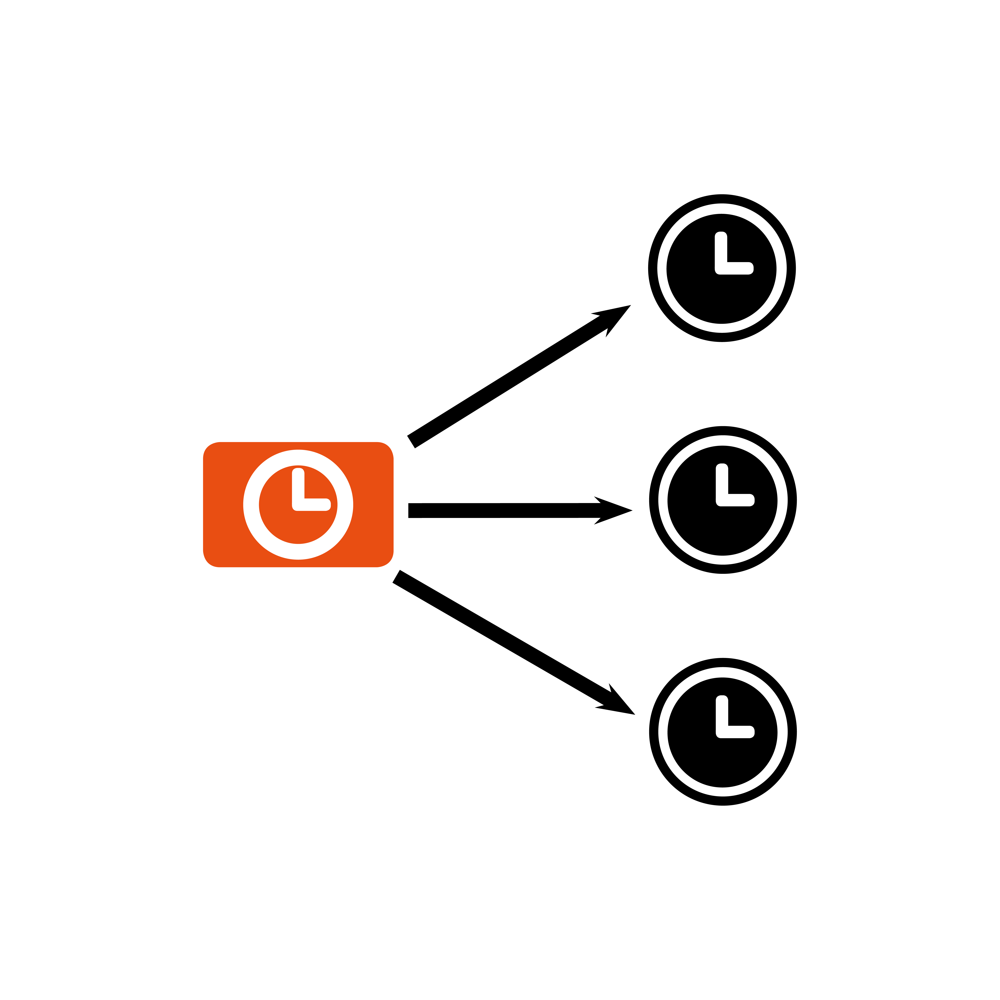
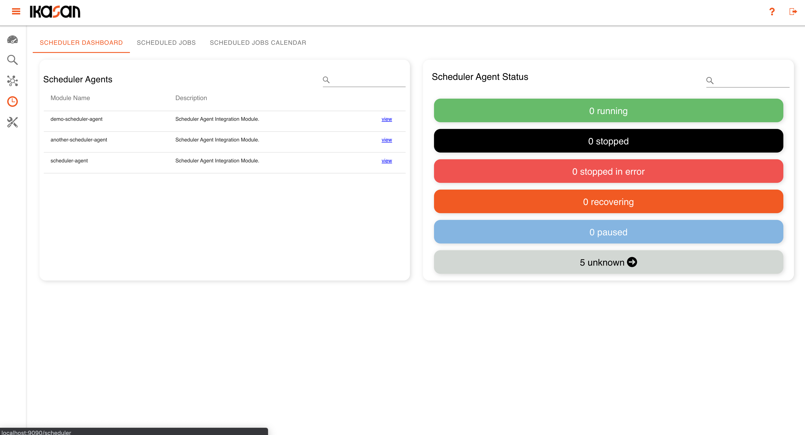
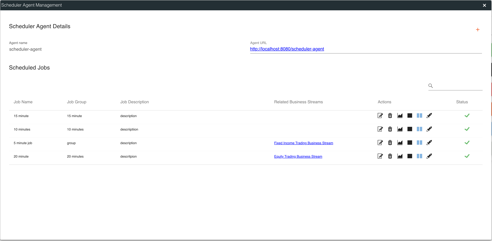
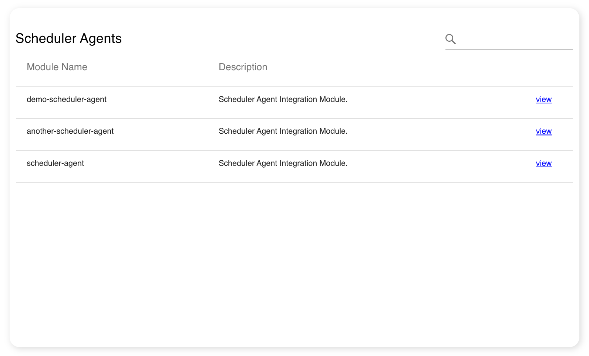
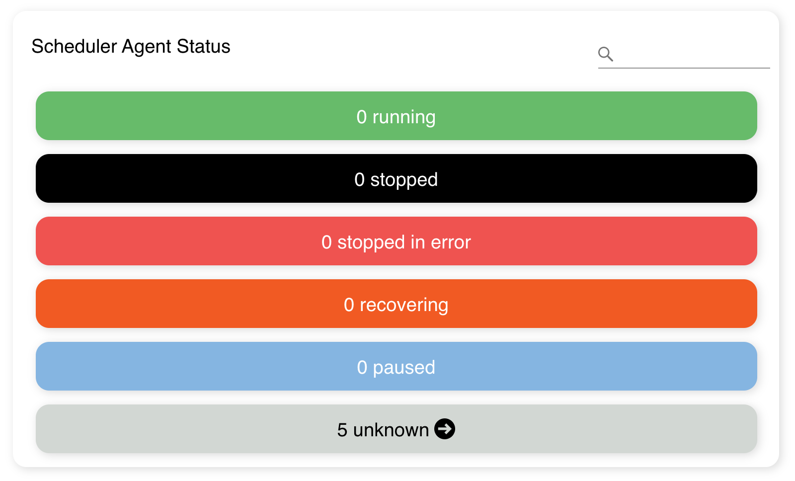
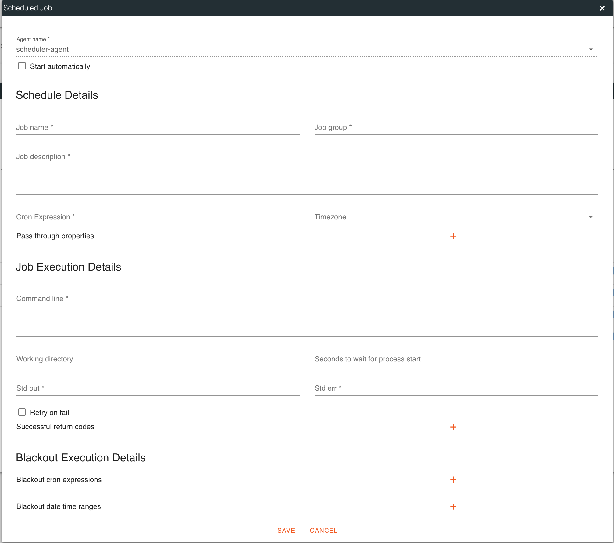
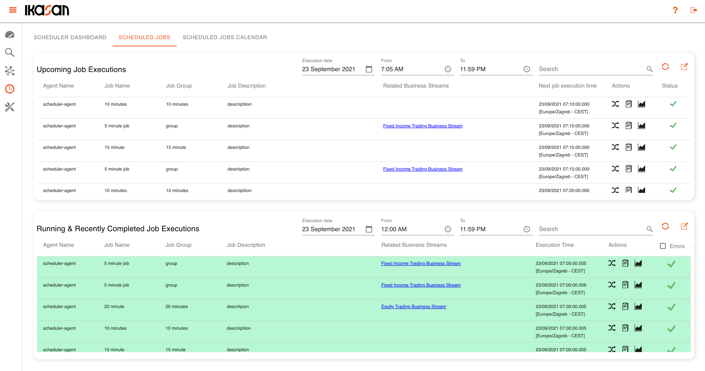
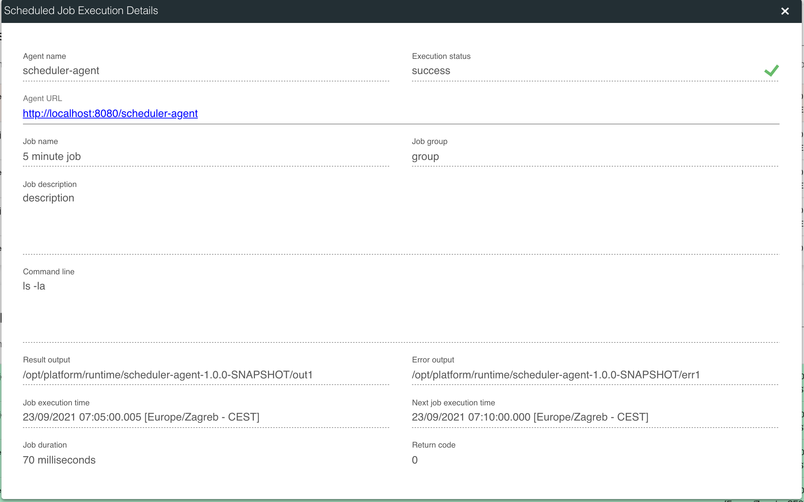
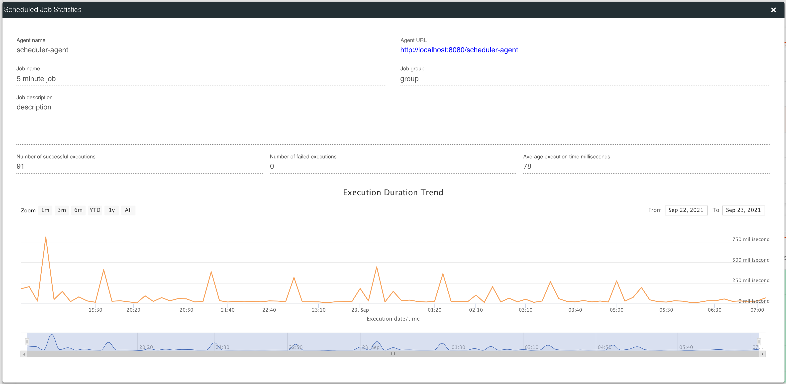

# Scheduler Agents
Version 3.2.0 of Ikasan has seen the introduction of a new bundled fully fledged Ikasan Module that fulfils the role of an enterprise scheduler. This
is the first zero code offering of the Ikasan platform. 

All scheduler agents are managed from the Ikasan dashboard as seen below. In a typical deployment a single Scheduler Agent modules is deployed on a 
per host basis. The Scheduler Agent advertises itself to the Ikasan Dashboard when initially started and from this point onwards the agent becomes 
manageable from the dashboard.

The diagram below provides a conceptual view of a single agent per host. 

Each agent is responsible for managing any number of scheduled jobs as seen below. 

### Creating a New Scheduled Job
Upon navigating to the scheduler view, users are presented with the Scheduler Dashboard. The scheduler dashboard provides a view onto all Scheduler Agents as well as the status of all running jobs. In order to manage Scheduler Agent, the user must double click on the table row for the desired Scheduler Agent.

The user is presented with the Scheduler Agent Management Dialog. This dialog contains details of the Scheduled Agent along with a list of jobs associated with the agent. The status of the available along with variious controls relating to the job. In the top right corner of the dialog is a plus icon that is clicked in order to create a new job. 

### Modules and Agents Widget

### Hospital Events Widget

### Error Occurrences Widget

