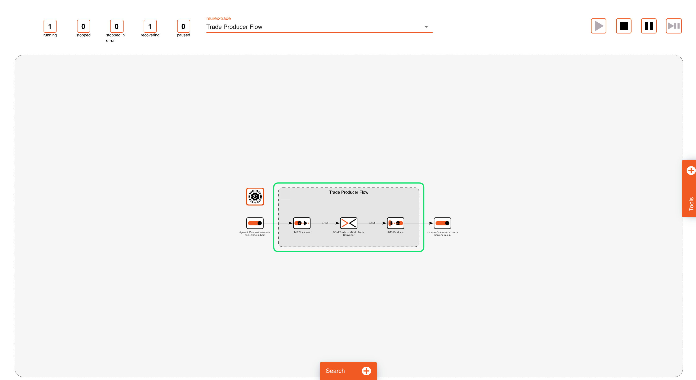
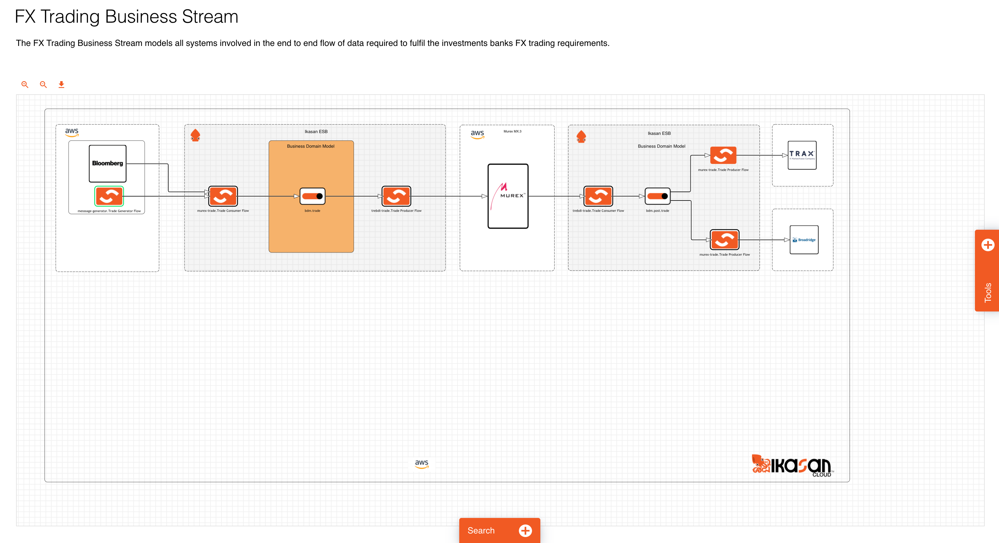
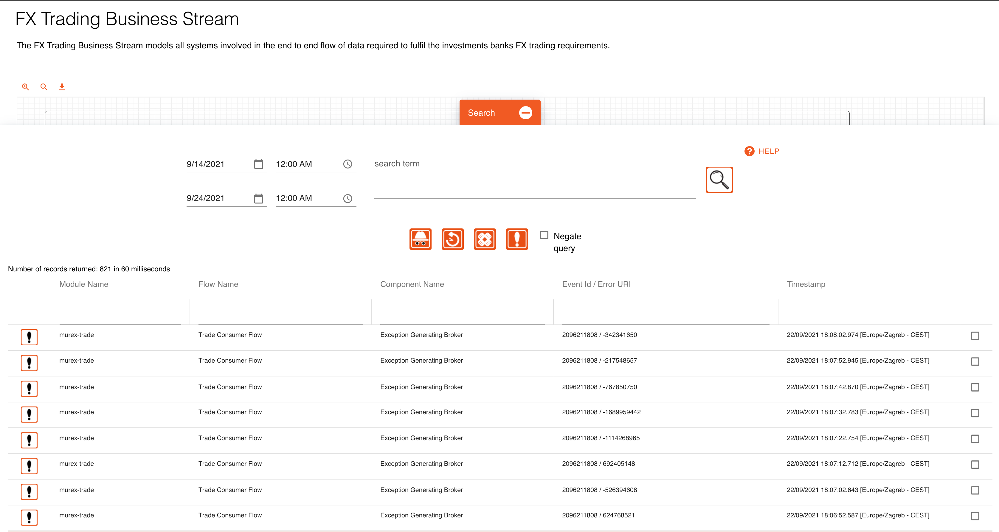
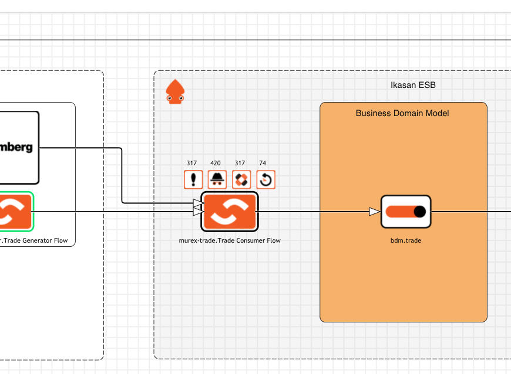
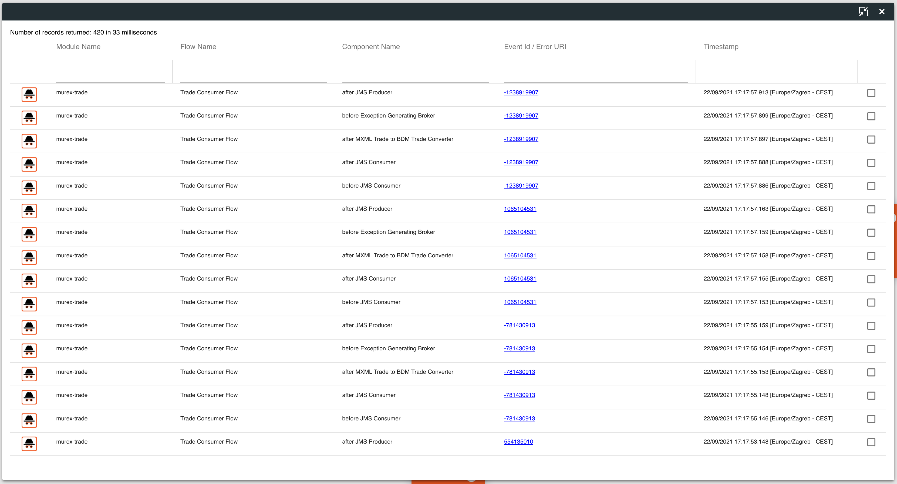
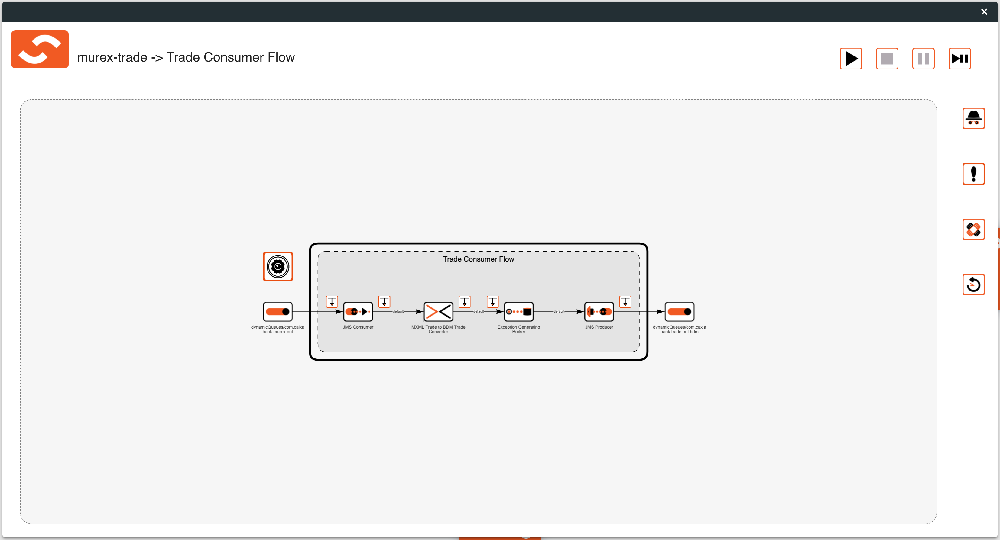

# Module, Flow and Business Stream Visualisations
The dashboard is the the initial screen that a user is directed to upon logging into the Ikasan Dashboard. The dashboard provides a view onto the 
runtime state on all flows within the Ikasan estate. It also provides visibility of errors and hospital events that have occurred as well as details of
all business streams, modules and agents and the ability to open visualisations of each.

### Module and Flow Visualisations

- [Wiretap Management](./wiretap-management.md)
- [Start Up Control Management](./startup-control-management.md)

### Business Stream Visualisations

